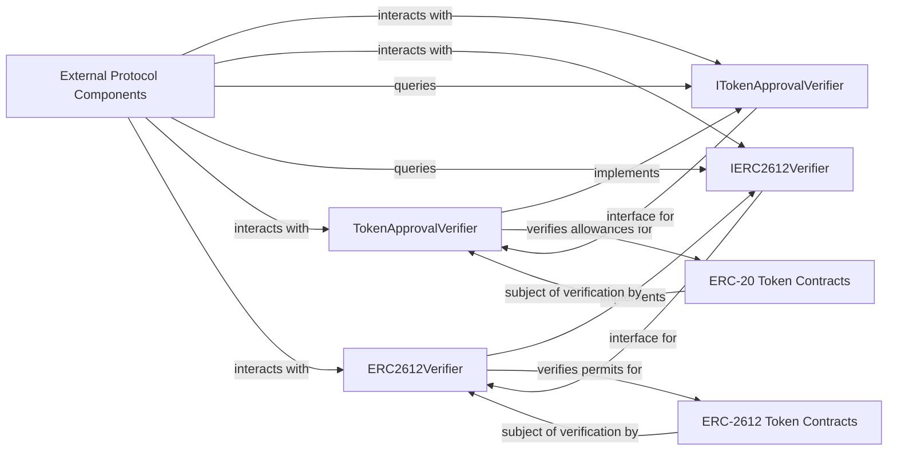

## Details

The `cian-protocol`'s verifier subsystem, located in `contracts/core/verifier`, is responsible for managing and validating token approvals, both for standard ERC-20 tokens and for ERC-2612 off-chain permits. It comprises `TokenApprovalVerifier` for ERC-20 style approvals and `ERC2612Verifier` for ERC-2612 permit signatures, each adhering to their respective interfaces, `ITokenApprovalVerifier` and `IERC2612Verifier`. These verifier contracts interact with external ERC-20 and ERC-2612 token contracts to perform their verification duties, and are utilized by other `cian-protocol` components requiring token approval services. This design promotes modularity, allowing for distinct handling of different token approval mechanisms while providing clear interfaces for external interactions.

### TokenApprovalVerifier
Enforces ERC-20 token transfer permissions by verifying that a `spender` has a sufficient `allowance` granted by the `owner` for a specific `token`. It ensures all ERC-20 token operations requiring prior approval are authorized, including handling off-chain `permit` signatures for ERC-20 like approvals.

**Related Classes/Methods**:

- `TokenApprovalVerifier`

### ERC2612Verifier
Validates off-chain ERC-2612 `permit` signatures. This mechanism allows users to grant token approvals to operators without an on-chain transaction, significantly reducing gas costs and improving user experience by enabling a single transaction for both approval and subsequent transfer. It also verifies permissions based on adapter types.

**Related Classes/Methods**:

- `ERC2612Verifier`

### ITokenApprovalVerifier
Defines the public interface (functions and events) that `TokenApprovalVerifier` must implement. It serves as a standardized contract for other parts of the `cian-protocol` to interact with the general ERC-20 token approval verification logic, promoting modularity and clear dependencies.

**Related Classes/Methods**:

- `ITokenApprovalVerifier`

### IERC2612Verifier
Defines the public interface for `ERC2612Verifier`, specifying the functions and events related to ERC-2612 permit signature and operator approval verification. Similar to `ITokenApprovalVerifier`, it provides a clear contract for external interactions.

**Related Classes/Methods**:

- `IERC2612Verifier`

### External Protocol Components
Represents other contracts or modules within the `cian-protocol` that require token approval or permit verification services. These components act as clients to the verifier subsystem, querying for permission status before executing token-related operations.

**Related Classes/Methods**: _None_

### ERC-20 Token Contracts
Represents generic ERC-20 token contracts whose allowances are conceptually managed and verified by `TokenApprovalVerifier`. The verifier ensures that operations on these tokens are authorized.

**Related Classes/Methods**: _None_

### ERC-2612 Token Contracts
Represents generic ERC-2612 token contracts whose permit operations are conceptually managed and verified by `ERC2612Verifier`. The verifier facilitates and validates off-chain approvals for these tokens.

**Related Classes/Methods**: _None_

### [FAQ](https://github.com/CodeBoarding/GeneratedOnBoardings/tree/main?tab=readme-ov-file#faq)