```mermaid
graph LR
    User_External_DApp["User/External DApp"]
    Cian_Protocol_Core["Cian Protocol Core"]
    Adapter_Manager["Adapter Manager"]
    External_DeFi_Adapters["External DeFi Adapters"]
    Token_Approval_Verifiers["Token & Approval Verifiers"]
    Fee_Basic_Verifier["Fee & Basic Verifier"]
    External_Protocol_Interfaces["External Protocol Interfaces"]
    User_External_DApp -- "initiates operations in" --> Cian_Protocol_Core
    Cian_Protocol_Core -- "delegates requests to" --> Adapter_Manager
    Cian_Protocol_Core -- "requests validation from" --> Token_Approval_Verifiers
    Adapter_Manager -- "routes requests to" --> External_DeFi_Adapters
    Adapter_Manager -- "integrates with" --> Fee_Basic_Verifier
    External_DeFi_Adapters -- "utilizes" --> External_Protocol_Interfaces
    Fee_Basic_Verifier -- "reports to" --> Cian_Protocol_Core
    click Cian_Protocol_Core href "https://github.com/CodeBoarding/GeneratedOnBoardings/blob/main/cian-protocol/Cian_Protocol_Core.md" "Details"
    click Adapter_Manager href "https://github.com/CodeBoarding/GeneratedOnBoardings/blob/main/cian-protocol/Adapter_Manager.md" "Details"
    click External_DeFi_Adapters href "https://github.com/CodeBoarding/GeneratedOnBoardings/blob/main/cian-protocol/External_DeFi_Adapters.md" "Details"
    click Token_Approval_Verifiers href "https://github.com/CodeBoarding/GeneratedOnBoardings/blob/main/cian-protocol/Token_Approval_Verifiers.md" "Details"
```

## Details

The Cian Protocol operates as a robust decentralized finance (DeFi) automation platform, with its core logic encapsulated within the **Cian Protocol Core**. This central component serves as the primary interface for **User/External DApp** interactions, processing incoming requests and orchestrating subsequent operations. For any interaction with external DeFi protocols, the Core delegates requests to the **Adapter Manager**. This manager acts as a standardized gateway, abstracting the complexities of diverse external platforms and routing requests to specific **External DeFi Adapters**. These adapters, in turn, utilize **External Protocol Interfaces** to ensure type-safe and compliant communication with various DEXs, lending platforms, and wrapped asset gateways. Throughout these operations, the **Cian Protocol Core** relies on the **Token & Approval Verifiers** to enforce token-related permissions and ensure adherence to ERC-20 and ERC-2612 standards. Additionally, the **Adapter Manager** integrates with the **Fee & Basic Verifier**, which handles protocol fee collection and provides essential pre-execution checks, reporting back to the **Cian Protocol Core**. This modular architecture ensures efficient, secure, and extensible interactions within the DeFi ecosystem.

### User/External DApp
Represents external entities, such as users interacting directly with the protocol or other decentralized applications (DApps) that integrate with Cian Protocol. This component initiates operations and sends requests to the core protocol.

**Related Classes/Methods**: _None_

### Cian Protocol Core [[Expand]](./Cian_Protocol_Core.md)
The central orchestrator of the Cian Protocol, managing user accounts, executing automated strategies, and linking various protocol functionalities. It is the primary entry point for user interactions and internal operation coordination.

**Related Classes/Methods**:

- <a href="https://github.com/cian-ai/cian-protocol/blob/main/contracts/core/accountManager/AccountManager.sol" target="_blank" rel="noopener noreferrer">`contracts/core/accountManager/AccountManager.sol`</a>
- <a href="https://github.com/cian-ai/cian-protocol/blob/main/contracts/core/automation/Automation.sol" target="_blank" rel="noopener noreferrer">`contracts/core/automation/Automation.sol`</a>
- <a href="https://github.com/cian-ai/cian-protocol/blob/main/contracts/core/controller/ControllerLib.sol" target="_blank" rel="noopener noreferrer">`contracts/core/controller/ControllerLib.sol`</a>
- <a href="https://github.com/cian-ai/cian-protocol/blob/main/contracts/core/controller/ControllerLink.sol" target="_blank" rel="noopener noreferrer">`contracts/core/controller/ControllerLink.sol`</a>
- <a href="https://github.com/cian-ai/cian-protocol/blob/main/contracts/core/controller/ProxyWallet.sol" target="_blank" rel="noopener noreferrer">`contracts/core/controller/ProxyWallet.sol`</a>

### Adapter Manager [[Expand]](./Adapter_Manager.md)
A crucial intermediary that centralizes and manages all interactions with external DeFi protocols. It provides a standardized interface for the `Cian Protocol Core` to communicate with various external services, abstracting away their specific implementations.

**Related Classes/Methods**:

- <a href="https://github.com/cian-ai/cian-protocol/blob/main/contracts/adapters/AdapterManager.sol" target="_blank" rel="noopener noreferrer">`contracts/adapters/AdapterManager.sol`</a>
- <a href="https://github.com/cian-ai/cian-protocol/blob/main/contracts/adapters/base/AdapterBase.sol" target="_blank" rel="noopener noreferrer">`contracts/adapters/base/AdapterBase.sol`</a>
- <a href="https://github.com/cian-ai/cian-protocol/blob/main/contracts/adapters/IAdapterManager.sol" target="_blank" rel="noopener noreferrer">`contracts/adapters/IAdapterManager.sol`</a>
- <a href="https://github.com/cian-ai/cian-protocol/blob/main/contracts/adapters/base/IAdapterBase.sol" target="_blank" rel="noopener noreferrer">`contracts/adapters/base/IAdapterBase.sol`</a>

### External DeFi Adapters [[Expand]](./External_DeFi_Adapters.md)
A collection of specialized adapters designed to facilitate seamless interaction with various Decentralized Exchanges (DEXs), lending platforms, and wrapped asset gateways. These adapters enable the protocol to perform token swaps, manage liquidity, and handle asset wrapping across different DeFi platforms.

**Related Classes/Methods**:

- <a href="https://github.com/cian-ai/cian-protocol/blob/main/contracts/adapters/1inch/OneInchAdapter.sol" target="_blank" rel="noopener noreferrer">`contracts/adapters/1inch/OneInchAdapter.sol`</a>
- <a href="https://github.com/cian-ai/cian-protocol/blob/main/contracts/adapters/paraswap/ParaswapAdapter.sol" target="_blank" rel="noopener noreferrer">`contracts/adapters/paraswap/ParaswapAdapter.sol`</a>
- <a href="https://github.com/cian-ai/cian-protocol/blob/main/contracts/adapters/traderJoe/TraderJoeAdapter.sol" target="_blank" rel="noopener noreferrer">`contracts/adapters/traderJoe/TraderJoeAdapter.sol`</a>
- <a href="https://github.com/cian-ai/cian-protocol/blob/main/contracts/adapters/benqi/BenqiAdapter.sol" target="_blank" rel="noopener noreferrer">`contracts/adapters/benqi/BenqiAdapter.sol`</a>
- <a href="https://github.com/cian-ai/cian-protocol/blob/main/contracts/adapters/benqi/SAVAXAdapter.sol" target="_blank" rel="noopener noreferrer">`contracts/adapters/benqi/SAVAXAdapter.sol`</a>
- <a href="https://github.com/cian-ai/cian-protocol/blob/main/contracts/adapters/traderJoe/BankerJoeAdapter.sol" target="_blank" rel="noopener noreferrer">`contracts/adapters/traderJoe/BankerJoeAdapter.sol`</a>
- <a href="https://github.com/cian-ai/cian-protocol/blob/main/contracts/adapters/WavaxGateway/WavaxGateway.sol" target="_blank" rel="noopener noreferrer">`contracts/adapters/WavaxGateway/WavaxGateway.sol`</a>

### Token & Approval Verifiers [[Expand]](./Token_Approval_Verifiers.md)
Responsible for enforcing token-related permissions and approvals within the protocol. It ensures that all token transfers and operations comply with necessary authorizations, including ERC-20 and ERC-2612 standards.

**Related Classes/Methods**:

- <a href="https://github.com/cian-ai/cian-protocol/blob/main/contracts/core/verifier/TokenApprovalVerifier.sol" target="_blank" rel="noopener noreferrer">`contracts/core/verifier/TokenApprovalVerifier.sol`</a>
- <a href="https://github.com/cian-ai/cian-protocol/blob/main/contracts/core/verifier/ERC2612Verifier.sol" target="_blank" rel="noopener noreferrer">`contracts/core/verifier/ERC2612Verifier.sol`</a>
- <a href="https://github.com/cian-ai/cian-protocol/blob/main/contracts/core/verifier/ITokenApprovalVerifier.sol" target="_blank" rel="noopener noreferrer">`contracts/core/verifier/ITokenApprovalVerifier.sol`</a>
- <a href="https://github.com/cian-ai/cian-protocol/blob/main/contracts/core/verifier/IERC2612Verifier.sol" target="_blank" rel="noopener noreferrer">`contracts/core/verifier/IERC2612Verifier.sol`</a>

### Fee & Basic Verifier
Manages the collection of protocol fees and provides basic verification utilities, particularly for adapter-related operations. It ensures that fees are correctly applied and that fundamental conditions are met before certain actions are executed.

**Related Classes/Methods**:

- <a href="https://github.com/cian-ai/cian-protocol/blob/main/contracts/adapters/feeBox/FeeBoxAVAX.sol" target="_blank" rel="noopener noreferrer">`contracts/adapters/feeBox/FeeBoxAVAX.sol`</a>
- <a href="https://github.com/cian-ai/cian-protocol/blob/main/contracts/adapters/feeBox/FeeBoxSAVAX.sol" target="_blank" rel="noopener noreferrer">`contracts/adapters/feeBox/FeeBoxSAVAX.sol`</a>
- <a href="https://github.com/cian-ai/cian-protocol/blob/main/contracts/adapters/feeBox/VerifierBasic.sol" target="_blank" rel="noopener noreferrer">`contracts/adapters/feeBox/VerifierBasic.sol`</a>

### External Protocol Interfaces
Defines the Solidity interfaces for interacting with external smart contracts, including standard token contracts (ERC-20) and specific interfaces for integrated DeFi protocols (e.g., Benqi, TraderJoe). These interfaces are crucial for enabling type-safe external calls.

**Related Classes/Methods**:

- <a href="https://github.com/cian-ai/cian-protocol/blob/main/contracts/interfaces/IToken.sol" target="_blank" rel="noopener noreferrer">`contracts/interfaces/IToken.sol`</a>
- <a href="https://github.com/cian-ai/cian-protocol/blob/main/contracts/interfaces/IWAVAX.sol" target="_blank" rel="noopener noreferrer">`contracts/interfaces/IWAVAX.sol`</a>
- <a href="https://github.com/cian-ai/cian-protocol/blob/main/contracts/interfaces/benqi/IComptroller.sol" target="_blank" rel="noopener noreferrer">`contracts/interfaces/benqi/IComptroller.sol`</a>
- <a href="https://github.com/cian-ai/cian-protocol/blob/main/contracts/interfaces/benqi/IMaximillion.sol" target="_blank" rel="noopener noreferrer">`contracts/interfaces/benqi/IMaximillion.sol`</a>
- <a href="https://github.com/cian-ai/cian-protocol/blob/main/contracts/interfaces/benqi/IQiAVAX.sol" target="_blank" rel="noopener noreferrer">`contracts/interfaces/benqi/IQiAVAX.sol`</a>
- <a href="https://github.com/cian-ai/cian-protocol/blob/main/contracts/interfaces/benqi/IQiToken.sol" target="_blank" rel="noopener noreferrer">`contracts/interfaces/benqi/IQiToken.sol`</a>
- <a href="https://github.com/cian-ai/cian-protocol/blob/main/contracts/interfaces/benqi/ISAVAX.sol" target="_blank" rel="noopener noreferrer">`contracts/interfaces/benqi/ISAVAX.sol`</a>
- <a href="https://github.com/cian-ai/cian-protocol/blob/main/contracts/interfaces/traderJoe/IBankerJoeLens.sol" target="_blank" rel="noopener noreferrer">`contracts/interfaces/traderJoe/IBankerJoeLens.sol`</a>

### [FAQ](https://github.com/CodeBoarding/GeneratedOnBoardings/tree/main?tab=readme-ov-file#faq)