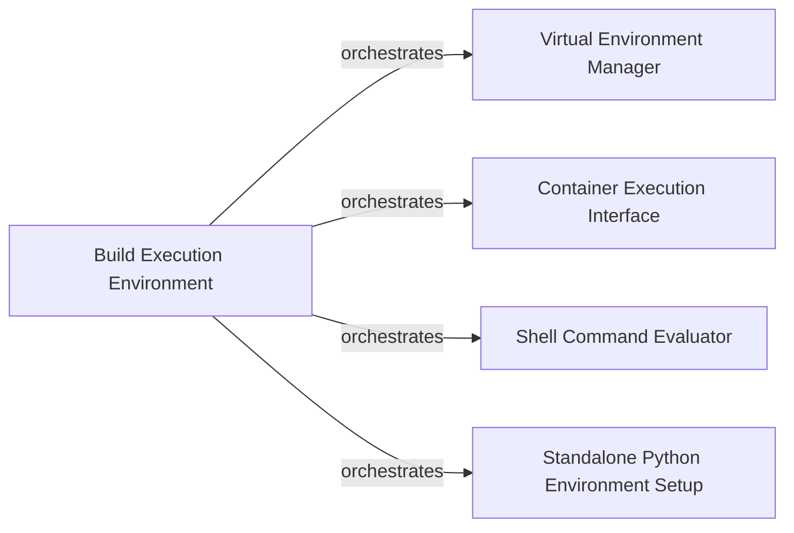

## Details

The Build Execution Environment subsystem provides the foundational services for executing build steps. It is designed as an Adapter layer, abstracting various external execution mechanisms such as isolated Python virtual environments, containerized builds (for Linux), evaluation of shell commands, and the setup of standalone Python distributions. This subsystem ensures that the core build logic can interact with diverse execution contexts uniformly.

### Build Execution Environment [[Expand]](./Build_Execution_Environment.md)
This is the central orchestrator and facade for the entire subsystem. It provides a unified interface for setting up and managing diverse build environments, abstracting the complexities of underlying execution strategies (virtual environments, container execution, shell command evaluation, and standalone Python setups). It embodies the Adapter and Strategy patterns by adapting different execution mechanisms to a common interface, aligning with the project's architectural bias towards cross-platform compatibility and extensibility.

**Related Classes/Methods**:

- <a href="https://github.com/pypa/cibuildwheel/blob/main/cibuildwheel/venv.py" target="_blank" rel="noopener noreferrer">`cibuildwheel.venv`</a>
- <a href="https://github.com/pypa/cibuildwheel/blob/main/cibuildwheel/oci_container.py" target="_blank" rel="noopener noreferrer">`cibuildwheel.oci_container`</a>
- <a href="https://github.com/pypa/cibuildwheel/blob/main/cibuildwheel/bashlex_eval.py" target="_blank" rel="noopener noreferrer">`cibuildwheel.bashlex_eval`</a>
- <a href="https://github.com/pypa/cibuildwheel/blob/main/cibuildwheel/util/__init__.py" target="_blank" rel="noopener noreferrer">`cibuildwheel.util`</a>
- <a href="https://github.com/pypa/cibuildwheel/blob/main/cibuildwheel/util/python_build_standalone.py" target="_blank" rel="noopener noreferrer">`cibuildwheel.util.python_build_standalone`</a>

### Virtual Environment Manager
Manages the creation, activation, and setup of isolated Python virtual environments. This component is crucial for ensuring that build dependencies and tools are confined to a specific environment, preventing conflicts with the host system or other builds, which is a core requirement for reproducible Python packaging.

**Related Classes/Methods**:

- <a href="https://github.com/pypa/cibuildwheel/blob/main/cibuildwheel/venv.py#L89-L156" target="_blank" rel="noopener noreferrer">`cibuildwheel.venv.virtualenv`:89-156</a>

### Container Execution Interface
Provides the capability to execute commands within OCI (Open Container Initiative) containers, primarily used for Linux builds (e.g., manylinux, musllinux). It abstracts the underlying container runtime interactions, ensuring consistent and isolated build environments for specific platforms.

**Related Classes/Methods**:

- <a href="https://github.com/pypa/cibuildwheel/blob/main/cibuildwheel/oci_container.py#L425-L505" target="_blank" rel="noopener noreferrer">`cibuildwheel.oci_container.call`:425-505</a>

### Shell Command Evaluator
Offers a robust mechanism for parsing, evaluating, and executing shell commands. This component handles the complexities of shell syntax and environment variables, enabling dynamic script execution within the build process across different operating systems.

**Related Classes/Methods**:

- <a href="https://github.com/pypa/cibuildwheel/blob/main/cibuildwheel/bashlex_eval.py#L27-L50" target="_blank" rel="noopener noreferrer">`cibuildwheel.bashlex_eval.evaluate`:27-50</a>

### Standalone Python Environment Setup
Handles the setup of build environments using pre-built standalone Python distributions. This is crucial for specific platforms (e.g., Windows, macOS) or when custom Python versions are required, providing a self-contained Python runtime without relying on system-wide installations or traditional virtual environments.

**Related Classes/Methods**:

- <a href="https://github.com/pypa/cibuildwheel/blob/main/cibuildwheel/util/python_build_standalone.py#L140-L181" target="_blank" rel="noopener noreferrer">`cibuildwheel.util.python_build_standalone.create_python_build_standalone_environment`:140-181</a>

### [FAQ](https://github.com/CodeBoarding/GeneratedOnBoardings/tree/main?tab=readme-ov-file#faq)