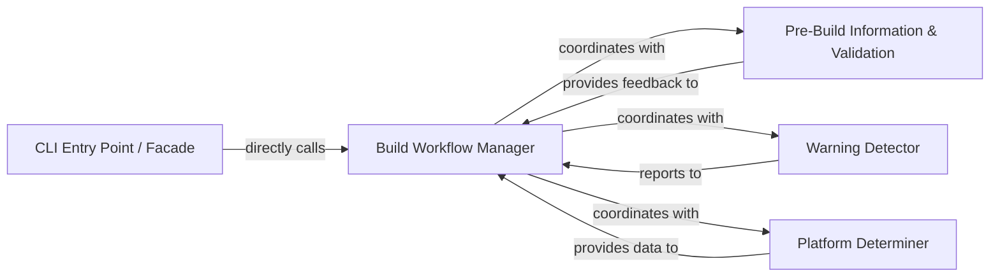

## Details

The `CLI Orchestrator` subsystem serves as the primary user interface and high-level workflow initiator for `cibuildwheel`. It is responsible for parsing command-line arguments and triggering the overall build process, acting as a Facade to the underlying complexities of the build system.

### CLI Entry Point / Facade
This component serves as the primary user interface. Its core responsibility is to parse command-line arguments, initialize the application's environment (e.g., logging), and act as a Facade by initiating the high-level build process without exposing the underlying complexities to the user. It handles the initial setup and delegation.

**Related Classes/Methods**:

- <a href="https://github.com/pypa/cibuildwheel/blob/main/cibuildwheel/__main__.py#L59-L73" target="_blank" rel="noopener noreferrer">`cibuildwheel.__main__.main`:59-73</a>

### Build Workflow Manager
This component orchestrates the core, high-level build process within the specified project directory. It manages the sequence of operations required for a successful build, including setting up the build environment, performing initial pre-build checks, determining the target platform, and coordinating with subsequent, more specialized build stages.

**Related Classes/Methods**:

- <a href="https://github.com/pypa/cibuildwheel/blob/main/cibuildwheel/__main__.py#L322-L390" target="_blank" rel="noopener noreferrer">`cibuildwheel.__main__.build_in_directory`:322-390</a>

### Pre-Build Information & Validation
Responsible for gathering and printing essential pre-build information to the console, providing immediate feedback to the user about the build context and environment.

**Related Classes/Methods**:

- <a href="https://github.com/pypa/cibuildwheel/blob/main/cibuildwheel/__main__.py#L393-L429" target="_blank" rel="noopener noreferrer">`cibuildwheel.__main__.print_preamble`:393-429</a>

### Warning Detector
Identifies and reports potential issues or non-critical warnings related to the build environment or configuration, ensuring the user is aware of any caveats without necessarily halting execution.

**Related Classes/Methods**:

- <a href="https://github.com/pypa/cibuildwheel/blob/main/cibuildwheel/__main__.py#L453-L503" target="_blank" rel="noopener noreferrer">`cibuildwheel.__main__.detect_warnings`:453-503</a>

### Platform Determiner
Computes and returns the specific platform (e.g., operating system, architecture) on which `cibuildwheel` is currently executing, enabling platform-specific build logic and configuration.

**Related Classes/Methods**:

- <a href="https://github.com/pypa/cibuildwheel/blob/main/cibuildwheel/__main__.py#L300-L319" target="_blank" rel="noopener noreferrer">`cibuildwheel.__main__._compute_platform`:300-319</a>

### [FAQ](https://github.com/CodeBoarding/GeneratedOnBoardings/tree/main?tab=readme-ov-file#faq)