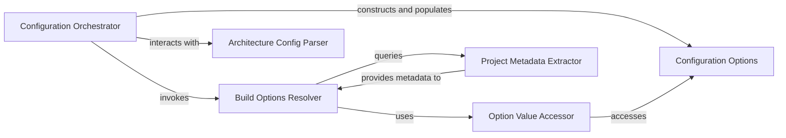

## Details

The `Configuration & Options Manager` subsystem is central to `cibuildwheel`, responsible for consolidating all build-related settings. It acts as the single source of truth for the build process, integrating configurations from various sources like CLI arguments, environment variables, and `pyproject.toml`, while also incorporating project and architecture-specific details.

### Configuration Options
The immutable data structure that encapsulates the consolidated and validated build configuration. It serves as the single source of truth for all build settings, embodying the "Configuration Manager" aspect.

**Related Classes/Methods**:

- <a href="https://github.com/pypa/cibuildwheel/blob/main/cibuildwheel/options.py#L578-L1026" target="_blank" rel="noopener noreferrer">`cibuildwheel.options.Options`:578-1026</a>

### Configuration Orchestrator
The primary entry point and facade for the entire configuration process. It orchestrates the loading, parsing, merging, and validation of all build settings, returning a fully populated `Options` object.

**Related Classes/Methods**:

- <a href="https://github.com/pypa/cibuildwheel/blob/main/cibuildwheel/options.py#L1029-L1034" target="_blank" rel="noopener noreferrer">`cibuildwheel.options.compute_options`:1029-1034</a>

### Build Options Resolver
An internal method responsible for the complex logic of combining configuration from various sources (CLI arguments, environment variables, `pyproject.toml`), handling precedence and merging rules.

**Related Classes/Methods**:

- <a href="https://github.com/pypa/cibuildwheel/blob/main/cibuildwheel/options.py#L714-L888" target="_blank" rel="noopener noreferrer">`cibuildwheel.options._compute_build_options`:714-888</a>

### Option Value Accessor
Provides a unified interface to retrieve specific configuration values from the `Options` object, ensuring that cascading rules and overrides are correctly applied. It acts as a "Strategy" for value retrieval.

**Related Classes/Methods**:

- <a href="https://github.com/pypa/cibuildwheel/blob/main/cibuildwheel/options.py" target="_blank" rel="noopener noreferrer">`cibuildwheel.options.Options:get`</a>

### Architecture Config Parser
Responsible for parsing and validating architecture-related configuration strings (e.g., from `CIBW_ARCHS`), translating them into internal architecture representations. This acts as an "Adapter" for architecture-specific configuration.

**Related Classes/Methods**:

- <a href="https://github.com/pypa/cibuildwheel/blob/main/cibuildwheel/architecture.py#L86-L108" target="_blank" rel="noopener noreferrer">`cibuildwheel.architecture.parse_config`:86-108</a>

### Project Metadata Extractor
Extracts the Python version requirements (`python_requires`) from the project's metadata files (`pyproject.toml` or `setup.py`), contributing essential project metadata to the configuration.

**Related Classes/Methods**:

- <a href="https://github.com/pypa/cibuildwheel/blob/main/cibuildwheel/projectfiles.py#L68-L86" target="_blank" rel="noopener noreferrer">`cibuildwheel.projectfiles.get_requires_python_str`:68-86</a>

### [FAQ](https://github.com/CodeBoarding/GeneratedOnBoardings/tree/main?tab=readme-ov-file#faq)