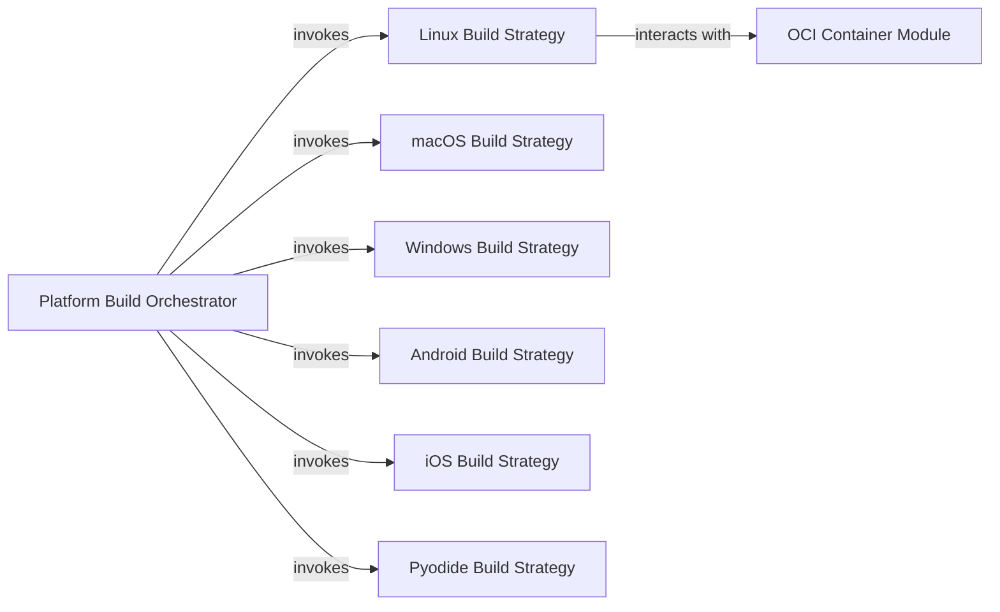

## Details

The `Platform Build Orchestrator` subsystem is central to `cibuildwheel`'s cross-platform build capabilities, embodying the Strategy pattern to manage diverse build environments.

### Platform Build Orchestrator [[Expand]](./Platform_Build_Orchestrator.md)
This is the core component responsible for identifying the current platform's specific Python configurations and target architectures. It acts as the central dispatcher, determining the relevant build identifiers and then invoking the appropriate platform-specific build strategy. It serves as the "Context" or "Client" in the Strategy pattern.

**Related Classes/Methods**:

- <a href="https://github.com/pypa/cibuildwheel/blob/main/cibuildwheel/platforms/__init__.py" target="_blank" rel="noopener noreferrer">`cibuildwheel.platforms.__init__.py`</a>

### Linux Build Strategy
Implements the detailed build logic for Linux environments. This includes setting up the build environment, installing dependencies, executing the wheel build command, and performing any Linux-specific post-processing like `auditwheel` repair and testing. It specifically integrates with OCI containers for isolated builds.

**Related Classes/Methods**:

- <a href="https://github.com/pypa/cibuildwheel/blob/main/cibuildwheel/platforms/linux.py" target="_blank" rel="noopener noreferrer">`cibuildwheel.platforms.linux.py`</a>

### macOS Build Strategy
Implements the detailed build logic for macOS environments. This includes setting up the build environment, installing dependencies, executing the wheel build command, and performing any macOS-specific post-processing like `delocate` and testing.

**Related Classes/Methods**:

- <a href="https://github.com/pypa/cibuildwheel/blob/main/cibuildwheel/platforms/macos.py" target="_blank" rel="noopener noreferrer">`cibuildwheel.platforms.macos.py`</a>

### Windows Build Strategy
Implements the detailed build logic for Windows environments. This includes setting up the build environment, installing dependencies, executing the wheel build command, and performing any Windows-specific post-processing and testing.

**Related Classes/Methods**:

- <a href="https://github.com/pypa/cibuildwheel/blob/main/cibuildwheel/platforms/windows.py" target="_blank" rel="noopener noreferrer">`cibuildwheel.platforms.windows.py`</a>

### Android Build Strategy
Implements the specific build logic for Android environments, including environment setup, dependency installation, build execution, and handling any platform-specific post-processing.

**Related Classes/Methods**:

- <a href="https://github.com/pypa/cibuildwheel/blob/main/cibuildwheel/platforms/android.py" target="_blank" rel="noopener noreferrer">`cibuildwheel.platforms.android.py`</a>

### iOS Build Strategy
Implements the specific build logic for iOS environments, including environment setup, dependency installation, build execution, and handling any platform-specific post-processing.

**Related Classes/Methods**:

- <a href="https://github.com/pypa/cibuildwheel/blob/main/cibuildwheel/platforms/ios.py" target="_blank" rel="noopener noreferrer">`cibuildwheel.platforms.ios.py`</a>

### Pyodide Build Strategy
Implements the specific build logic for Pyodide environments, including environment setup, dependency installation, build execution, and handling any platform-specific post-processing.

**Related Classes/Methods**:

- <a href="https://github.com/pypa/cibuildwheel/blob/main/cibuildwheel/platforms/pyodide.py" target="_blank" rel="noopener noreferrer">`cibuildwheel.platforms.pyodide.py`</a>

### OCI Container Module
Provides functionalities for executing build processes within OCI (Open Container Initiative) containers. This module is primarily utilized by the `Linux Build Strategy` to ensure isolated, reproducible, and consistent build environments.

**Related Classes/Methods**:

- <a href="https://github.com/pypa/cibuildwheel/blob/main/cibuildwheel/oci_container.py" target="_blank" rel="noopener noreferrer">`cibuildwheel.oci_container.py`</a>

### [FAQ](https://github.com/CodeBoarding/GeneratedOnBoardings/tree/main?tab=readme-ov-file#faq)