```mermaid
graph LR
    CLI_Orchestrator["CLI Orchestrator"]
    Configuration_Options_Manager["Configuration & Options Manager"]
    Platform_Build_Orchestrator["Platform Build Orchestrator"]
    Build_Execution_Environment["Build Execution Environment"]
    CLI_Orchestrator -- "Requests Build Options" --> Configuration_Options_Manager
    CLI_Orchestrator -- "Triggers Build Process" --> Platform_Build_Orchestrator
    Configuration_Options_Manager -- "Provides Processed Options" --> Platform_Build_Orchestrator
    Platform_Build_Orchestrator -- "Requests Environment Services" --> Build_Execution_Environment
    Build_Execution_Environment -- "Returns Execution Results" --> Platform_Build_Orchestrator
    click CLI_Orchestrator href "https://github.com/CodeBoarding/GeneratedOnBoardings/blob/main/cibuildwheel/CLI_Orchestrator.md" "Details"
    click Configuration_Options_Manager href "https://github.com/CodeBoarding/GeneratedOnBoardings/blob/main/cibuildwheel/Configuration_Options_Manager.md" "Details"
    click Platform_Build_Orchestrator href "https://github.com/CodeBoarding/GeneratedOnBoardings/blob/main/cibuildwheel/Platform_Build_Orchestrator.md" "Details"
    click Build_Execution_Environment href "https://github.com/CodeBoarding/GeneratedOnBoardings/blob/main/cibuildwheel/Build_Execution_Environment.md" "Details"
```

## Details

The cibuildwheel project is designed to build Python wheels for various platforms with a clear separation of concerns, enabling robust and reproducible builds. The core flow initiates from a command-line interface, which then orchestrates configuration loading, platform-specific build strategies, and isolated build environment execution. This architecture promotes modularity, allowing for easy extension to new platforms or build environments without significantly impacting core logic. The use of distinct components for configuration, platform handling, and execution environment management simplifies the overall system and enhances maintainability.

### CLI Orchestrator [[Expand]](./CLI_Orchestrator.md)
The primary user interface and high-level workflow initiator. It parses command-line arguments and triggers the overall build process, acting as a Facade to the underlying complexities.

**Related Classes/Methods**:

- <a href="https://github.com/pypa/cibuildwheel/blob/main/cibuildwheel/__main__.py" target="_blank" rel="noopener noreferrer">`cibuildwheel/__main__.py`</a>
- <a href="https://github.com/pypa/cibuildwheel/blob/main/cibuildwheel/__main__.py#L59-L73" target="_blank" rel="noopener noreferrer">`cibuildwheel.__main__.main`:59-73</a>
- <a href="https://github.com/pypa/cibuildwheel/blob/main/cibuildwheel/__main__.py#L322-L390" target="_blank" rel="noopener noreferrer">`cibuildwheel.__main__.build_in_directory`:322-390</a>

### Configuration & Options Manager [[Expand]](./Configuration_Options_Manager.md)
Centralized component for loading, parsing, merging, and validating all build-related configurations from CLI arguments, environment variables, and pyproject.toml. It also incorporates project metadata and architecture specifics.

**Related Classes/Methods**:

- <a href="https://github.com/pypa/cibuildwheel/blob/main/cibuildwheel/options.py" target="_blank" rel="noopener noreferrer">`cibuildwheel/options.py`</a>
- <a href="https://github.com/pypa/cibuildwheel/blob/main/cibuildwheel/architecture.py" target="_blank" rel="noopener noreferrer">`cibuildwheel/architecture.py`</a>
- <a href="https://github.com/pypa/cibuildwheel/blob/main/cibuildwheel/util/__init__.py" target="_blank" rel="noopener noreferrer">`cibuildwheel.util.__init__.py`</a>
- <a href="https://github.com/pypa/cibuildwheel/blob/main/cibuildwheel/options.py#L1029-L1034" target="_blank" rel="noopener noreferrer">`cibuildwheel.options.compute_options`:1029-1034</a>
- <a href="https://github.com/pypa/cibuildwheel/blob/main/cibuildwheel/options.py#L532-L575" target="_blank" rel="noopener noreferrer">`cibuildwheel.options.get`:532-575</a>
- <a href="https://github.com/pypa/cibuildwheel/blob/main/cibuildwheel/architecture.py#L86-L108" target="_blank" rel="noopener noreferrer">`cibuildwheel.architecture.parse_config`:86-108</a>
- <a href="https://github.com/pypa/cibuildwheel/blob/main/cibuildwheel/projectfiles.py#L68-L86" target="_blank" rel="noopener noreferrer">`cibuildwheel.projectfiles.get_requires_python_str`:68-86</a>

### Platform Build Orchestrator [[Expand]](./Platform_Build_Orchestrator.md)
Determines the specific Python configurations and target architectures for the current platform, then dispatches build jobs to the appropriate platform-specific build strategies (Linux, macOS, Windows, etc.). This component embodies the Strategy pattern.

**Related Classes/Methods**:

- <a href="https://github.com/pypa/cibuildwheel/blob/main/cibuildwheel/platforms/__init__.py" target="_blank" rel="noopener noreferrer">`cibuildwheel.platforms.__init__.py`</a>
- <a href="https://github.com/pypa/cibuildwheel/blob/main/cibuildwheel/platforms/linux.py" target="_blank" rel="noopener noreferrer">`cibuildwheel/platforms/linux.py`</a>
- <a href="https://github.com/pypa/cibuildwheel/blob/main/cibuildwheel/platforms/macos.py" target="_blank" rel="noopener noreferrer">`cibuildwheel/platforms/macos.py`</a>
- <a href="https://github.com/pypa/cibuildwheel/blob/main/cibuildwheel/platforms/windows.py" target="_blank" rel="noopener noreferrer">`cibuildwheel/platforms/windows.py`</a>
- <a href="https://github.com/pypa/cibuildwheel/blob/main/cibuildwheel/platforms/android.py" target="_blank" rel="noopener noreferrer">`cibuildwheel/platforms/android.py`</a>
- <a href="https://github.com/pypa/cibuildwheel/blob/main/cibuildwheel/platforms/ios.py" target="_blank" rel="noopener noreferrer">`cibuildwheel/platforms/ios.py`</a>
- <a href="https://github.com/pypa/cibuildwheel/blob/main/cibuildwheel/platforms/pyodide.py" target="_blank" rel="noopener noreferrer">`cibuildwheel/platforms/pyodide.py`</a>
- <a href="https://github.com/pypa/cibuildwheel/blob/main/cibuildwheel/platforms/__init__.py#L54-L60" target="_blank" rel="noopener noreferrer">`cibuildwheel.platforms.__init__.get_build_identifiers`:54-60</a>
- <a href="https://github.com/pypa/cibuildwheel/blob/main/cibuildwheel/platforms/linux.py#L433-L493" target="_blank" rel="noopener noreferrer">`cibuildwheel.platforms.linux.build`:433-493</a>
- <a href="https://github.com/pypa/cibuildwheel/blob/main/cibuildwheel/platforms/macos.py#L386-L751" target="_blank" rel="noopener noreferrer">`cibuildwheel.platforms.macos.build`:386-751</a>
- <a href="https://github.com/pypa/cibuildwheel/blob/main/cibuildwheel/platforms/windows.py#L374-L634" target="_blank" rel="noopener noreferrer">`cibuildwheel.platforms.windows.build`:374-634</a>

### Build Execution Environment [[Expand]](./Build_Execution_Environment.md)
Provides the foundational services for executing build steps. This includes managing isolated Python virtual environments, orchestrating containerized builds (for Linux), evaluating shell commands, and handling standalone Python distribution setup. It acts as an Adapter layer for various external execution mechanisms.

**Related Classes/Methods**:

- <a href="https://github.com/pypa/cibuildwheel/blob/main/cibuildwheel/venv.py" target="_blank" rel="noopener noreferrer">`cibuildwheel.venv.py`</a>
- <a href="https://github.com/pypa/cibuildwheel/blob/main/cibuildwheel/oci_container.py" target="_blank" rel="noopener noreferrer">`cibuildwheel/oci_container.py`</a>
- <a href="https://github.com/pypa/cibuildwheel/blob/main/cibuildwheel/bashlex_eval.py" target="_blank" rel="noopener noreferrer">`cibuildwheel/bashlex_eval.py`</a>
- <a href="https://github.com/pypa/cibuildwheel/blob/main/cibuildwheel/util/__init__.py" target="_blank" rel="noopener noreferrer">`cibuildwheel.util.__init__.py`</a>
- <a href="https://github.com/pypa/cibuildwheel/blob/main/cibuildwheel/venv.py#L89-L156" target="_blank" rel="noopener noreferrer">`cibuildwheel.venv.virtualenv`:89-156</a>
- <a href="https://github.com/pypa/cibuildwheel/blob/main/cibuildwheel/oci_container.py#L425-L505" target="_blank" rel="noopener noreferrer">`cibuildwheel.oci_container.call`:425-505</a>
- <a href="https://github.com/pypa/cibuildwheel/blob/main/cibuildwheel/bashlex_eval.py#L27-L50" target="_blank" rel="noopener noreferrer">`cibuildwheel.bashlex_eval.evaluate`:27-50</a>
- <a href="https://github.com/pypa/cibuildwheel/blob/main/cibuildwheel/util/python_build_standalone.py#L140-L181" target="_blank" rel="noopener noreferrer">`cibuildwheel.util.python_build_standalone.create_python_build_standalone_environment`:140-181</a>

### [FAQ](https://github.com/CodeBoarding/GeneratedOnBoardings/tree/main?tab=readme-ov-file#faq)