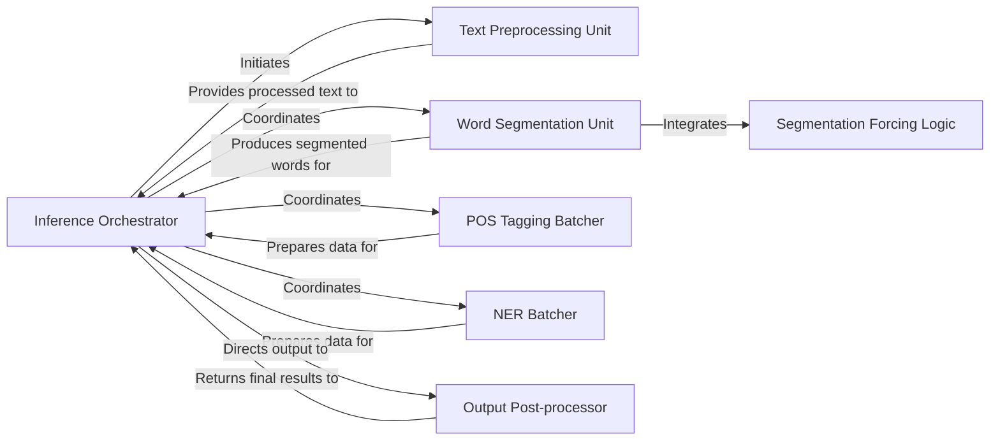

## Details

The `ckiptagger` NLP subsystem is structured around a set of specialized components orchestrated by distinct `__call__` methods within its `WS`, `POS`, and `NER` API classes. The **Inference Orchestrator** (represented by these `__call__` methods) serves as the central control, managing the entire NLP pipeline from initial input to final output. It first directs raw text to the **Text Preprocessing Unit** for normalization and sentence segmentation. The preprocessed text then flows to the **Word Segmentation Unit**, which handles tokenization and integrates **Segmentation Forcing Logic** for refined word boundaries. For subsequent tasks, the orchestrator coordinates with the **POS Tagging Batcher** and **NER Batcher** to prepare data for their respective models. Finally, all processed outputs are directed to the **Output Post-processor** for final formatting, entity extraction, and whitespace handling before being returned by the orchestrator. This design ensures a clear, sequential flow of data and control, with the orchestrator maintaining oversight of all processing stages.

### Inference Orchestrator [[Expand]](./Inference_Orchestrator.md)
The central control unit managing the overall NLP pipeline. It acts as the primary entry point, dispatching tasks to specialized units for preprocessing, word segmentation, POS tagging, and NER, and then consolidating their outputs. The `WS`, `POS`, and `NER` classes each contain an `__call__` method that orchestrates their respective inference flows.

**Related Classes/Methods**:

- <a href="https://github.com/ckiplab/ckiptagger/blob/master/src/api.py" target="_blank" rel="noopener noreferrer">`ckiptagger.src.api.WS.__call__`</a>

### Text Preprocessing Unit
Prepares raw text input by performing character normalization and segmenting the text into individual sentences, making it ready for further NLP tasks.

**Related Classes/Methods**:

- <a href="https://github.com/ckiplab/ckiptagger/blob/master/src/api.py" target="_blank" rel="noopener noreferrer">`ckiptagger.src.api._normalize_sentence`</a>
- <a href="https://github.com/ckiplab/ckiptagger/blob/master/src/api.py" target="_blank" rel="noopener noreferrer">`ckiptagger.src.api._segment_sentence`</a>

### Word Segmentation Unit
Breaks down preprocessed sentences into individual words or tokens. This includes handling batching for efficient processing and applying sequence labeling models.

**Related Classes/Methods**:

- <a href="https://github.com/ckiplab/ckiptagger/blob/master/src/api.py" target="_blank" rel="noopener noreferrer">`ckiptagger.src.api._get_ws_batch_list`</a>
- <a href="https://github.com/ckiplab/ckiptagger/blob/master/src/api.py" target="_blank" rel="noopener noreferrer">`ckiptagger.src.api.WS.model.predict_label_for_a_batch`</a>
- <a href="https://github.com/ckiplab/ckiptagger/blob/master/src/api.py" target="_blank" rel="noopener noreferrer">`ckiptagger.src.api._run_word_segmentation_with_dictionary`</a>

### Segmentation Forcing Logic
Applies specific rules to influence or force word segmentation behavior, often used in conjunction with dictionary-based segmentation to ensure desired tokenization outcomes. This logic is integrated within the word segmentation process.

**Related Classes/Methods**:

- <a href="https://github.com/ckiplab/ckiptagger/blob/master/src/api.py" target="_blank" rel="noopener noreferrer">`ckiptagger.src.api._run_word_segmentation_with_dictionary`</a>

### POS Tagging Batcher
Prepares and batches segmented words specifically for the Part-of-Speech (POS) tagging model, optimizing data input for model inference.

**Related Classes/Methods**:

- <a href="https://github.com/ckiplab/ckiptagger/blob/master/src/api.py" target="_blank" rel="noopener noreferrer">`ckiptagger.src.api._get_pos_batch_list`</a>

### NER Batcher
Prepares and batches segmented words specifically for the Named Entity Recognition (NER) model, ensuring data is in the correct format and size for efficient model inference.

**Related Classes/Methods**:

- <a href="https://github.com/ckiplab/ckiptagger/blob/master/src/api.py" target="_blank" rel="noopener noreferrer">`ckiptagger.src.api._get_ner_batch_list`</a>

### Output Post-processor
Finalizes the processed output from the NLP models. This includes enforcing whitespace rules, extracting identified entities, and converting internal data structures into the desired external output format for the user.

**Related Classes/Methods**:

- <a href="https://github.com/ckiplab/ckiptagger/blob/master/src/api.py" target="_blank" rel="noopener noreferrer">`ckiptagger.src.api._force_whitespace_tagging`</a>
- <a href="https://github.com/ckiplab/ckiptagger/blob/master/src/api.py" target="_blank" rel="noopener noreferrer">`ckiptagger.src.api._get_entity_set`</a>
- <a href="https://github.com/ckiplab/ckiptagger/blob/master/src/api.py" target="_blank" rel="noopener noreferrer">`ckiptagger.src.api._get_word_sentence_from_seq_sentence`</a>

### [FAQ](https://github.com/CodeBoarding/GeneratedOnBoardings/tree/main?tab=readme-ov-file#faq)