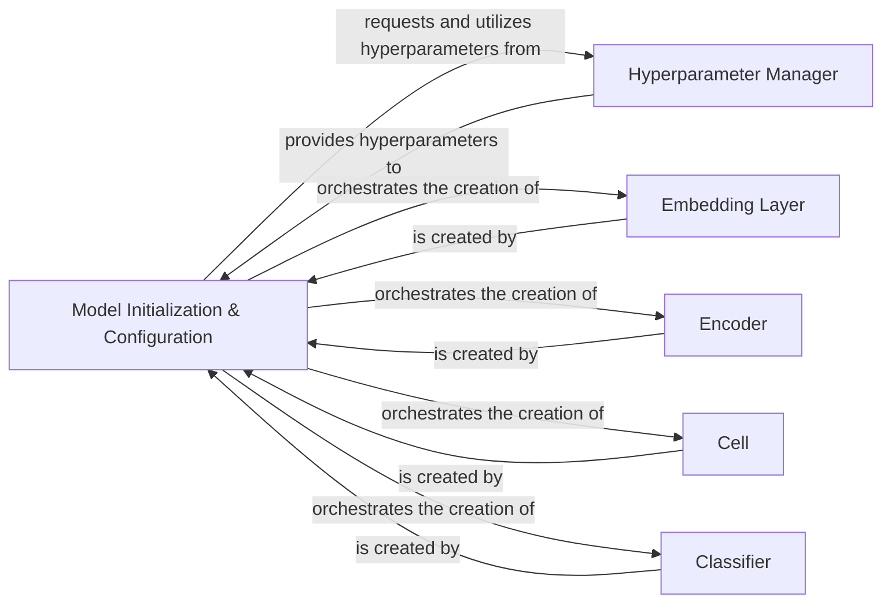

## Details

The core of the system revolves around the `Model Initialization & Configuration` component, which acts as the central orchestrator for setting up and configuring deep learning models. This component is responsible for initializing and integrating other key components: the `Hyperparameter Manager`, `Embedding Layer`, `Encoder`, `Cell`, and `Classifier`. The `Hyperparameter Manager` provides essential configuration parameters to the `Model Initialization & Configuration`. During the model setup, the `Model Initialization & Configuration` component creates the `Embedding Layer` to handle input embeddings, the `Encoder` to process these embeddings into higher-level features, and the `Cell` components (specifically BiLSTM or Cross_BiLSTM cells) which are fundamental to the sequential processing within the encoder. Finally, the `Classifier` is created to make predictions based on the processed features. This structured initialization ensures a cohesive and functional deep learning model.

### Model Initialization & Configuration [[Expand]](./Model_Initialization_Configuration.md)
The central orchestrator for setting up, loading, and configuring deep learning models. It manages the assembly of all necessary sub-components to form a complete, functional model and handles the loading of pre-trained models or configurations.

**Related Classes/Methods**:

- <a href="https://github.com/ckiplab/ckiptagger/blob/master/src/model_ws.py#L208-L215" target="_blank" rel="noopener noreferrer">`WS.__init__`:208-215</a>
- <a href="https://github.com/ckiplab/ckiptagger/blob/master/src/model_pos.py#L167-L174" target="_blank" rel="noopener noreferrer">`POS.__init__`:167-174</a>
- <a href="https://github.com/ckiplab/ckiptagger/blob/master/src/model_ner.py#L168-L175" target="_blank" rel="noopener noreferrer">`NER.__init__`:168-175</a>

### Hyperparameter Manager
Provides and manages the hyperparameters required for model configuration and training.

**Related Classes/Methods**:

- <a href="https://github.com/ckiplab/ckiptagger/blob/master/src/model_ws.py#L217-L223" target="_blank" rel="noopener noreferrer">`Model.create_hyper_parameter`:217-223</a>

### Embedding Layer
Responsible for creating and managing the word or character embeddings used as input to the deep learning models.

**Related Classes/Methods**:

- <a href="https://github.com/ckiplab/ckiptagger/blob/master/src/model_ws.py#L225-L229" target="_blank" rel="noopener noreferrer">`Model.create_embedding`:225-229</a>

### Encoder
Processes the input embeddings to extract higher-level features, often involving recurrent or convolutional neural networks.

**Related Classes/Methods**:

- <a href="https://github.com/ckiplab/ckiptagger/blob/master/src/model_ws.py#L231-L278" target="_blank" rel="noopener noreferrer">`Model.create_encoder`:231-278</a>

### Cell
Represents the fundamental computational unit within recurrent neural networks, responsible for sequential processing.

**Related Classes/Methods**:

- <a href="https://github.com/ckiplab/ckiptagger/blob/master/src/model_ws.py#L105-L115" target="_blank" rel="noopener noreferrer">`BiLSTM.create_cell`:105-115</a>

### Classifier
The final layer of the model responsible for making predictions based on the features extracted by the encoder and processed by the cells.

**Related Classes/Methods**:

- <a href="https://github.com/ckiplab/ckiptagger/blob/master/src/model_ws.py#L280-L314" target="_blank" rel="noopener noreferrer">`Model.create_classifier`:280-314</a>

### [FAQ](https://github.com/CodeBoarding/GeneratedOnBoardings/tree/main?tab=readme-ov-file#faq)