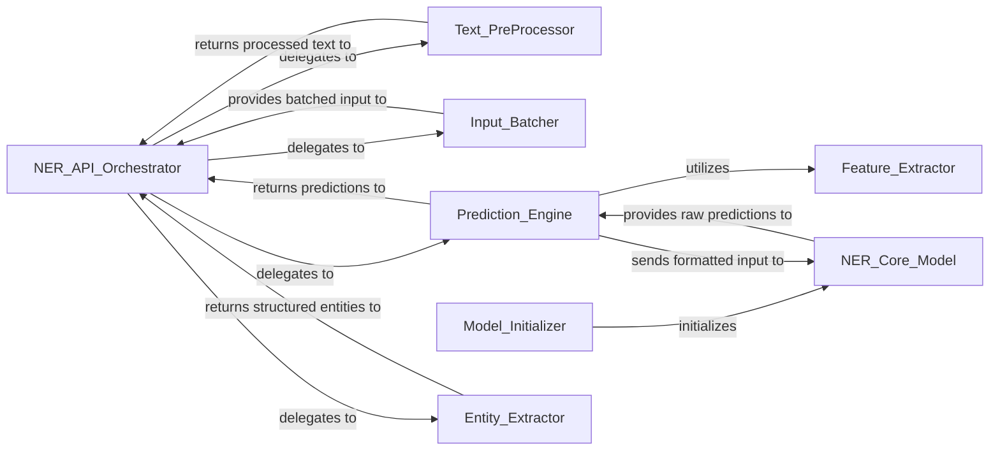

## Details

Analysis of the Named Entity Recognition (NER) Component subsystem within the `ckiptagger` project.

### NER_API_Orchestrator
The public interface and primary orchestrator for the entire NER process. It manages the flow from raw text input through pre-processing, model inference, and post-processing to structured entity output.

**Related Classes/Methods**:

- <a href="https://github.com/ckiplab/ckiptagger/blob/master/src/api.py" target="_blank" rel="noopener noreferrer">`src.api.NER:__call__`</a>

### Text_PreProcessor
Handles all initial text preparation steps, including normalization, sentence segmentation, and word segmentation, ensuring the input is in a suitable format for the NER model.

**Related Classes/Methods**:

- <a href="https://github.com/ckiplab/ckiptagger/blob/master/src/api.py" target="_blank" rel="noopener noreferrer">`src.api.NER:_normalize_sentence`</a>
- <a href="https://github.com/ckiplab/ckiptagger/blob/master/src/api.py" target="_blank" rel="noopener noreferrer">`src.api.NER:_segment_sentence`</a>
- <a href="https://github.com/ckiplab/ckiptagger/blob/master/src/api.py" target="_blank" rel="noopener noreferrer">`src.api.NER:_segment_word_sentence`</a>
- <a href="https://github.com/ckiplab/ckiptagger/blob/master/src/api.py" target="_blank" rel="noopener noreferrer">`src.api.NER:_run_word_segmentation_with_dictionary`</a>

### Input_Batcher
Transforms pre-processed text into batches optimized for efficient processing by the underlying machine learning model.

**Related Classes/Methods**:

- <a href="https://github.com/ckiplab/ckiptagger/blob/master/src/api.py" target="_blank" rel="noopener noreferrer">`src.api.NER:_get_ner_batch_list`</a>

### NER_Core_Model
Encapsulates the neural network architecture for Named Entity Recognition, including its forward pass logic for prediction. This is the core ML model.

**Related Classes/Methods**:

- <a href="https://github.com/ckiplab/ckiptagger/blob/master/src/model_ner.py" target="_blank" rel="noopener noreferrer">`src.model_ner.Model`</a>

### Model_Initializer
Configures and builds the various layers and components of the neural network model (NER_Core_Model) during its instantiation.

**Related Classes/Methods**:

- <a href="https://github.com/ckiplab/ckiptagger/blob/master/src/model_ner.py" target="_blank" rel="noopener noreferrer">`src.model_ner.Model:__init__`</a>
- <a href="https://github.com/ckiplab/ckiptagger/blob/master/src/model_ner.py" target="_blank" rel="noopener noreferrer">`src.model_ner.Model:create_hyper_parameter`</a>
- <a href="https://github.com/ckiplab/ckiptagger/blob/master/src/model_ner.py" target="_blank" rel="noopener noreferrer">`src.model_ner.Model:create_embedding`</a>
- <a href="https://github.com/ckiplab/ckiptagger/blob/master/src/model_ner.py" target="_blank" rel="noopener noreferrer">`src.model_ner.Model:create_cell`</a>
- <a href="https://github.com/ckiplab/ckiptagger/blob/master/src/model_ner.py" target="_blank" rel="noopener noreferrer">`src.model_ner.Model:create_classifier`</a>

### Feature_Extractor
Prepares input features (e.g., word and character embeddings) in the specific format required by the NER_Core_Model for prediction.

**Related Classes/Methods**:

- <a href="https://github.com/ckiplab/ckiptagger/blob/master/src/model_ner.py" target="_blank" rel="noopener noreferrer">`src.model_ner.Model:get_formatted_input`</a>

### Prediction_Engine
Executes the forward pass of the NER_Core_Model to generate predicted entity labels for a given batch of input.

**Related Classes/Methods**:

- <a href="https://github.com/ckiplab/ckiptagger/blob/master/src/model_ner.py" target="_blank" rel="noopener noreferrer">`src.model_ner.Model:predict_label_for_a_batch`</a>

### Entity_Extractor
Processes the raw output (predicted labels) from the Prediction_Engine and formats it into a structured set of identified named entities.

**Related Classes/Methods**:

- <a href="https://github.com/ckiplab/ckiptagger/blob/master/src/api.py" target="_blank" rel="noopener noreferrer">`src.api.NER:_get_entity_set`</a>

### [FAQ](https://github.com/CodeBoarding/GeneratedOnBoardings/tree/main?tab=readme-ov-file#faq)