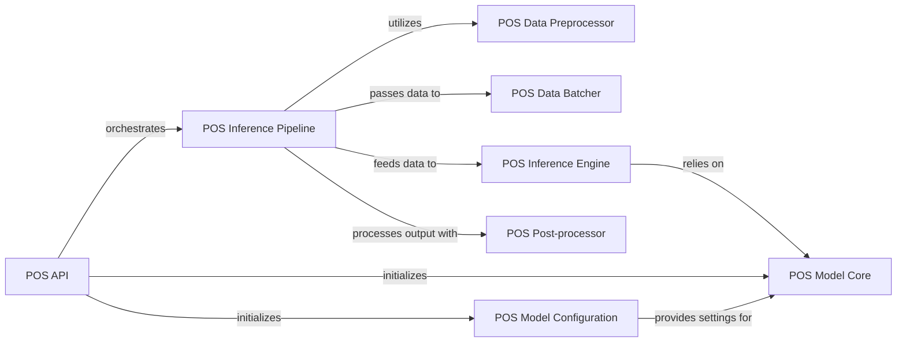

## Details

The `Part-of-Speech (POS) Component` subsystem is a specialized part of the `ckiptagger` project, focusing on assigning grammatical tags to segmented words.

### POS API
The main entry point and public interface for the POS tagging functionality. It initializes the underlying POS model and orchestrates the entire tagging process.

**Related Classes/Methods**:

- <a href="https://github.com/ckiplab/ckiptagger/blob/master/src/api.py#L158-L256" target="_blank" rel="noopener noreferrer">`src.api.POS`:158-256</a>

### POS Inference Pipeline
The core method that defines the sequential steps for processing input sentences and generating POS tags, acting as the workflow manager for the tagging process.

**Related Classes/Methods**:

- <a href="https://github.com/ckiplab/ckiptagger/blob/master/src/api.py" target="_blank" rel="noopener noreferrer">`src.api.POS:__call__`</a>

### POS Model Core
Represents the trained neural network model specifically designed for Part-of-Speech tagging, responsible for the actual prediction of POS labels.

**Related Classes/Methods**:

- <a href="https://github.com/ckiplab/ckiptagger/blob/master/src/model_pos.py" target="_blank" rel="noopener noreferrer">`src.model_pos.Model`</a>

### POS Data Preprocessor
Handles the initial preparation of raw input sentences, including character normalization and sentence segmentation at the word level, making data suitable for model input.

**Related Classes/Methods**:

- <a href="https://github.com/ckiplab/ckiptagger/blob/master/src/api.py" target="_blank" rel="noopener noreferrer">`src.api.POS:__call__`</a>
- <a href="https://github.com/ckiplab/ckiptagger/blob/master/src/api.py#L433-L446" target="_blank" rel="noopener noreferrer">`src.api._segment_word_sentence`:433-446</a>

### POS Data Batcher
Groups segmented sentences into batches for efficient processing by the neural network model, optimizing performance.

**Related Classes/Methods**:

- <a href="https://github.com/ckiplab/ckiptagger/blob/master/src/api.py#L477-L502" target="_blank" rel="noopener noreferrer">`src.api._get_pos_batch_list`:477-502</a>

### POS Inference Engine
Executes the forward pass of the POS Model Core on batched input to generate predicted POS labels, acting as the runtime for the model.

**Related Classes/Methods**:

- <a href="https://github.com/ckiplab/ckiptagger/blob/master/src/model_pos.py" target="_blank" rel="noopener noreferrer">`src.model_pos.Model:predict_label_for_a_batch`</a>

### POS Model Configuration
Manages and provides the hyperparameters and settings required for initializing and running the POS Model Core, ensuring the model operates correctly.

**Related Classes/Methods**:

- <a href="https://github.com/ckiplab/ckiptagger/blob/master/src/model_pos.py" target="_blank" rel="noopener noreferrer">`src.model_pos.Config`</a>

### POS Post-processor
Refines the output of the POS Inference Engine, including undoing sentence segmentation and adjusting tags based on whitespace, to produce the final, user-friendly output.

**Related Classes/Methods**:

- <a href="https://github.com/ckiplab/ckiptagger/blob/master/src/api.py" target="_blank" rel="noopener noreferrer">`src.api.POS:__call__`</a>
- <a href="https://github.com/ckiplab/ckiptagger/blob/master/src/api.py#L623-L627" target="_blank" rel="noopener noreferrer">`src.api._force_whitespace_tagging`:623-627</a>

### [FAQ](https://github.com/CodeBoarding/GeneratedOnBoardings/tree/main?tab=readme-ov-file#faq)