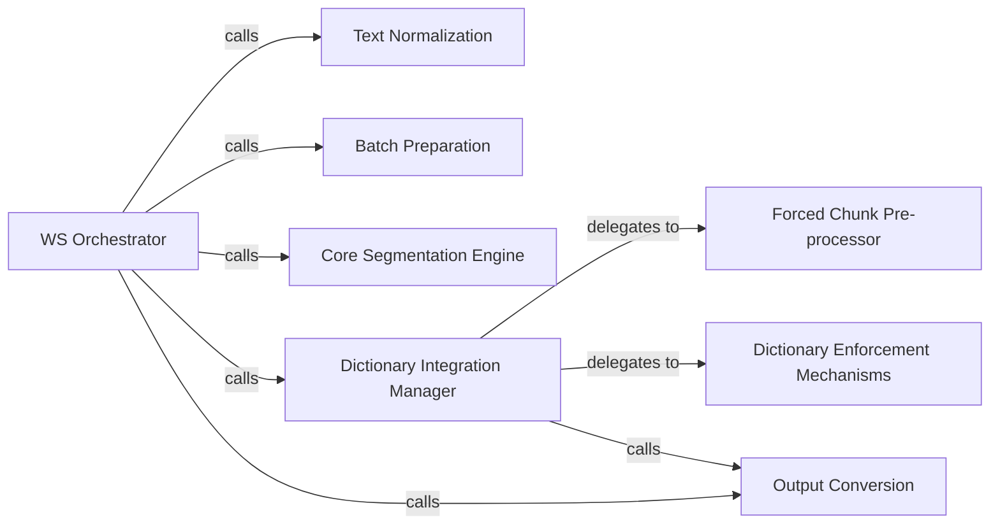

## Details

The Word Segmentation (WS) Component is primarily defined by the WS class, specifically its __call__ method, which acts as the central orchestrator. This subsystem encompasses all functionalities related to tokenizing raw text into words, including pre-processing, core segmentation, dictionary integration, and output formatting. All identified components operate within the scope of this WS class, contributing to its overall word segmentation capability. The Word Segmentation (WS) Component functions as a sequential processing pipeline, orchestrated by the WS.__call__ method. The process begins with input text undergoing normalization and subsequent batching to optimize for the underlying ML model. The core segmentation then produces an initial token sequence. This sequence can then be refined by the Dictionary Integration Manager, which leverages the Forced Chunk Pre-processor and the specific Dictionary Enforcement Mechanisms to apply custom dictionary rules. Finally, the processed sequence is transformed into a user-friendly word-sentence format by the Output Conversion component. This structured flow ensures a robust and customizable word segmentation process, characteristic of an ML Toolkit/Library.

### WS Orchestrator
Serves as the primary entry point for initiating word segmentation. It orchestrates the entire process by coordinating calls to various sub-components, managing the flow from raw text input to segmented word output.

**Related Classes/Methods**:

- <a href="https://github.com/ckiplab/ckiptagger/blob/master/src/api.py" target="_blank" rel="noopener noreferrer">`WS.__call__`</a>

### Text Normalization
Pre-processes raw input text by cleaning and standardizing it (e.g., handling whitespace, special characters) to ensure consistent input for the segmentation model.

**Related Classes/Methods**:

- <a href="https://github.com/ckiplab/ckiptagger/blob/master/src/api.py#L401-L414" target="_blank" rel="noopener noreferrer">`_normalize_sentence`:401-414</a>

### Batch Preparation
Prepares and batches sentences into a format optimized for efficient processing by the underlying word segmentation model, crucial for performance in ML systems.

**Related Classes/Methods**:

- <a href="https://github.com/ckiplab/ckiptagger/blob/master/src/api.py#L449-L474" target="_blank" rel="noopener noreferrer">`_get_ws_batch_list`:449-474</a>

### Core Segmentation Engine
Executes the fundamental word tokenization algorithm, likely involving the inference step of the underlying ML model. This is the core processing unit that performs the actual segmentation.

**Related Classes/Methods**:

- <a href="https://github.com/ckiplab/ckiptagger/blob/master/src/api.py#L417-L430" target="_blank" rel="noopener noreferrer">`_segment_sentence`:417-430</a>

### Dictionary Integration Manager
Manages the integration of custom dictionaries to influence and refine the word segmentation results, ensuring specific terms are handled as desired. It coordinates the application of dictionary-based rules.

**Related Classes/Methods**:

- <a href="https://github.com/ckiplab/ckiptagger/blob/master/src/api.py#L606-L620" target="_blank" rel="noopener noreferrer">`_run_word_segmentation_with_dictionary`:606-620</a>

### Forced Chunk Pre-processor
Pre-processes dictionary entries to identify and prepare chunks that require special handling (forcing) during segmentation, converting them into a usable format for enforcement mechanisms.

**Related Classes/Methods**:

- <a href="https://github.com/ckiplab/ckiptagger/blob/master/src/api.py#L559-L584" target="_blank" rel="noopener noreferrer">`_get_forced_chunk_set`:559-584</a>

### Dictionary Enforcement Mechanisms
These components implement the logic for enforcing dictionary entries during segmentation. _soft_force_seq_sentence allows for flexible adherence, while _hard_force_seq_sentence ensures strict, unyielding application of dictionary terms as single tokens.

**Related Classes/Methods**:

- <a href="https://github.com/ckiplab/ckiptagger/blob/master/src/api.py#L587-L593" target="_blank" rel="noopener noreferrer">`_soft_force_seq_sentence`:587-593</a>
- <a href="https://github.com/ckiplab/ckiptagger/blob/master/src/api.py#L596-L603" target="_blank" rel="noopener noreferrer">`_hard_force_seq_sentence`:596-603</a>

### Output Conversion
Converts the sequence-based outputs from the segmentation model (or dictionary enforcement) into a human-readable word-sentence format, making the results consumable by downstream components or users.

**Related Classes/Methods**:

- <a href="https://github.com/ckiplab/ckiptagger/blob/master/src/api.py#L542-L556" target="_blank" rel="noopener noreferrer">`_get_word_sentence_from_seq_sentence`:542-556</a>

### [FAQ](https://github.com/CodeBoarding/GeneratedOnBoardings/tree/main?tab=readme-ov-file#faq)