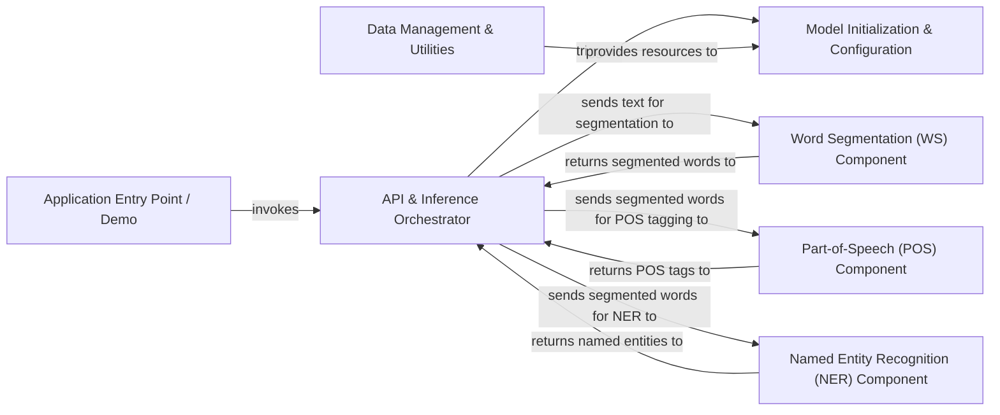

## Details

The `ckiptagger` project is structured around a clear pipeline for Chinese Natural Language Processing. The `Application Entry Point / Demo` serves as the user interface, initiating the NLP process by interacting with the `API & Inference Orchestrator`. This orchestrator, primarily embodied by the `CkipTagger` class, manages the sequential execution of specialized NLP tasks: Word Segmentation, Part-of-Speech Tagging, and Named Entity Recognition. Before processing, `Data Management & Utilities` ensures that necessary external data resources are available. Each specialized NLP component (WS, POS, NER) is initialized and configured by the `Model Initialization & Configuration` module, which sets up their respective deep learning models. Data flows sequentially from raw text input through segmentation, then POS tagging, and finally NER, with intermediate results being passed back to the orchestrator for subsequent processing.

### Application Entry Point / Demo
The user-facing interface and demonstration module for interacting with the `ckiptagger` library.

**Related Classes/Methods**:

- <a href="https://github.com/ckiplab/ckiptagger/blob/master/demo.py#L13-L75" target="_blank" rel="noopener noreferrer">`main`:13-75</a>

### API & Inference Orchestrator [[Expand]](./API_Inference_Orchestrator.md)
The central control unit managing the entire NLP pipeline, handling input/output, and orchestrating calls to individual models.

**Related Classes/Methods**:

- <a href="https://github.com/ckiplab/ckiptagger/blob/master/src/api.py#L297-L357" target="_blank" rel="noopener noreferrer">`__call__`:297-357</a>

### Data Management & Utilities
Handles the acquisition and preparation of external data resources required by the NLP models.

**Related Classes/Methods**:

- <a href="https://github.com/ckiplab/ckiptagger/blob/master/src/data_utils.py#L5-L15" target="_blank" rel="noopener noreferrer">`download_data_gdown`:5-15</a>
- <a href="https://github.com/ckiplab/ckiptagger/blob/master/src/data_utils.py#L21-L30" target="_blank" rel="noopener noreferrer">`download_data_url`:21-30</a>

### Model Initialization & Configuration [[Expand]](./Model_Initialization_Configuration.md)
Manages the setup, loading, and configuration of the deep learning models for each NLP task.

**Related Classes/Methods**:

- <a href="https://github.com/ckiplab/ckiptagger/blob/master/src/model_ws.py#L208-L215" target="_blank" rel="noopener noreferrer">`WS.__init__`:208-215</a>
- <a href="https://github.com/ckiplab/ckiptagger/blob/master/src/model_pos.py#L167-L174" target="_blank" rel="noopener noreferrer">`POS.__init__`:167-174</a>
- <a href="https://github.com/ckiplab/ckiptagger/blob/master/src/model_ner.py#L168-L175" target="_blank" rel="noopener noreferrer">`NER.__init__`:168-175</a>

### Word Segmentation (WS) Component [[Expand]](./Word_Segmentation_WS_Component.md)
The specialized component responsible for tokenizing raw text into words.

**Related Classes/Methods**:

- <a href="https://github.com/ckiplab/ckiptagger/blob/master/src/api.py#L194-L256" target="_blank" rel="noopener noreferrer">`WS.__call__`:194-256</a>

### Part-of-Speech (POS) Component [[Expand]](./Part_of_Speech_POS_Component.md)
The specialized component for assigning grammatical tags to segmented words.

**Related Classes/Methods**:

- <a href="https://github.com/ckiplab/ckiptagger/blob/master/src/api.py#L194-L256" target="_blank" rel="noopener noreferrer">`POS.__call__`:194-256</a>

### Named Entity Recognition (NER) Component [[Expand]](./Named_Entity_Recognition_NER_Component.md)
The specialized component for identifying and classifying named entities within text.

**Related Classes/Methods**:

- <a href="https://github.com/ckiplab/ckiptagger/blob/master/src/api.py#L297-L357" target="_blank" rel="noopener noreferrer">`NER.__call__`:297-357</a>

### [FAQ](https://github.com/CodeBoarding/GeneratedOnBoardings/tree/main?tab=readme-ov-file#faq)