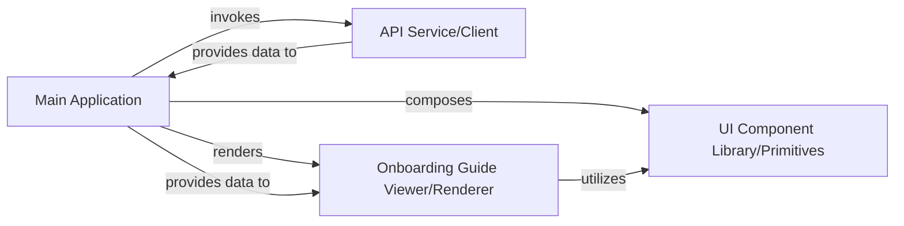

## Details

The application is a React-based frontend that interacts with a backend service to display onboarding guides. The `Main Application` component, rooted in `App.tsx`, orchestrates the overall user experience, handling routing and state management. It communicates with the `API Service/Client` to fetch data, including the structured onboarding guide content. The fetched content is then passed to the `Onboarding Guide Viewer/Renderer` component, which is responsible for parsing and visually presenting the guide, potentially utilizing Mermaid diagrams for code visualization. The entire user interface is built upon a `UI Component Library/Primitives`, ensuring consistency and reusability across the application.

### Main Application
The root component of the React application. It orchestrates the overall application flow, manages top-level state, handles routing, and initiates data fetching processes from the Backend Service. It serves as the primary container for other components.

**Related Classes/Methods**:

- <a href="https://github.com/ivanmilevtues/claude-code-testing/blob/main/backend/main.py" target="_blank" rel="noopener noreferrer">`App`</a>

### API Service/Client
This component encapsulates all logic for communicating with the Backend Service's API. It handles HTTP requests (e.g., using Axios) to fetch structured data, including the onboarding guide content, and abstracts the network layer from the UI components.

**Related Classes/Methods**:

- <a href="https://github.com/ivanmilevtues/claude-code-testing/blob/main/frontend/src/api.ts#L6-L8" target="_blank" rel="noopener noreferrer">`api`:6-8</a>

### Onboarding Guide Viewer/Renderer
Responsible for taking the structured onboarding guide data (e.g., markdown, Mermaid diagrams) received from the API and rendering it into an interactive and visually appealing format for the end-user. It leverages libraries like `React-Markdown` and `Mermaid` for content visualization.

**Related Classes/Methods**:

- <a href="https://github.com/ivanmilevtues/claude-code-testing/blob/main/frontend/src/components/ContentView.tsx" target="_blank" rel="noopener noreferrer">`ContentView`</a>

### UI Component Library/Primitives
A collection of reusable, atomic UI components (e.g., buttons, input fields, layout containers, navigation elements) that form the foundational building blocks of the application's user interface. These components promote consistency, reusability, and maintainability across the application.

**Related Classes/Methods**:

- <a href="https://github.com/ivanmilevtues/claude-code-testing/blob/main/frontend/src/components/" target="_blank" rel="noopener noreferrer">`UIComponents`</a>

### [FAQ](https://github.com/CodeBoarding/GeneratedOnBoardings/tree/main?tab=readme-ov-file#faq)