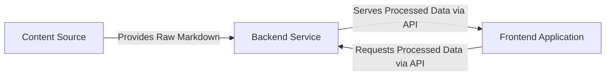

## Details

The CodeBoarding project operates as a web application designed to display interactive onboarding guides. At its core, the system processes raw markdown files into a structured format, which is then consumed and rendered by a user-facing interface. This architecture promotes a clear separation of concerns: content storage, data processing and serving, and user interface presentation. The flow begins with markdown files residing in a local content directory, which are then accessed and transformed by a Python backend. This backend exposes the processed data via a RESTful API, enabling a React-based frontend to dynamically fetch and display the onboarding content.

### Content Source
A local directory storing raw markdown files, which serve as the foundational content for the onboarding guides.

**Related Classes/Methods**: _None_

### Backend Service
A Python FastAPI application responsible for reading, parsing, and processing the markdown content from the Content Source. It exposes this processed data as structured information through a RESTful API.

**Related Classes/Methods**:

- <a href="https://github.com/ivanmilevtues/claude-code-testing/blob/main/backend/main.py" target="_blank" rel="noopener noreferrer">`backend.main`</a>

### Frontend Application [[Expand]](./Frontend_Application.md)
A React TypeScript application that consumes the structured data from the Backend Service's API. It dynamically renders interactive user interfaces and displays the onboarding guides to the end-user.

**Related Classes/Methods**:

- <a href="https://github.com/ivanmilevtues/claude-code-testing/blob/main/frontend/src/App.tsx" target="_blank" rel="noopener noreferrer">`frontend.App`</a>

### [FAQ](https://github.com/CodeBoarding/GeneratedOnBoardings/tree/main?tab=readme-ov-file#faq)