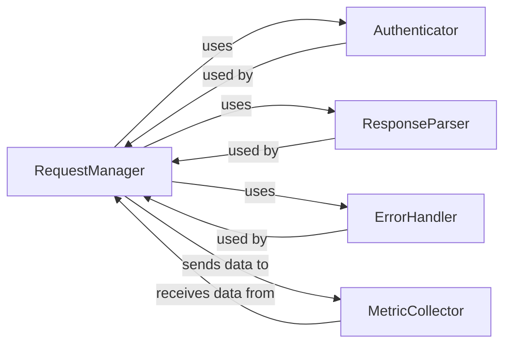

## Details

The cli/src/lib/request subsystem forms the backbone for all external API communications within the project. At its core, the SnykHttpClient (acting as the RequestManager) initiates and manages HTTP requests. Before sending, it relies on an Authenticator to ensure requests are properly authorized. Upon receiving a response, the ResponseParser processes the raw data, while the ErrorHandler stands ready to manage any issues that arise during the request-response cycle. Throughout this process, a MetricCollector passively gathers vital performance and usage statistics, providing insights into the subsystem's operational health. This modular design ensures robust, secure, and observable interactions with external services.

### RequestManager
The core orchestrator responsible for constructing, sending, and managing HTTP requests to external APIs. It initiates and executes API calls, acting as the central hub for all outbound API interactions.

**Related Classes/Methods**:

### Authenticator
Manages API tokens (e.g., storage, retrieval, refresh), generates and attaches authentication headers to outgoing requests, and performs client-side authorization checks (e.g., token validity, scope).

**Related Classes/Methods**:

### ResponseParser
Parses raw API responses (e.g., JSON, XML) into structured data, validates the integrity of the response, and extracts relevant information for the calling modules.

**Related Classes/Methods**:

### ErrorHandler
Identifies and processes API-specific error codes, network errors, and implements appropriate error handling strategies such as logging, retries, and generating user-friendly error messages.

**Related Classes/Methods**:

### MetricCollector
Gathers and reports performance and usage metrics for API calls, such as request duration, success/failure rates, and data transfer volumes.

**Related Classes/Methods**:

### [FAQ](https://github.com/CodeBoarding/GeneratedOnBoardings/tree/main?tab=readme-ov-file#faq)