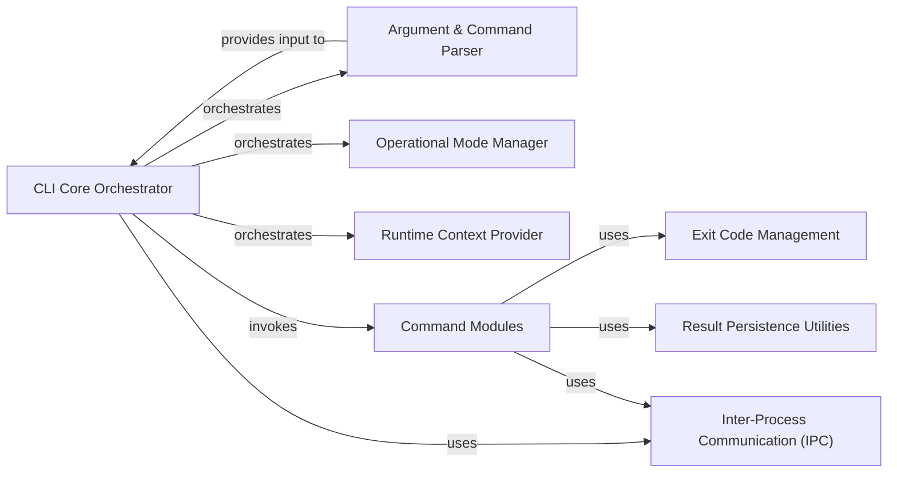

## Details

The CLI subsystem operates with CLI Core Orchestrator as its central hub, responsible for the overall command execution flow. Upon launch, it delegates to the Argument & Command Parser to interpret user input. Once arguments are parsed, the orchestrator consults the Operational Mode Manager and Runtime Context Provider to establish the correct execution environment. It then dispatches control to the relevant Command Modules, which encapsulate the specific business logic for each command. Both the orchestrator and individual command modules interact with Exit Code Management to report execution status, Inter-Process Communication (IPC) for external communication, and Result Persistence Utilities for handling output data. This modular design ensures clear separation of concerns and facilitates the addition of new commands and functionalities.

### CLI Core Orchestrator
The primary entry point and orchestrator for the CLI application. It manages the overall execution flow, delegates tasks to specialized components, and dispatches commands based on parsed arguments.

**Related Classes/Methods**:

- <a href="https://github.com/snyk/cli/blob/main/src/cli/main.ts" target="_blank" rel="noopener noreferrer">`src.cli.main`</a>

### Argument & Command Parser
Responsible for parsing and validating command-line arguments and options provided by the user. It translates raw input into structured data for command execution.

**Related Classes/Methods**:

- <a href="https://github.com/snyk/cli/blob/main/src/cli/args.ts" target="_blank" rel="noopener noreferrer">`src.cli.args`</a>

### Operational Mode Manager
Handles the definition and validation of different operational modes or states the CLI can operate in, ensuring commands are executed within the correct context.

**Related Classes/Methods**:

- <a href="https://github.com/snyk/cli/blob/main/src/cli/main.ts" target="_blank" rel="noopener noreferrer">`src.cli.modes`</a>

### Runtime Context Provider
Manages and provides essential information about the application's runtime environment, such as current working directory, environment variables, and system configurations.

**Related Classes/Methods**:

- <a href="https://github.com/snyk/cli/blob/main/src/cli/main.ts" target="_blank" rel="noopener noreferrer">`src.cli.runtime`</a>

### Exit Code Management
Defines and manages standardized application exit codes, crucial for signaling the outcome of command execution (success, specific errors, warnings) to the operating system or calling scripts.

**Related Classes/Methods**:

- <a href="https://github.com/snyk/cli/blob/main/src/cli/exit-codes.ts" target="_blank" rel="noopener noreferrer">`src.cli.exit_codes`</a>

### Inter-Process Communication (IPC)
Potentially handles communication mechanisms if the CLI needs to interact with other processes or services running concurrently.

**Related Classes/Methods**:

- <a href="https://github.com/snyk/cli/blob/main/src/cli/ipc.ts" target="_blank" rel="noopener noreferrer">`src.cli.ipc`</a>

### Result Persistence Utilities
Provides utilities for file operations such as copying or saving results, enabling the persistence of command outputs or generated reports.

**Related Classes/Methods**:

- <a href="https://github.com/snyk/cli/blob/main/src/cli/copy.ts" target="_blank" rel="noopener noreferrer">`src.cli.copy`</a>

### Command Modules
A collection of specialized modules, each encapsulating the specific logic and execution flow for a distinct CLI command (e.g., `monitor`, `test`, `fix`, `authentication`).

**Related Classes/Methods**:

- <a href="https://github.com/snyk/cli/blob/main/src/cli/commands" target="_blank" rel="noopener noreferrer">`src.cli.commands`</a>

### [FAQ](https://github.com/CodeBoarding/GeneratedOnBoardings/tree/main?tab=readme-ov-file#faq)