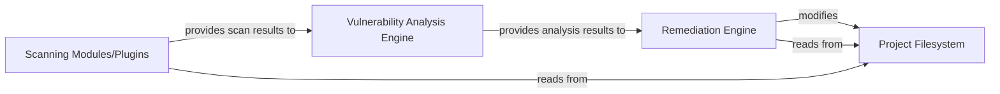

## Details

The `cliv2` project functions as a command-line interface for vulnerability management. Its core, represented by `cliv2/cmd/cliv2/main.go`, orchestrates the entire process. It leverages various `Scanning Modules/Plugins` (implemented as CLI extensions) to read and analyze the `Project Filesystem` for vulnerabilities. The raw scan results are then fed into a `Vulnerability Analysis Engine` which processes and refines these findings. Finally, the `Remediation Engine` takes the analyzed vulnerability data and, where possible, automatically applies fixes by modifying the `Project Filesystem`. The system's modular design, with distinct CLI extensions, allows for flexible and extensible vulnerability detection and remediation capabilities.

### Remediation Engine [[Expand]](./Remediation_Engine.md)
This component is responsible for analyzing vulnerability scan results to identify issues that can be automatically fixed. It then applies these automated remediation steps, such as dependency upgrades or patches, directly to the user's project files.

**Related Classes/Methods**:

- <a href="https://github.com/snyk/cli/blob/main/cliv2/cmd/cliv2/main.go" target="_blank" rel="noopener noreferrer">`cliv2/cmd/cliv2/main.go`</a>

### Scanning Modules/Plugins
Component responsible for scanning and identifying vulnerabilities. These are likely implemented as CLI extensions.

**Related Classes/Methods**:

### Vulnerability Analysis Engine
Component responsible for analyzing vulnerability scan results. This component likely processes the raw scan data into actionable insights.

**Related Classes/Methods**:

- <a href="https://github.com/snyk/cli/blob/main/cliv2/cmd/cliv2/main.go" target="_blank" rel="noopener noreferrer">`cliv2/cmd/cliv2/main.go`</a>

### Project Filesystem
Represents the user's project files and directories that are subject to scanning and potential remediation.

**Related Classes/Methods**: _None_

### [FAQ](https://github.com/CodeBoarding/GeneratedOnBoardings/tree/main?tab=readme-ov-file#faq)