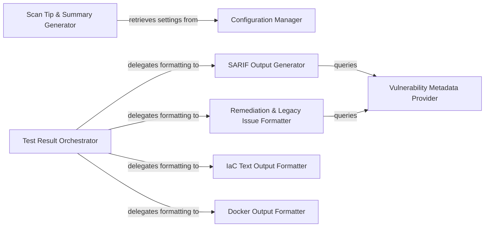

## Details

The CLI application's core functionality revolves around processing scan results and presenting them to the user in various formats. The Configuration Manager acts as the central repository for application settings, which are utilized by components like the Scan Tip & Summary Generator. The Test Result Orchestrator serves as the primary dispatcher, taking raw test results and delegating their formatting to specialized components such as the SARIF Output Generator, Remediation & Legacy Issue Formatter, Docker Output Formatter, and IaC Text Output Formatter. These formatters, in turn, rely on the Vulnerability Metadata Provider to enrich the output with consistent vulnerability details.

### Configuration Manager
Centrally manages and provides access to all CLI configuration settings, including API endpoints, user preferences, and organization-specific details. This component ensures consistent access to application-wide settings.

**Related Classes/Methods**:

- <a href="https://github.com/snyk/cli/blob/main/src/lib/config/index.ts" target="_blank" rel="noopener noreferrer">`src/lib/config/index.ts`</a>
- <a href="https://github.com/snyk/cli/blob/main/src/lib/config/api-url.ts" target="_blank" rel="noopener noreferrer">`src/lib/config/api-url.ts`</a>

### Test Result Orchestrator
Acts as the primary entry point for processing raw test results and delegating to specific formatters based on the desired output type (e.g., human-readable console output, SARIF, JSON). It orchestrates the transformation of raw data into various output formats.

**Related Classes/Methods**:

- <a href="https://github.com/snyk/cli/blob/main/src/lib/formatters/test/format-test-results.ts" target="_blank" rel="noopener noreferrer">`src/lib/formatters/test/format-test-results.ts`</a>
- <a href="https://github.com/snyk/cli/blob/main/src/lib/formatters/test/display-result.ts" target="_blank" rel="noopener noreferrer">`src/lib/formatters/test/display-result.ts`</a>

### SARIF Output Generator
Specializes in converting scan results (IaC, Open Source, Containers) into the SARIF (Static Analysis Results Interchange Format) standard, enabling machine-readable and interoperable output for security tools and platforms.

**Related Classes/Methods**:

- <a href="https://github.com/snyk/cli/blob/main/src/lib/formatters/iac-output/sarif.ts" target="_blank" rel="noopener noreferrer">`src/lib/formatters/iac-output/sarif.ts`</a>
- <a href="https://github.com/snyk/cli/blob/main/src/lib/formatters/open-source-sarif-output.ts" target="_blank" rel="noopener noreferrer">`src/lib/formatters/open-source-sarif-output.ts`</a>

### Remediation & Legacy Issue Formatter
Formats security vulnerabilities and issues for human-readable display, including detailed remediation advice. It supports both modern remediation-focused output and older, legacy formats.

**Related Classes/Methods**:

- <a href="https://github.com/snyk/cli/blob/main/src/lib/formatters/remediation-based-format-issues.ts" target="_blank" rel="noopener noreferrer">`src/lib/formatters/remediation-based-format-issues.ts`</a>
- <a href="https://github.com/snyk/cli/blob/main/src/lib/formatters/legacy-format-issue.ts" target="_blank" rel="noopener noreferrer">`src/lib/formatters/legacy-format-issue.ts`</a>

### IaC Text Output Formatter
Formats Infrastructure as Code (IaC) scan results, including issues, failures, and warnings, into a human-readable text format specifically for console output.

**Related Classes/Methods**:

- <a href="https://github.com/snyk/cli/blob/main/src/lib/formatters/iac-output/text/formatters.ts" target="_blank" rel="noopener noreferrer">`src/lib/formatters/iac-output/text/formatters.ts`</a>
- <a href="https://github.com/snyk/cli/blob/main/src/lib/formatters/iac-output/text/issues-list/index.ts" target="_blank" rel="noopener noreferrer">`src/lib/formatters/iac-output/text/issues-list/index.ts`</a>

### Docker Output Formatter
Handles the specific formatting requirements for Docker-related scan results, including binary issues and remediation advice, for console display.

**Related Classes/Methods**:

- <a href="https://github.com/snyk/cli/blob/main/src/lib/formatters/docker/format-docker-binary-issues.ts" target="_blank" rel="noopener noreferrer">`src/lib/formatters/docker/format-docker-binary-issues.ts`</a>
- <a href="https://github.com/snyk/cli/blob/main/src/lib/formatters/docker/format-docker-advice.ts" target="_blank" rel="noopener noreferrer">`src/lib/formatters/docker/format-docker-advice.ts`</a>

### Scan Tip & Summary Generator
Generates informative messages, tips (e.g., multi-scan tips), and summaries for various scan outcomes, including monitor responses and errors, to provide contextual feedback to the user.

**Related Classes/Methods**:

- <a href="https://github.com/snyk/cli/blob/main/src/lib/formatters/show-multi-scan-tip.ts" target="_blank" rel="noopener noreferrer">`src/lib/formatters/show-multi-scan-tip.ts`</a>
- <a href="https://github.com/snyk/cli/blob/main/src/lib/formatters/format-monitor-response.ts" target="_blank" rel="noopener noreferrer">`src/lib/formatters/format-monitor-response.ts`</a>

### Vulnerability Metadata Provider
Provides common vulnerability-related metadata such as URLs, severity values, and flags (e.g., new vulnerability, fixable) to various formatters.

**Related Classes/Methods**:

- <a href="https://github.com/snyk/cli/blob/main/src/lib/formatters/get-vuln-url.ts" target="_blank" rel="noopener noreferrer">`src/lib/formatters/get-vuln-url.ts`</a>
- <a href="https://github.com/snyk/cli/blob/main/src/lib/formatters/get-severity-value.ts" target="_blank" rel="noopener noreferrer">`src/lib/formatters/get-severity-value.ts`</a>

### [FAQ](https://github.com/CodeBoarding/GeneratedOnBoardings/tree/main?tab=readme-ov-file#faq)