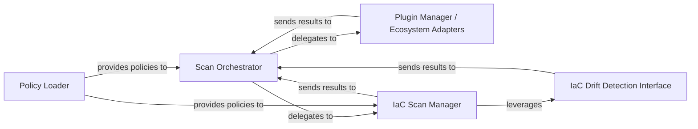

## Details

The project's core functionality revolves around a Scan Orchestrator that coordinates various security scans. It delegates specific scanning tasks to specialized components like the Plugin Manager / Ecosystem Adapters for language-specific dependency analysis and the IaC Scan Manager for Infrastructure as Code evaluations. The Policy Loader is responsible for providing the necessary security policies to both the IaC Scan Manager and the Scan Orchestrator, ensuring that scans are performed against defined standards. Additionally, the IaC Scan Manager integrates with the IaC Drift Detection Interface to identify configuration drifts in IaC.

### Scan Orchestrator
Acts as the primary coordinator for all scan types within the engine. It manages the end-to-end testing process, including assembling payloads, sending scan requests, and parsing the results. It orchestrates the flow between different analysis modules.

**Related Classes/Methods**:

- <a href="https://github.com/snyk/cli/blob/main/src/lib/snyk-test/index.js" target="_blank" rel="noopener noreferrer">`snyk-test.index`</a>

### Plugin Manager / Ecosystem Adapters
Provides a modular and extensible framework for integrating with various language ecosystems and specialized scanning capabilities (e.g., Node.js, RubyGems, SAST). It's responsible for detecting project types and extracting dependencies specific to each environment.

**Related Classes/Methods**:

- <a href="https://github.com/snyk/cli/blob/main/src/lib/plugins" target="_blank" rel="noopener noreferrer">`src/lib/plugins`</a>

### IaC Scan Manager
Specializes in initiating and managing Infrastructure as Code (IaC) scans. It handles IaC-specific configurations, flag processing, and authentication for IaC-related API interactions.

**Related Classes/Methods**:

### Policy Loader
Locates and loads security policies relevant to the ongoing scan. These policies define the security standards and rules against which the scan results are evaluated.

**Related Classes/Methods**:

### IaC Drift Detection Interface
Manages the integration with the external driftctl tool for detecting configuration drift in IaC. This includes downloading, executing the binary, and generating necessary scan flags.

**Related Classes/Methods**:

### [FAQ](https://github.com/CodeBoarding/GeneratedOnBoardings/tree/main?tab=readme-ov-file#faq)