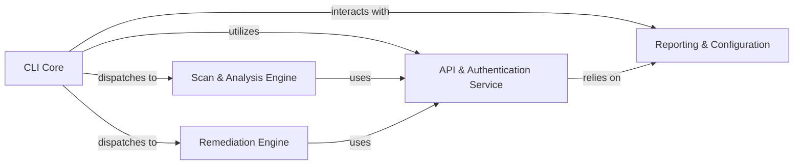

## Details

Analysis of the Snyk CLI architecture, detailing its core components, their functionalities, and their interdependencies.

### CLI Core [[Expand]](./CLI_Core.md)
The central entry point, responsible for parsing arguments, dispatching commands, and orchestrating the overall execution flow. It interacts with other components to fulfill command-specific tasks.

**Related Classes/Methods**:

- <a href="https://github.com/snyk/cli/blob/main/src/cli/" target="_blank" rel="noopener noreferrer">`src/cli/`</a>
- <a href="https://github.com/snyk/cli/blob/main/src/cli/commands/" target="_blank" rel="noopener noreferrer">`src/cli/commands/`</a>

### Scan & Analysis Engine [[Expand]](./Scan_Analysis_Engine.md)
Detects project ecosystems, loads and manages plugins for dependency extraction and code analysis, and applies security policies to scan results. It includes specialized capabilities for Infrastructure as Code (IaC) analysis.

**Related Classes/Methods**:

- <a href="https://github.com/snyk/cli/blob/main/src/lib/snyk-test/" target="_blank" rel="noopener noreferrer">`src/lib/snyk-test/`</a>
- <a href="https://github.com/snyk/cli/blob/main/src/lib/plugins/" target="_blank" rel="noopener noreferrer">`src/lib/plugins/`</a>
- <a href="https://github.com/snyk/cli/blob/main/src/lib/policy/" target="_blank" rel="noopener noreferrer">`src/lib/policy/`</a>
- <a href="https://github.com/snyk/cli/blob/main/src/lib/iac/" target="_blank" rel="noopener noreferrer">`src/lib/iac/`</a>

### API & Authentication Service [[Expand]](./API_Authentication_Service.md)
Manages all external API communications, including request construction, execution, user authentication (API tokens), and authorization checks.

**Related Classes/Methods**:

- <a href="https://github.com/snyk/cli/blob/main/src/lib/request/" target="_blank" rel="noopener noreferrer">`src/lib/request/`</a>

### Remediation Engine [[Expand]](./Remediation_Engine.md)
Identifies fixable vulnerabilities from scan results and applies automated remediation steps (e.g., dependency upgrades, patches) directly to project files.

**Related Classes/Methods**:

- <a href="https://github.com/snyk/cli/blob/main/packages/snyk_fix/src/" target="_blank" rel="noopener noreferrer">`packages/snyk_fix/src/`</a>

### Reporting & Configuration [[Expand]](./Reporting_Configuration.md)
Handles the transformation of raw data into various output formats (console, JSON, SARIF) and centrally manages all CLI configuration settings, including API endpoints and user preferences.

**Related Classes/Methods**:

- <a href="https://github.com/snyk/cli/blob/main/src/lib/formatters/" target="_blank" rel="noopener noreferrer">`src/lib/formatters/`</a>
- <a href="https://github.com/snyk/cli/blob/main/src/lib/config/" target="_blank" rel="noopener noreferrer">`src/lib/config/`</a>

### [FAQ](https://github.com/CodeBoarding/GeneratedOnBoardings/tree/main?tab=readme-ov-file#faq)