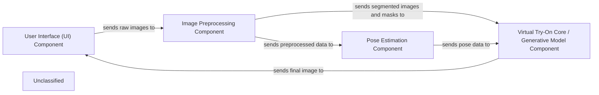

## Details

The virtual try-on system operates through a client-server architecture. The User Interface (UI) Component, built with Flask, serves as the entry point for users to upload images. These raw images are then sent to the backend, where the Image Preprocessing Component handles tasks such as background removal and cloth mask generation. Subsequently, the Pose Estimation Component extracts human pose information. All processed data converges at the Virtual Try-On Core / Generative Model Component, which leverages a series of deep learning models (Segmentation Generator, GMM, and ALIAS Generator) to synthesize the final try-on image. This generated image is then returned to the UI for display.

### User Interface (UI) Component
This component, implemented using Flask, handles user interactions. It allows users to upload person and clothing images and displays the final virtual try-on results. It communicates with the backend processing pipeline via an API endpoint.

**Related Classes/Methods**:

- <a href="https://github.com/SwayamInSync/clothes-virtual-try-on/blob/main/client-side/app.py" target="_blank" rel="noopener noreferrer">`flask.Flask`</a>
- <a href="https://github.com/SwayamInSync/clothes-virtual-try-on/blob/main/client-side/app.py#L10-L12" target="_blank" rel="noopener noreferrer">`home`:10-12</a>
- <a href="https://github.com/SwayamInSync/clothes-virtual-try-on/blob/main/client-side/app.py#L15-L34" target="_blank" rel="noopener noreferrer">`submit`:15-34</a>

### Image Preprocessing Component
This component is responsible for preparing raw images for the generative models. It includes background removal, cloth mask generation, and image resizing/normalization.

**Related Classes/Methods**:

- <a href="https://github.com/SwayamInSync/clothes-virtual-try-on/blob/main/remove_bg.py" target="_blank" rel="noopener noreferrer">`preprcessInput.remove_bg`</a>
- <a href="https://github.com/SwayamInSync/clothes-virtual-try-on/blob/main/networks/u2net.py#L349-L455" target="_blank" rel="noopener noreferrer">`networks.u2net.U2NET`:349-455</a>
- <a href="https://github.com/SwayamInSync/clothes-virtual-try-on/blob/main/run.py#L7-L10" target="_blank" rel="noopener noreferrer">`resize_img`:7-10</a>

### Pose Estimation Component
This component extracts human pose information from preprocessed person images. It utilizes an external OpenPose executable to generate pose keypoints and images, which are crucial for aligning clothing in the generative model.

**Related Classes/Methods**:

- <a href="https://github.com/SwayamInSync/clothes-virtual-try-on/blob/main/run.py" target="_blank" rel="noopener noreferrer">`os.system`</a>

### Virtual Try-On Core / Generative Model Component
This is the central AI/ML component that performs the virtual try-on. It integrates segmented person images, cloth masks, and pose data to synthesize the final try-on image using a pipeline of generative models (Segmentation Generator, GMM, and ALIAS Generator).

**Related Classes/Methods**:

- <a href="https://github.com/SwayamInSync/clothes-virtual-try-on/blob/main/test.py" target="_blank" rel="noopener noreferrer">`test.py`</a>
- <a href="https://github.com/SwayamInSync/clothes-virtual-try-on/blob/main/network.py#L58-L116" target="_blank" rel="noopener noreferrer">`network.SegGenerator`:58-116</a>
- <a href="https://github.com/SwayamInSync/clothes-virtual-try-on/blob/main/network.py#L309-L327" target="_blank" rel="noopener noreferrer">`network.GMM`:309-327</a>
- <a href="https://github.com/SwayamInSync/clothes-virtual-try-on/blob/main/network.py#L453-L526" target="_blank" rel="noopener noreferrer">`network.ALIASGenerator`:453-526</a>

### Unclassified
Component for all unclassified files and utility functions (Utility functions/External Libraries/Dependencies)

**Related Classes/Methods**: _None_

### [FAQ](https://github.com/CodeBoarding/GeneratedOnBoardings/tree/main?tab=readme-ov-file#faq)