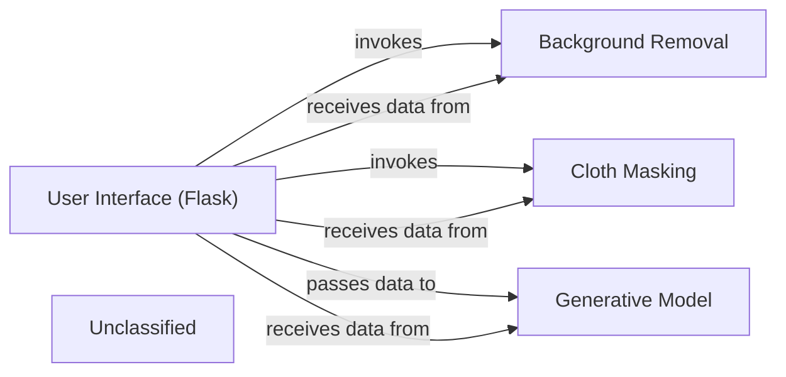

## Details

This architecture describes a virtual try-on system where a Flask-based user interface orchestrates the workflow. User-uploaded images of a person and clothing are first processed by dedicated components for background removal and cloth masking, respectively. The processed outputs are then fed into a generative model, which synthesizes the final try-on image. This result is subsequently returned to the user interface for display. The system's core functionality is modularized into distinct components, allowing for clear separation of concerns and facilitating potential future enhancements or replacements of individual processing steps.

### User Interface (Flask)
The web-based interface built with Flask, serving as the primary interaction point for users. It handles image uploads (cloth and model), sends them to the backend for processing, and displays the final virtual try-on image.

**Related Classes/Methods**:

- <a href="https://github.com/SwayamInSync/clothes-virtual-try-on/blob/main/client-side/app.py#L15-L34" target="_blank" rel="noopener noreferrer">`client-side.app.submit`:15-34</a>

### Background Removal
This component is responsible for isolating the person from their background in the uploaded image. It uses the `rembg` library to achieve this, preparing the person's image for integration with the virtual clothing.

**Related Classes/Methods**:

- <a href="https://github.com/SwayamInSync/clothes-virtual-try-on/blob/main/remove_bg.py#L20-L33" target="_blank" rel="noopener noreferrer">`remove_bg.preprcessInput.remove_bg`:20-33</a>

### Cloth Masking
This component processes the uploaded clothing image to generate a precise mask of the garment. It utilizes a U2NET model to perform semantic segmentation, ensuring only the clothing item is used in the try-on process.

**Related Classes/Methods**:

- <a href="https://github.com/SwayamInSync/clothes-virtual-try-on/blob/main/cloth-mask.py#L104-L124" target="_blank" rel="noopener noreferrer">`cloth-mask.py`:104-124</a>
- <a href="https://github.com/SwayamInSync/clothes-virtual-try-on/blob/main/networks/u2net.py#L349-L455" target="_blank" rel="noopener noreferrer">`networks.u2net.U2NET`:349-455</a>

### Generative Model
The central AI component that synthesizes the final virtual try-on image. It takes the background-removed person image and the masked cloth image as inputs and generates a new image where the person appears to be wearing the uploaded clothing.

**Related Classes/Methods**:

- <a href="https://github.com/SwayamInSync/clothes-virtual-try-on/blob/main/network.py#L58-L116" target="_blank" rel="noopener noreferrer">`network.SegGenerator`:58-116</a>

### Unclassified
Component for all unclassified files and utility functions (Utility functions/External Libraries/Dependencies)

**Related Classes/Methods**: _None_

### [FAQ](https://github.com/CodeBoarding/GeneratedOnBoardings/tree/main?tab=readme-ov-file#faq)