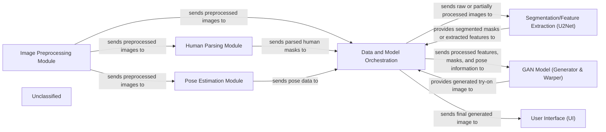

## Details

The virtual try-on system orchestrates a complex image generation pipeline. It begins with the Image Preprocessing Module preparing input images by resizing, masking clothing, and removing backgrounds. These preprocessed images are then fed into the Human Parsing Module for detailed body segmentation and the Pose Estimation Module to extract human pose data. The Data and Model Orchestration component acts as the central coordinator, managing the flow of all processed data. It directs images to the Segmentation/Feature Extraction (U2Net) for further feature extraction or segmentation. Finally, all relevant information—preprocessed images, masks, features, and pose data—is passed to the GAN Model (Generator & Warper), which synthesizes the final try-on image. The generated image is then delivered to the User Interface (UI) for display.

### Image Preprocessing Module
This module is responsible for the initial preparation of input images. It handles tasks such as resizing images to a consistent dimension, generating masks for clothing items, and removing backgrounds from person images to isolate the subject.

**Related Classes/Methods**:

- <a href="https://github.com/SwayamInSync/clothes-virtual-try-on/blob/main/run.py#L7-L10" target="_blank" rel="noopener noreferrer">`run.resize_img`:7-10</a>
- <a href="https://github.com/SwayamInSync/clothes-virtual-try-on/blob/main/cloth-mask.py" target="_blank" rel="noopener noreferrer">`cloth-mask.py`</a>
- <a href="https://github.com/SwayamInSync/clothes-virtual-try-on/blob/main/remove_bg.py" target="_blank" rel="noopener noreferrer">`remove_bg.py`</a>

### Human Parsing Module
This component performs detailed semantic segmentation of human images, identifying and separating different body parts. This parsing is crucial for accurately manipulating and overlaying clothing during the try-on process.

**Related Classes/Methods**:

- `Self-Correction-Human-Parsing.simple_extractor.py`:10-20

### Pose Estimation Module
This module is dedicated to detecting and extracting keypoints representing the human pose from input images. The pose information is vital for correctly aligning and warping clothing onto the person's body.

**Related Classes/Methods**:

- `openpose.bin`:1-10

### Data and Model Orchestration
This central component manages the entire virtual try-on workflow. It coordinates the execution of various sub-modules, handles the loading of necessary models, directs the flow of data between different processing stages, and ultimately oversees the generation of the final output image. It acts as the primary control script for the system.

**Related Classes/Methods**:

- <a href="https://github.com/SwayamInSync/clothes-virtual-try-on/blob/main/run.py" target="_blank" rel="noopener noreferrer">`run.py`</a>

### Segmentation/Feature Extraction (U2Net)
This component utilizes a U2Net model to perform precise segmentation of clothing or the person, or to extract relevant features from input images. These extracted features and masks are critical inputs for the subsequent GAN model.

**Related Classes/Methods**:

- <a href="https://github.com/SwayamInSync/clothes-virtual-try-on/blob/main/networks/u2net.py#L349-L455" target="_blank" rel="noopener noreferrer">`networks.u2net.U2NET`:349-455</a>

### GAN Model (Generator & Warper)
This is the core generative adversarial network responsible for synthesizing the final try-on image. It includes a geometric matching module (GMM) for warping clothing based on pose and a generator network for creating the realistic composite image.

**Related Classes/Methods**:

- <a href="https://github.com/SwayamInSync/clothes-virtual-try-on/blob/main/network.py#L58-L116" target="_blank" rel="noopener noreferrer">`network.SegGenerator`:58-116</a>
- <a href="https://github.com/SwayamInSync/clothes-virtual-try-on/blob/main/network.py#L122-L141" target="_blank" rel="noopener noreferrer">`network.FeatureExtraction`:122-141</a>
- <a href="https://github.com/SwayamInSync/clothes-virtual-try-on/blob/main/network.py#L178-L306" target="_blank" rel="noopener noreferrer">`network.TpsGridGen`:178-306</a>

### User Interface (UI)
This component provides the front-end interface for users to interact with the virtual try-on system. It allows users to upload input images and displays the final generated try-on results.

**Related Classes/Methods**:

- <a href="https://github.com/SwayamInSync/clothes-virtual-try-on/blob/main/client-side/app.py" target="_blank" rel="noopener noreferrer">`client-side.app.py`</a>

### Unclassified
Component for all unclassified files and utility functions (Utility functions/External Libraries/Dependencies)

**Related Classes/Methods**: _None_

### [FAQ](https://github.com/CodeBoarding/GeneratedOnBoardings/tree/main?tab=readme-ov-file#faq)