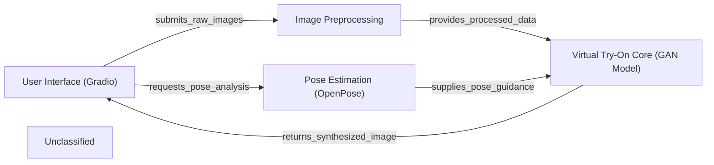

## Details

The Clothes Virtual Try-On system is structured around a clear data flow, starting with user interaction and culminating in a synthesized try-on image. The User Interface (Gradio) serves as the primary interaction point, allowing users to upload images and view results. Upon receiving input, the system initiates Image Preprocessing to prepare both the person and clothing images by removing backgrounds, segmenting humans, and generating masks. Concurrently, Pose Estimation (OpenPose), an external tool, analyzes the person's image to extract crucial pose keypoints. The processed images and pose data are then fed into the Virtual Try-On Core (GAN Model), which synthesizes the final try-on image. This generated image is subsequently returned to the User Interface (Gradio) for display.

### User Interface (Gradio) [[Expand]](./User_Interface_Gradio_.md)
The primary entry and exit point for the application, handling user interactions, image uploads, and displaying the final generated try-on results. It orchestrates the overall workflow.

**Related Classes/Methods**:

- <a href="https://github.com/SwayamInSync/clothes-virtual-try-on/blob/main/client-side/app.py" target="_blank" rel="noopener noreferrer">`app.py`</a>

### Image Preprocessing [[Expand]](./Image_Preprocessing.md)
Responsible for preparing both the person and clothing images. This includes background removal, human segmentation, and mask generation to ready the images for the generative model.

**Related Classes/Methods**:

- <a href="https://github.com/SwayamInSync/clothes-virtual-try-on/blob/main/remove_bg.py" target="_blank" rel="noopener noreferrer">`remove_bg.py`</a>
- <a href="https://github.com/SwayamInSync/clothes-virtual-try-on/blob/main/networks/u2net.py" target="_blank" rel="noopener noreferrer">`u2net.py`</a>
- <a href="https://github.com/SwayamInSync/clothes-virtual-try-on/blob/main/cloth-mask.py" target="_blank" rel="noopener noreferrer">`cloth-mask.py`</a>

### Pose Estimation (OpenPose)
Utilizes an external OpenPose executable to analyze the input person's image, detecting and extracting keypoint data representing the person's skeletal pose. This information is crucial for guiding the virtual try-on process.

**Related Classes/Methods**:

- `OpenPose`:1-10

### Virtual Try-On Core (GAN Model) [[Expand]](./Virtual_Try_On_Core_GAN_Model_.md)
The central generative model that synthesizes the final try-on image. It integrates processed person and clothing images, masks, and pose information to create a realistic virtual try-on.

**Related Classes/Methods**:

- <a href="https://github.com/SwayamInSync/clothes-virtual-try-on/blob/main/network.py" target="_blank" rel="noopener noreferrer">`network.py`</a>

### Unclassified
Component for all unclassified files and utility functions (Utility functions/External Libraries/Dependencies)

**Related Classes/Methods**: _None_

### [FAQ](https://github.com/CodeBoarding/GeneratedOnBoardings/tree/main?tab=readme-ov-file#faq)