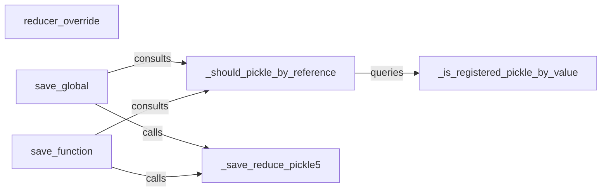

## Details

The `Pickle Protocol Integration` subsystem in `cloudpickle` is responsible for managing the interaction with Python's standard `pickle` module, determining when `cloudpickle`'s custom serialization logic should be applied versus when to defer to `pickle`'s default behavior. This ensures compatibility while extending `pickle`'s capabilities for complex Python objects.

### reducer_override
The primary entry point and dispatcher for `cloudpickle`'s custom serialization logic, intercepting the standard pickling process. It acts as a central hub, directing the pickling process to `cloudpickle`'s specialized reduction methods for specific object types that require custom handling.

**Related Classes/Methods**:

- <a href="https://github.com/cloudpipe/cloudpickle/blob/master/cloudpickle/cloudpickle.py#L1348-L1392" target="_blank" rel="noopener noreferrer">`cloudpickle.cloudpickle.reducer_override`:1348-1392</a>

### _should_pickle_by_reference
The core decision-making component that determines whether an object requires `cloudpickle`'s custom value-based serialization or can be handled by standard `pickle`'s reference-based serialization. It serves as a crucial gatekeeper, deciding whether an object should be serialized by reference or by value.

**Related Classes/Methods**:

- <a href="https://github.com/cloudpipe/cloudpickle/blob/master/cloudpickle/cloudpickle.py#L237-L270" target="_blank" rel="noopener noreferrer">`cloudpickle.cloudpickle._should_pickle_by_reference`:237-270</a>

### _is_registered_pickle_by_value
A helper component that supports `_should_pickle_by_reference` by checking if an object type has been explicitly marked for custom value-based pickling. It provides a lookup mechanism for value-based serialization registrations.

**Related Classes/Methods**:

- <a href="https://github.com/cloudpipe/cloudpickle/blob/master/cloudpickle/cloudpickle.py#L181-L192" target="_blank" rel="noopener noreferrer">`cloudpickle.cloudpickle._is_registered_pickle_by_value`:181-192</a>

### _save_reduce_pickle5
Encapsulates the specific custom serialization logic for objects when using Pickle Protocol 5, handling the actual byte-level representation for `cloudpickle`-specific objects. It implements the actual custom serialization logic for objects requiring specialized handling.

**Related Classes/Methods**:

- <a href="https://github.com/cloudpipe/cloudpickle/blob/master/cloudpickle/cloudpickle.py#L1401-L1432" target="_blank" rel="noopener noreferrer">`cloudpickle.cloudpickle._save_reduce_pickle5`:1401-1432</a>

### save_global
Manages the custom saving process for global objects, deciding the appropriate serialization strategy (custom vs. default) and invoking the relevant custom logic. It orchestrates decision-making and delegates to appropriate custom serialization logic.

**Related Classes/Methods**:

- <a href="https://github.com/cloudpipe/cloudpickle/blob/master/cloudpickle/cloudpickle.py#L1434-L1456" target="_blank" rel="noopener noreferrer">`cloudpickle.cloudpickle.save_global`:1434-1456</a>

### save_function
Manages the custom saving process for function objects, similar to `save_global`, determining the serialization strategy and delegating to custom logic when necessary. It handles custom saving for functions, including closures and dynamically created functions.

**Related Classes/Methods**:

- <a href="https://github.com/cloudpipe/cloudpickle/blob/master/cloudpickle/cloudpickle.py#L1460-L1473" target="_blank" rel="noopener noreferrer">`cloudpickle.cloudpickle.save_function`:1460-1473</a>

### [FAQ](https://github.com/CodeBoarding/GeneratedOnBoardings/tree/main?tab=readme-ov-file#faq)