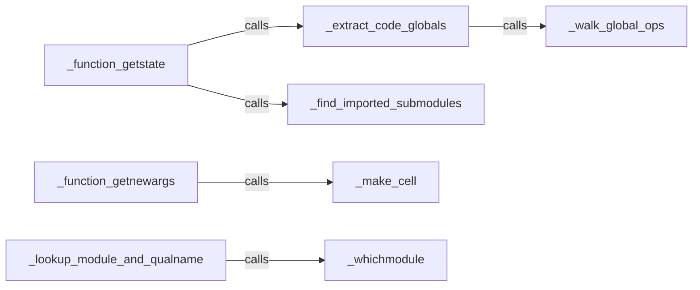

## Details

The `Runtime Environment Analyzer` subsystem is responsible for deeply inspecting Python objects, particularly functions and classes, to capture their complete runtime context for serialization. This includes identifying referenced global variables, imported modules, and handling closures, ensuring that these dynamic objects can be accurately reconstructed in a different environment.

### _function_getstate
This is the orchestrator for preparing the state of a function for serialization. It coordinates the collection of global dependencies and imported submodules by invoking other components within this subsystem. It acts as a primary interface for the serialization process to obtain a function's state.

**Related Classes/Methods**:

- <a href="https://github.com/cloudpipe/cloudpickle/blob/master/cloudpickle/cloudpickle.py#L707-L747" target="_blank" rel="noopener noreferrer">`cloudpickle.cloudpickle._function_getstate`:707-747</a>

### _function_getnewargs
Prepares the arguments necessary to reconstruct a function during deserialization. Its key responsibility is to correctly handle and recreate cell objects for closures, ensuring that the function's captured environment is restored.

**Related Classes/Methods**:

- <a href="https://github.com/cloudpipe/cloudpickle/blob/master/cloudpickle/cloudpickle.py#L1268-L1299" target="_blank" rel="noopener noreferrer">`cloudpickle.cloudpickle._function_getnewargs`:1268-1299</a>

### _extract_code_globals
Scans a code object's bytecode to identify and collect all global variables it references. It recursively processes nested code objects (e.g., inner functions, lambda functions) to ensure a comprehensive capture of the global environment.

**Related Classes/Methods**:

- <a href="https://github.com/cloudpipe/cloudpickle/blob/master/cloudpickle/cloudpickle.py#L313-L335" target="_blank" rel="noopener noreferrer">`cloudpickle.cloudpickle._extract_code_globals`:313-335</a>

### _find_imported_submodules
Analyzes a function's code object to identify all modules that are imported within its scope. This ensures that the entire module hierarchy required by the function is captured, preventing `ModuleNotFoundError` during deserialization.

**Related Classes/Methods**:

- <a href="https://github.com/cloudpipe/cloudpickle/blob/master/cloudpickle/cloudpickle.py#L338-L384" target="_blank" rel="noopener noreferrer">`cloudpickle.cloudpickle._find_imported_submodules`:338-384</a>

### _lookup_module_and_qualname
Resolves an object to its canonical, fully qualified name (e.g., `module.submodule.ClassName.method_name`). This is a fundamental step for making objects reconstructible by reference, especially for objects defined in interactive sessions.

**Related Classes/Methods**:

- <a href="https://github.com/cloudpipe/cloudpickle/blob/master/cloudpickle/cloudpickle.py#L273-L310" target="_blank" rel="noopener noreferrer">`cloudpickle.cloudpickle._lookup_module_and_qualname`:273-310</a>

### _make_cell
Creates a Python cell object and initializes it with a specific value. Cell objects are internal Python constructs used to implement closures, allowing inner functions to access variables from their enclosing scopes. This component is key to correctly capturing and recreating closure variables.

**Related Classes/Methods**:

- <a href="https://github.com/cloudpipe/cloudpickle/blob/master/cloudpickle/cloudpickle.py#L528-L532" target="_blank" rel="noopener noreferrer">`cloudpickle.cloudpickle._make_cell`:528-532</a>

### _walk_global_ops
A low-level helper that iterates through the bytecode instructions of a code object to specifically locate `LOAD_GLOBAL` and `STORE_GLOBAL` operations, which indicate access to global variables.

**Related Classes/Methods**:

- <a href="https://github.com/cloudpipe/cloudpickle/blob/master/cloudpickle/cloudpickle.py#L411-L416" target="_blank" rel="noopener noreferrer">`cloudpickle.cloudpickle._walk_global_ops`:411-416</a>

### _whichmodule
Determines the fully qualified module name to which a given object belongs. This is crucial for correctly identifying and locating objects that might be defined in various modules, especially in dynamic contexts.

**Related Classes/Methods**:

- <a href="https://github.com/cloudpipe/cloudpickle/blob/master/cloudpickle/cloudpickle.py#L203-L234" target="_blank" rel="noopener noreferrer">`cloudpickle.cloudpickle._whichmodule`:203-234</a>

### [FAQ](https://github.com/CodeBoarding/GeneratedOnBoardings/tree/main?tab=readme-ov-file#faq)