```mermaid
graph LR
    Serialization_API_User_Interface_["Serialization API (User Interface)"]
    cloudpickle_cloudpickle_dump["cloudpickle.cloudpickle.dump"]
    cloudpickle_cloudpickle_dumps["cloudpickle.cloudpickle.dumps"]
    cloudpickle_cloudpickle_Pickler["cloudpickle.cloudpickle.Pickler"]
    Serialization_API_User_Interface_ -- "uses" --> cloudpickle_cloudpickle_dump
    Serialization_API_User_Interface_ -- "uses" --> cloudpickle_cloudpickle_dumps
    cloudpickle_cloudpickle_dump -- "instantiates and uses" --> cloudpickle_cloudpickle_Pickler
    cloudpickle_cloudpickle_dumps -- "leverages" --> cloudpickle_cloudpickle_dump
    cloudpickle_cloudpickle_Pickler -- "extends" --> pickle_Pickler
    cloudpickle_cloudpickle_Pickler -- "manages serialization of" --> Python_Objects
    click Serialization_API_User_Interface_ href "https://github.com/CodeBoarding/GeneratedOnBoardings/blob/main/cloudpickle/Serialization_API_User_Interface_.md" "Details"
```

## Details

The cloudpickle subsystem provides robust serialization capabilities for Python objects, extending the standard pickle module to handle complex and dynamic objects like functions and classes. At its core, the Serialization API (User Interface) offers high-level functions (dump and dumps) for users to easily serialize objects to files or in-memory byte streams. These functions internally leverage the Pickler component, which encapsulates the intricate logic for converting Python objects into a byte stream, managing various object types and pickling protocols. The Pickler component, through its reducer_override method (or save_global and save_function in PyPy), intelligently determines how to serialize different object types, including dynamic functions and classes, ensuring that their global namespaces and closures are correctly preserved. This design allows cloudpickle to provide a flexible and powerful serialization solution while abstracting the underlying complexities from the end-user.

### Serialization API (User Interface) [[Expand]](./Serialization_API_User_Interface_.md)
Provides the primary, high-level interface for users to initiate the serialization process. It exposes functions that abstract the underlying pickling complexities, allowing users to easily convert Python objects into byte streams.

**Related Classes/Methods**:

- <a href="https://github.com/cloudpipe/cloudpickle/blob/master/cloudpickle/cloudpickle.py#L1506-L1519" target="_blank" rel="noopener noreferrer">`cloudpickle.cloudpickle.dump`:1506-1519</a>
- <a href="https://github.com/cloudpipe/cloudpickle/blob/master/cloudpickle/cloudpickle.py#L1522-L1538" target="_blank" rel="noopener noreferrer">`cloudpickle.cloudpickle.dumps`:1522-1538</a>

### cloudpickle.cloudpickle.dump
Provides the primary interface for serializing Python objects to a file-like object. It orchestrates the serialization by instantiating and utilizing the Pickler to write the object's byte stream to the specified output stream.

**Related Classes/Methods**:

- <a href="https://github.com/cloudpipe/cloudpickle/blob/master/cloudpickle/cloudpickle.py#L1506-L1519" target="_blank" rel="noopener noreferrer">`cloudpickle.cloudpickle.dump`:1506-1519</a>

### cloudpickle.cloudpickle.dumps
Offers a convenient interface for serializing Python objects directly into a byte string (in-memory). It abstracts stream management from the user by redirecting output to an in-memory buffer, leveraging the dump function for the actual serialization.

**Related Classes/Methods**:

- <a href="https://github.com/cloudpipe/cloudpickle/blob/master/cloudpickle/cloudpickle.py#L1522-L1538" target="_blank" rel="noopener noreferrer">`cloudpickle.cloudpickle.dumps`:1522-1538</a>

### cloudpickle.cloudpickle.Pickler
Encapsulates the intricate serialization logic within a dedicated engine, consistently applied for both in-memory and stream-based serialization. This component is responsible for the core mechanics of converting Python objects into a byte stream, handling various object types and pickling protocols. It extends pickle.Pickler and overrides key methods to handle dynamic functions and classes, ensuring proper serialization of their global namespaces and closures.

**Related Classes/Methods**:

- <a href="https://github.com/cloudpipe/cloudpickle/blob/master/cloudpickle/cloudpickle.py#L1214-L1500" target="_blank" rel="noopener noreferrer">`cloudpickle.cloudpickle.Pickler`:1214-1500</a>

### [FAQ](https://github.com/CodeBoarding/GeneratedOnBoardings/tree/main?tab=readme-ov-file#faq)