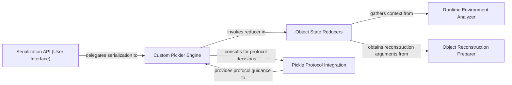

## Details

cloudpickle functions as an advanced serialization library, extending Python's native pickle module to handle complex and dynamic objects, particularly those defined in interactive sessions or with closures.

### Serialization API (User Interface) [[Expand]](./Serialization_API_User_Interface_.md)
Provides the primary, high-level interface for users to initiate the serialization process. It exposes functions that abstract the underlying pickling complexities, allowing users to easily convert Python objects into byte streams.

**Related Classes/Methods**:

- <a href="https://github.com/cloudpipe/cloudpickle/blob/master/cloudpickle/cloudpickle.py#L1506-L1519" target="_blank" rel="noopener noreferrer">`cloudpickle.cloudpickle.dump`:1506-1519</a>
- <a href="https://github.com/cloudpipe/cloudpickle/blob/master/cloudpickle/cloudpickle.py#L1522-L1538" target="_blank" rel="noopener noreferrer">`cloudpickle.cloudpickle.dumps`:1522-1538</a>

### Custom Pickler Engine
The central orchestrator of `cloudpickle`'s custom serialization logic. This component extends the standard `pickle.Pickler` and overrides its behavior to handle complex or dynamic Python objects that `pickle` cannot. It manages the custom dispatch table and the `reducer_override` mechanism.

**Related Classes/Methods**:

- <a href="https://github.com/cloudpipe/cloudpickle/blob/master/cloudpickle/cloudpickle.py#L1214-L1500" target="_blank" rel="noopener noreferrer">`cloudpickle.cloudpickle.Pickler`:1214-1500</a>
- <a href="https://github.com/cloudpipe/cloudpickle/blob/master/cloudpickle/cloudpickle.py" target="_blank" rel="noopener noreferrer">`cloudpickle.cloudpickle.Pickler.reducer_override`</a>
- <a href="https://github.com/cloudpipe/cloudpickle/blob/master/cloudpickle/cloudpickle.py" target="_blank" rel="noopener noreferrer">`cloudpickle.cloudpickle.Pickler.dispatch_table`</a>
- <a href="https://github.com/cloudpipe/cloudpickle/blob/master/cloudpickle/cloudpickle.py" target="_blank" rel="noopener noreferrer">`cloudpickle.cloudpickle.Pickler.dump`</a>

### Object State Reducers
Contains specific logic for transforming various Python object types (e.g., functions, classes, modules, type variables) into a picklable representation. These methods extract the essential state and structure of complex objects, preparing them for serialization by the `Custom Pickler Engine`.

**Related Classes/Methods**:

- <a href="https://github.com/cloudpipe/cloudpickle/blob/master/cloudpickle/cloudpickle.py#L1254-L1266" target="_blank" rel="noopener noreferrer">`cloudpickle.cloudpickle._function_reduce`:1254-1266</a>
- <a href="https://github.com/cloudpipe/cloudpickle/blob/master/cloudpickle/cloudpickle.py#L1248-L1252" target="_blank" rel="noopener noreferrer">`cloudpickle.cloudpickle._dynamic_function_reduce`:1248-1252</a>
- <a href="https://github.com/cloudpipe/cloudpickle/blob/master/cloudpickle/cloudpickle.py#L1063-L1075" target="_blank" rel="noopener noreferrer">`cloudpickle.cloudpickle._class_reduce`:1063-1075</a>
- <a href="https://github.com/cloudpipe/cloudpickle/blob/master/cloudpickle/cloudpickle.py#L1003-L1013" target="_blank" rel="noopener noreferrer">`cloudpickle.cloudpickle._module_reduce`:1003-1013</a>
- <a href="https://github.com/cloudpipe/cloudpickle/blob/master/cloudpickle/cloudpickle.py#L613-L623" target="_blank" rel="noopener noreferrer">`cloudpickle.cloudpickle._typevar_reduce`:613-623</a>
- <a href="https://github.com/cloudpipe/cloudpickle/blob/master/cloudpickle/cloudpickle.py#L707-L747" target="_blank" rel="noopener noreferrer">`cloudpickle.cloudpickle._function_getstate`:707-747</a>
- <a href="https://github.com/cloudpipe/cloudpickle/blob/master/cloudpickle/cloudpickle.py#L750-L786" target="_blank" rel="noopener noreferrer">`cloudpickle.cloudpickle._class_getstate`:750-786</a>
- <a href="https://github.com/cloudpipe/cloudpickle/blob/master/cloudpickle/cloudpickle.py#L789-L806" target="_blank" rel="noopener noreferrer">`cloudpickle.cloudpickle._enum_getstate`:789-806</a>

### Runtime Environment Analyzer [[Expand]](./Runtime_Environment_Analyzer.md)
Analyzes the runtime environment of objects, including their code objects, global variables, and module structures. This component is crucial for correctly capturing the context of dynamic objects (like functions and classes defined interactively) to ensure they can be reconstructed in a different environment.

**Related Classes/Methods**:

- <a href="https://github.com/cloudpipe/cloudpickle/blob/master/cloudpickle/cloudpickle.py#L313-L335" target="_blank" rel="noopener noreferrer">`cloudpickle.cloudpickle._extract_code_globals`:313-335</a>
- <a href="https://github.com/cloudpipe/cloudpickle/blob/master/cloudpickle/cloudpickle.py#L411-L416" target="_blank" rel="noopener noreferrer">`cloudpickle.cloudpickle._walk_global_ops`:411-416</a>
- <a href="https://github.com/cloudpipe/cloudpickle/blob/master/cloudpickle/cloudpickle.py#L338-L384" target="_blank" rel="noopener noreferrer">`cloudpickle.cloudpickle._find_imported_submodules`:338-384</a>
- <a href="https://github.com/cloudpipe/cloudpickle/blob/master/cloudpickle/cloudpickle.py#L203-L234" target="_blank" rel="noopener noreferrer">`cloudpickle.cloudpickle._whichmodule`:203-234</a>
- <a href="https://github.com/cloudpipe/cloudpickle/blob/master/cloudpickle/cloudpickle.py#L199-L200" target="_blank" rel="noopener noreferrer">`cloudpickle.cloudpickle._getattribute`:199-200</a>
- <a href="https://github.com/cloudpipe/cloudpickle/blob/master/cloudpickle/cloudpickle.py#L273-L310" target="_blank" rel="noopener noreferrer">`cloudpickle.cloudpickle._lookup_module_and_qualname`:273-310</a>
- <a href="https://github.com/cloudpipe/cloudpickle/blob/master/cloudpickle/cloudpickle.py#L519-L525" target="_blank" rel="noopener noreferrer">`cloudpickle.cloudpickle._make_empty_cell`:519-525</a>
- <a href="https://github.com/cloudpipe/cloudpickle/blob/master/cloudpickle/cloudpickle.py#L528-L532" target="_blank" rel="noopener noreferrer">`cloudpickle.cloudpickle._make_cell`:528-532</a>

### Object Reconstruction Preparer
Provides mechanisms for generating the necessary arguments and "skeleton" objects required for the deserialization process. This includes creating initial object structures or providing arguments for `__new__` methods, ensuring that objects can be correctly re-instantiated from their pickled state.

**Related Classes/Methods**:

- <a href="https://github.com/cloudpipe/cloudpickle/blob/master/cloudpickle/cloudpickle.py#L535-L557" target="_blank" rel="noopener noreferrer">`cloudpickle.cloudpickle._make_skeleton_class`:535-557</a>
- <a href="https://github.com/cloudpipe/cloudpickle/blob/master/cloudpickle/cloudpickle.py#L560-L588" target="_blank" rel="noopener noreferrer">`cloudpickle.cloudpickle._make_skeleton_enum`:560-588</a>
- <a href="https://github.com/cloudpipe/cloudpickle/blob/master/cloudpickle/cloudpickle.py#L591-L599" target="_blank" rel="noopener noreferrer">`cloudpickle.cloudpickle._make_typevar`:591-599</a>
- <a href="https://github.com/cloudpipe/cloudpickle/blob/master/cloudpickle/cloudpickle.py#L1268-L1299" target="_blank" rel="noopener noreferrer">`cloudpickle.cloudpickle._function_getnewargs`:1268-1299</a>
- <a href="https://github.com/cloudpipe/cloudpickle/blob/master/cloudpickle/cloudpickle.py#L665-L681" target="_blank" rel="noopener noreferrer">`cloudpickle.cloudpickle._class_getnewargs`:665-681</a>
- <a href="https://github.com/cloudpipe/cloudpickle/blob/master/cloudpickle/cloudpickle.py#L684-L694" target="_blank" rel="noopener noreferrer">`cloudpickle.cloudpickle._enum_getnewargs`:684-694</a>
- <a href="https://github.com/cloudpipe/cloudpickle/blob/master/cloudpickle/cloudpickle.py#L602-L610" target="_blank" rel="noopener noreferrer">`cloudpickle.cloudpickle._decompose_typevar`:602-610</a>
- <a href="https://github.com/cloudpipe/cloudpickle/blob/master/cloudpickle/cloudpickle.py#L118-L125" target="_blank" rel="noopener noreferrer">`cloudpickle.cloudpickle._lookup_class_or_track`:118-125</a>

### Pickle Protocol Integration [[Expand]](./Pickle_Protocol_Integration.md)
Manages the interaction with the standard `pickle` module's protocols and mechanisms. This component determines when `cloudpickle`'s custom logic should be applied versus when to fall back to `pickle`'s default behavior, ensuring compatibility and leveraging existing `pickle` functionalities.

**Related Classes/Methods**:

- <a href="https://github.com/cloudpipe/cloudpickle/blob/master/cloudpickle/cloudpickle.py#L1348-L1392" target="_blank" rel="noopener noreferrer">`cloudpickle.cloudpickle.reducer_override`:1348-1392</a>
- <a href="https://github.com/cloudpipe/cloudpickle/blob/master/cloudpickle/cloudpickle.py#L237-L270" target="_blank" rel="noopener noreferrer">`cloudpickle.cloudpickle._should_pickle_by_reference`:237-270</a>
- <a href="https://github.com/cloudpipe/cloudpickle/blob/master/cloudpickle/cloudpickle.py#L181-L192" target="_blank" rel="noopener noreferrer">`cloudpickle.cloudpickle._is_registered_pickle_by_value`:181-192</a>
- <a href="https://github.com/cloudpipe/cloudpickle/blob/master/cloudpickle/cloudpickle.py#L1401-L1432" target="_blank" rel="noopener noreferrer">`cloudpickle.cloudpickle._save_reduce_pickle5`:1401-1432</a>
- <a href="https://github.com/cloudpipe/cloudpickle/blob/master/cloudpickle/cloudpickle.py#L1434-L1456" target="_blank" rel="noopener noreferrer">`cloudpickle.cloudpickle.save_global`:1434-1456</a>
- <a href="https://github.com/cloudpipe/cloudpickle/blob/master/cloudpickle/cloudpickle.py#L1460-L1473" target="_blank" rel="noopener noreferrer">`cloudpickle.cloudpickle.save_function`:1460-1473</a>

### [FAQ](https://github.com/CodeBoarding/GeneratedOnBoardings/tree/main?tab=readme-ov-file#faq)