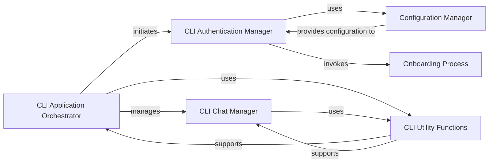

## Details

The CLI Application Core subsystem, primarily encapsulated within cli.py, serves as the central orchestrator for the command-line interface. It manages the application's lifecycle, user interaction flows, and delegates tasks to specialized components, acting as the primary entry point for the CLI.

### CLI Application Orchestrator
Serves as the primary entry point (cli.main) for the CLI application, managing the overall execution flow. It coordinates user authentication, initiates the chat interface, and performs initial status checks.

**Related Classes/Methods**:

- <a href="https://github.com/stypr/clubhouse-py/blob/master/cli.py#L341-L375" target="_blank" rel="noopener noreferrer">`cli.main`:341-375</a>

### CLI Authentication Manager
Manages the user authentication process, including handling onboarding, interacting with the Clubhouse API for login, and persisting user configuration.

**Related Classes/Methods**:

- <a href="https://github.com/stypr/clubhouse-py/blob/master/cli.py#L295-L339" target="_blank" rel="noopener noreferrer">`cli.user_authentication`:295-339</a>

### CLI Chat Manager
Manages the interactive chat experience within the CLI, including displaying channel lists and handling background tasks like keep-alive pings to maintain session activity.

**Related Classes/Methods**:

- <a href="https://github.com/stypr/clubhouse-py/blob/master/cli.py#L162-L293" target="_blank" rel="noopener noreferrer">`cli.chat_main`:162-293</a>

### Configuration Manager
Handles the persistence and retrieval of application and user-specific settings, such as authentication tokens, ensuring a consistent user experience across sessions.

**Related Classes/Methods**:

- <a href="https://github.com/stypr/clubhouse-py/blob/master/cli.py#L70-L79" target="_blank" rel="noopener noreferrer">`cli.read_config`:70-79</a>
- <a href="https://github.com/stypr/clubhouse-py/blob/master/cli.py#L55-L68" target="_blank" rel="noopener noreferrer">`cli.write_config`:55-68</a>

### Onboarding Process
Guides new users through the initial setup and registration steps required to use the Clubhouse service via the CLI, often involving phone number verification and profile setup.

**Related Classes/Methods**:

- <a href="https://github.com/stypr/clubhouse-py/blob/master/cli.py#L81-L131" target="_blank" rel="noopener noreferrer">`cli.process_onboarding`:81-131</a>

### CLI Utility Functions
Provides various helper functionalities that support the core operations of the CLI, such as managing network connectivity, scheduling tasks, displaying formatted output, and handling specific user permissions (e.g., speaker requests).

**Related Classes/Methods**:

- <a href="https://github.com/stypr/clubhouse-py/blob/master/cli.py#L182-L189" target="_blank" rel="noopener noreferrer">`cli._ping_keep_alive`:182-189</a>
- <a href="https://github.com/stypr/clubhouse-py/blob/master/cli.py#L35-L53" target="_blank" rel="noopener noreferrer">`cli.set_interval`:35-53</a>
- <a href="https://github.com/stypr/clubhouse-py/blob/master/cli.py#L133-L160" target="_blank" rel="noopener noreferrer">`cli.print_channel_list`:133-160</a>
- <a href="https://github.com/stypr/clubhouse-py/blob/master/cli.py#L172-L180" target="_blank" rel="noopener noreferrer">`cli._request_speaker_permission`:172-180</a>
- <a href="https://github.com/stypr/clubhouse-py/blob/master/cli.py#L191-L210" target="_blank" rel="noopener noreferrer">`cli._wait_speaker_permission`:191-210</a>

### [FAQ](https://github.com/CodeBoarding/GeneratedOnBoardings/tree/main?tab=readme-ov-file#faq)