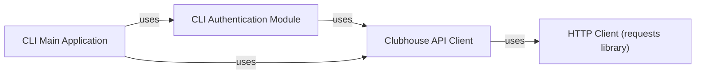

## Details

The `clubhouse-py` project's core functionality revolves around the `Clubhouse API Client`, which acts as the central hub for all interactions with the Clubhouse backend. This client leverages the `requests` library as its `HTTP Client` to perform the actual network communication. The `CLI Main Application` serves as the user's interface, orchestrating commands and delegating API calls to the `Clubhouse API Client`. User authentication, a critical pathway, is managed by the `CLI Authentication Module`, which also directly interacts with the `Clubhouse API Client` to handle login and session management. This architecture ensures a clear separation of concerns, with the API client handling all backend communication and the CLI components managing user interaction and authentication flows.

### Clubhouse API Client [[Expand]](./Clubhouse_API_Client.md)
This is the core and central component of the subsystem. It abstracts all direct interactions with the Clubhouse backend API, handling HTTP request construction, response parsing, and API session management. It serves as the primary interface for all Clubhouse API operations within the project.

**Related Classes/Methods**:

- <a href="https://github.com/stypr/clubhouse-py/blob/master/clubhouse/clubhouse.py#L20-L1628" target="_blank" rel="noopener noreferrer">`clubhouse.clubhouse.Clubhouse`:20-1628</a>

### HTTP Client (requests library)
An external, third-party library (`requests`) responsible for performing the underlying HTTP requests. It handles the low-level network communication, including sending requests and receiving raw responses, which are then processed by the Clubhouse API Client.

**Related Classes/Methods**:

- <a href="https://github.com/stypr/clubhouse-py/blob/master/" target="_blank" rel="noopener noreferrer">`requests`</a>

### CLI Authentication Module
A dedicated module within the CLI application responsible for managing user authentication flows. It interacts directly with the Clubhouse API Client to perform login, phone verification, and session management, ensuring secure access to Clubhouse services.

**Related Classes/Methods**:

- <a href="https://github.com/stypr/clubhouse-py/blob/master/cli.py#L295-L339" target="_blank" rel="noopener noreferrer">`cli.user_authentication`:295-339</a>

### CLI Main Application
The primary entry point and orchestrator for the command-line interface. It parses user commands, dispatches them to the appropriate API client methods, and coordinates various operations by leveraging the Clubhouse API Client to execute specific Clubhouse API calls.

**Related Classes/Methods**:

- <a href="https://github.com/stypr/clubhouse-py/blob/master/cli.py#L341-L375" target="_blank" rel="noopener noreferrer">`cli.main`:341-375</a>

### [FAQ](https://github.com/CodeBoarding/GeneratedOnBoardings/tree/main?tab=readme-ov-file#faq)