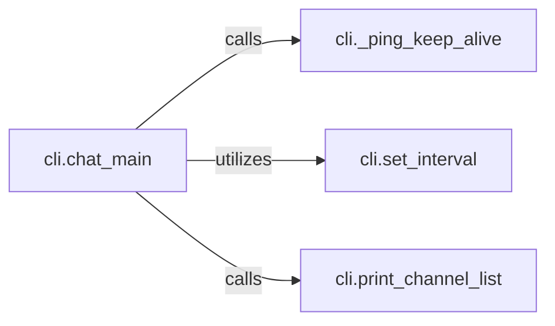

## Details

The Real-time Channel Interaction subsystem is primarily encapsulated within the cli.py file, focusing on the command-line interface's capabilities for managing real-time communication within Clubhouse rooms. Its core responsibility is to display channel information, facilitate chat messages, and ensure connection stability.

### cli.chat_main
This component serves as the central orchestrator for real-time chat sessions within the CLI. It manages the overall connection lifecycle, coordinates the display of information, and integrates other real-time functionalities.

**Related Classes/Methods**:

- <a href="https://github.com/stypr/clubhouse-py/blob/master/cli.py#L162-L293" target="_blank" rel="noopener noreferrer">`cli.chat_main`:162-293</a>

### cli._ping_keep_alive
Responsible for maintaining a persistent connection to the Clubhouse service by periodically sending "ping" signals. This prevents session timeouts and ensures continuous real-time interaction.

**Related Classes/Methods**:

- <a href="https://github.com/stypr/clubhouse-py/blob/master/cli.py#L182-L189" target="_blank" rel="noopener noreferrer">`cli._ping_keep_alive`:182-189</a>

### cli.print_channel_list
Handles the formatting and display of available Clubhouse channels to the user via the command-line interface, ensuring clear and organized presentation of real-time room information.

**Related Classes/Methods**:

- <a href="https://github.com/stypr/clubhouse-py/blob/master/cli.py#L133-L160" target="_blank" rel="noopener noreferrer">`cli.print_channel_list`:133-160</a>

### cli.set_interval
A utility component that schedules the repeated execution of a given function at specified regular intervals. This is crucial for implementing periodic tasks like connection pings to maintain real-time presence.

**Related Classes/Methods**:

- <a href="https://github.com/stypr/clubhouse-py/blob/master/cli.py#L35-L53" target="_blank" rel="noopener noreferrer">`cli.set_interval`:35-53</a>

### [FAQ](https://github.com/CodeBoarding/GeneratedOnBoardings/tree/main?tab=readme-ov-file#faq)