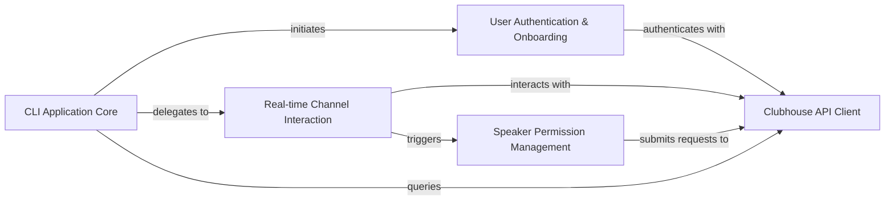

## Details

The clubhouse-py architecture is centered around a CLI Application Core that orchestrates user interactions with the Clubhouse platform. This core component initiates the User Authentication & Onboarding process, which in turn leverages the Clubhouse API Client for secure session establishment. Once authenticated, the CLI Application Core can delegate to specialized modules like Real-time Channel Interaction for managing in-room activities, including chat and channel browsing. The Real-time Channel Interaction component can further trigger Speaker Permission Management for users seeking to speak. All these functional components ultimately rely on the Clubhouse API Client to abstract the complexities of direct communication with the Clubhouse backend, forming a clear client-server interaction pattern. This design ensures a modular and extensible structure, with distinct boundaries between the CLI logic and the underlying API communication.

### CLI Application Core [[Expand]](./CLI_Application_Core.md)
The central orchestrator of the command-line interface, managing application lifecycle, configuration, and delegating tasks. It serves as the primary entry point for the CLI.

**Related Classes/Methods**:

- <a href="https://github.com/stypr/clubhouse-py/blob/master/cli.py" target="_blank" rel="noopener noreferrer">`cli.py`</a>

### User Authentication & Onboarding
Handles user authentication, login, and initial onboarding processes to establish and maintain a valid user session with the Clubhouse service.

**Related Classes/Methods**:

- <a href="https://github.com/stypr/clubhouse-py/blob/master/cli.py" target="_blank" rel="noopener noreferrer">`cli.py`</a>

### Real-time Channel Interaction [[Expand]](./Real_time_Channel_Interaction.md)
Manages real-time communication within Clubhouse rooms, including displaying channels, facilitating chat messages, and maintaining connection stability.

**Related Classes/Methods**:

- <a href="https://github.com/stypr/clubhouse-py/blob/master/cli.py" target="_blank" rel="noopener noreferrer">`cli.py`</a>

### Speaker Permission Management
Manages the process of requesting and monitoring speaker permissions for users within Clubhouse rooms.

**Related Classes/Methods**:

- <a href="https://github.com/stypr/clubhouse-py/blob/master/cli.py" target="_blank" rel="noopener noreferrer">`cli.py`</a>

### Clubhouse API Client [[Expand]](./Clubhouse_API_Client.md)
The core Python library responsible for all direct interactions with the Clubhouse backend API, abstracting HTTP requests, response parsing, and API session management.

**Related Classes/Methods**:

- <a href="https://github.com/stypr/clubhouse-py/blob/master/clubhouse/clubhouse.py" target="_blank" rel="noopener noreferrer">`clubhouse/clubhouse.py`</a>

### [FAQ](https://github.com/CodeBoarding/GeneratedOnBoardings/tree/main?tab=readme-ov-file#faq)