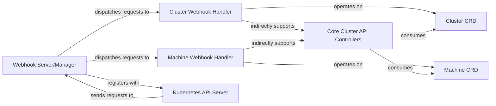

## Details

The Cluster API webhook subsystem plays a crucial role in ensuring the integrity and correctness of Cluster and Machine resources within a Kubernetes cluster. The `Kubernetes API Server` acts as the central entry point, receiving all API requests. For Cluster API resources, the API Server invokes the `Webhook Server/Manager`, which is implemented using the `controller-runtime` framework. This `Webhook Server/Manager` is responsible for registering and routing admission requests to specific handlers. The `Cluster Webhook Handler` and `Machine Webhook Handler` are the core components that implement the actual admission logic, performing validation, mutation, and defaulting operations on `Cluster CRD` and `Machine CRD` objects, respectively. These handlers ensure that Cluster and Machine resources conform to defined policies and schemas before they are persisted in the Kubernetes datastore. The `Core Cluster API Controllers` then consume these validated Cluster and Machine CRDs to reconcile the desired state of the cluster infrastructure.

### Webhook Server/Manager
Manages the lifecycle of webhook handlers, including listening for incoming admission requests from the Kubernetes API server, routing requests to the appropriate handler, and returning admission responses. It handles the registration of webhooks with the Kubernetes API server. This component leverages the `controller-runtime` Manager to orchestrate webhook operations.

**Related Classes/Methods**:

- <a href="https://github.com/kubernetes-sigs/cluster-api/blob/main/internal/webhooks/cluster.go" target="_blank" rel="noopener noreferrer">`sigs.k8s.io/cluster-api/internal/webhooks.Cluster.SetupWebhookWithManager`</a>
- <a href="https://github.com/kubernetes-sigs/cluster-api/blob/main/internal/webhooks/machine.go" target="_blank" rel="noopener noreferrer">`sigs.k8s.io/cluster-api/internal/webhooks.Machine.SetupWebhookWithManager`</a>

### Cluster Webhook Handler
Implements admission logic (validation, mutation, defaulting) specifically for Cluster Custom Resources. It intercepts API requests for Cluster CRDs, enforces validation rules, and performs mutation/defaulting operations.

**Related Classes/Methods**:

- <a href="https://github.com/kubernetes-sigs/cluster-api/blob/main/internal/webhooks/cluster.go" target="_blank" rel="noopener noreferrer">`sigs.k8s.io/cluster-api/internal/webhooks.Cluster`</a>

### Machine Webhook Handler
Implements admission logic (validation, mutation, defaulting) specifically for Machine Custom Resources. It intercepts API requests for Machine CRDs, enforces validation rules, and performs mutation/defaulting operations.

**Related Classes/Methods**:

- <a href="https://github.com/kubernetes-sigs/cluster-api/blob/main/internal/webhooks/machine.go" target="_blank" rel="noopener noreferrer">`sigs.k8s.io/cluster-api/internal/webhooks.Machine`</a>

### Kubernetes API Server
The central control plane component in Kubernetes that exposes the Kubernetes API. It sends admission requests to registered webhooks and receives responses. This is an external component to the `cluster-api` project.

**Related Classes/Methods**: _None_

### Cluster CRD
Custom Resource Definition for Cluster objects in Cluster API. These are the resources that the `Cluster Webhook Handler` validates, mutates, or defaults.

**Related Classes/Methods**:

- <a href="https://github.com/kubernetes-sigs/cluster-api/blob/main/api/core/v1beta1/cluster_types.go" target="_blank" rel="noopener noreferrer">``</a>

### Machine CRD
Custom Resource Definition for Machine objects in Cluster API. These are the resources that the `Machine Webhook Handler` validates, mutates, or defaults.

**Related Classes/Methods**:

- <a href="https://github.com/kubernetes-sigs/cluster-api/blob/main/api/core/v1beta1/machine_types.go" target="_blank" rel="noopener noreferrer">``</a>

### Core Cluster API Controllers [[Expand]](./Core_Cluster_API_Controllers.md)
Controllers responsible for reconciling Cluster API resources. While not part of the webhook subsystem itself, they rely on the webhooks to ensure the validity and correctness of the resources they manage.

**Related Classes/Methods**:

- <a href="https://github.com/kubernetes-sigs/cluster-api/blob/main/internal/controllers/cluster/cluster_controller.go" target="_blank" rel="noopener noreferrer">`sigs.k8s.io/cluster-api/internal/controllers/cluster.Reconciler`</a>

### [FAQ](https://github.com/CodeBoarding/GeneratedOnBoardings/tree/main?tab=readme-ov-file#faq)