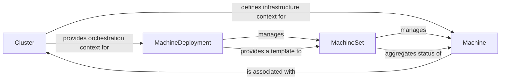

## Details

This subsystem focuses on the declarative management of Kubernetes clusters and their underlying infrastructure. It leverages Custom Resources (CRs) to define the desired state of clusters, individual machines, and groups of machines. The `Cluster` CR serves as the central orchestrator, defining the overall cluster configuration. `MachineDeployment` and `MachineSet` CRs manage the lifecycle and scaling of worker nodes, while individual `Machine` CRs represent the actual virtual or physical machines. This layered approach enables automated provisioning, scaling, and updates of Kubernetes clusters.

### Cluster
The foundational Custom Resource that defines the desired state and configuration of an entire Kubernetes cluster. It encapsulates high-level details such as the control plane configuration, infrastructure provider references, and networking specifications. It acts as the top-level resource that orchestrates the creation and management of all other cluster-related components.

**Related Classes/Methods**:

- `Cluster`

### Machine
Represents a single node (virtual machine or bare metal host) within a Kubernetes cluster. It defines the desired state of an individual machine, including its infrastructure details (e.g., instance type, image, cloud-specific configurations), bootstrap configuration (e.g., `kubeadm` join commands), and health status.

**Related Classes/Methods**:

- `Machine`

### MachineSet
Manages a specified number of identical `Machine` objects, similar to how a Kubernetes `ReplicaSet` manages Pods. It provides basic scaling and self-healing capabilities for groups of machines, ensuring a desired number of machines are running based on a `Machine` template.

**Related Classes/Methods**:

- `MachineSet`

### MachineDeployment
Provides declarative updates for `MachineSet`s and `Machine`s, enabling advanced features like rolling updates, rollbacks, and scaling of machine groups. It abstracts away the complexities of managing individual `MachineSet`s and `Machine`s during lifecycle operations.

**Related Classes/Methods**:

- `MachineDeployment`

### [FAQ](https://github.com/CodeBoarding/GeneratedOnBoardings/tree/main?tab=readme-ov-file#faq)