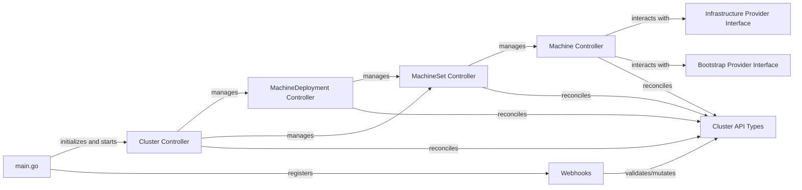

## Details

The Cluster API (CAPI) core provider is a Kubernetes controller that manages the lifecycle of Kubernetes clusters. It operates by reconciling Custom Resources (CRs) that define the desired state of clusters, machines, and related infrastructure. The `main` package serves as the entry point, initializing the controller-runtime manager, registering all core controllers, and setting up admission webhooks.

### main.go
The application's entry point and orchestrator. It initializes the `controller-runtime` Manager, sets up shared caches, and registers all core controllers and webhooks, effectively starting their reconciliation loops.

**Related Classes/Methods**:

- `main`

### Cluster Controller
The top-level reconciliation loop for `Cluster` Custom Resources. It orchestrates the entire cluster lifecycle, including the creation, update, and deletion of the control plane and worker nodes, by delegating tasks to other controllers and interacting with appropriate providers.

**Related Classes/Methods**:

- `sigs.k8s.io/cluster-api/controllers.ClusterReconciler`

### Machine Controller
Reconciles `Machine` Custom Resources. It manages the lifecycle of individual virtual machines or nodes that comprise the Kubernetes cluster, interacting with infrastructure and bootstrap providers to provision and configure them.

**Related Classes/Methods**:

- `sigs.k8s.io/cluster-api/controllers.MachineReconciler`

### MachineSet Controller
Reconciles `MachineSet` Custom Resources. It ensures a desired number of `Machine` replicas are running, similar to a Kubernetes `ReplicaSet`, by creating or deleting individual `Machine` resources.

**Related Classes/Methods**:

- `sigs.k8s.io/cluster-api/controllers.MachineSetReconciler`

### MachineDeployment Controller
Reconciles `MachineDeployment` Custom Resources. It provides declarative updates for `MachineSets` and `Machines`, enabling rolling updates, rollbacks, and scaling operations for groups of machines, similar to a Kubernetes `Deployment`.

**Related Classes/Methods**:

- `sigs.k8s.io/cluster-api/controllers.MachineDeploymentReconciler`

### Webhooks [[Expand]](./Webhooks.md)
Admission webhooks registered by `main.go`. These webhooks intercept API requests to perform validation or mutation of Cluster API resources before they are persisted in etcd.

**Related Classes/Methods**:

- `sigs.k8s.io/cluster-api/webhooks`

### Infrastructure Provider Interface
An interface for provisioning infrastructure resources.

**Related Classes/Methods**:

- `sigs.k8s.io/cluster-api/api/core/v1beta1.InfrastructureMachine`

### Bootstrap Provider Interface
An interface for configuring bootstrap resources.

**Related Classes/Methods**:

- `sigs.k8s.io/cluster-api/api/bootstrap/v1beta1.BootstrapConfig`

### Cluster API Types
Defines the Custom Resources (CRs) used by Cluster API.

**Related Classes/Methods**:

- `sigs.k8s.io/cluster-api/api/core/v1beta1.Cluster`

### [FAQ](https://github.com/CodeBoarding/GeneratedOnBoardings/tree/main?tab=readme-ov-file#faq)