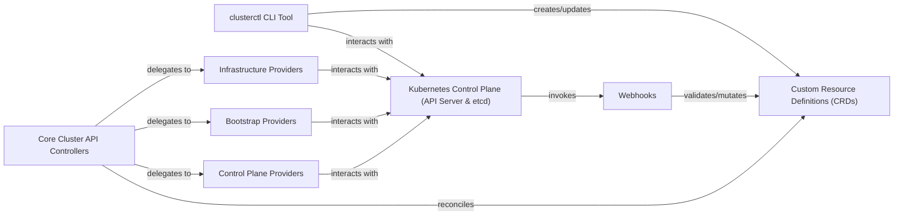

## Details

The Cluster API project extends Kubernetes to manage the lifecycle of Kubernetes clusters themselves. It operates by introducing Custom Resource Definitions (CRDs) that define the desired state of clusters, machines, and their associated infrastructure. Core Cluster API Controllers continuously reconcile these CRDs, delegating specific provisioning and configuration tasks to various pluggable providers (Infrastructure, Bootstrap, and Control Plane Providers). All interactions and state changes are managed through the Kubernetes API Server, with Webhooks ensuring data integrity and policy enforcement for Cluster API resources. The `clusterctl` CLI tool serves as the primary user interface for orchestrating these cluster lifecycle operations.

### Kubernetes Control Plane (API Server & etcd) [[Expand]](./Kubernetes_Control_Plane_API_Server_etcd_.md)
Acts as the central hub for all API interactions and the persistent store for all cluster data, including Cluster API Custom Resources.

**Related Classes/Methods**: _None_

### Custom Resource Definitions (CRDs)
Define the declarative API for managing Kubernetes clusters, extending the Kubernetes API with Cluster API-specific resources like `Cluster`, `Machine`, `MachineDeployment`.

**Related Classes/Methods**: _None_

### Core Cluster API Controllers [[Expand]](./Core_Cluster_API_Controllers.md)
Watches for changes to Cluster API CRs and reconciles the desired state with the actual state, orchestrating cluster creation, update, and deletion.

**Related Classes/Methods**: _None_

### Infrastructure Providers
Provisions and manages the underlying infrastructure (e.g., VMs, networks) for a Kubernetes cluster on a specific cloud or platform.

**Related Classes/Methods**: _None_

### Bootstrap Providers
Installs and configures Kubernetes components (e.g., `kubeadm`) on newly provisioned machines to turn them into Kubernetes nodes.

**Related Classes/Methods**: _None_

### Control Plane Providers
Manages the lifecycle of Kubernetes control plane components (e.g., `kube-apiserver`) on the provisioned infrastructure.

**Related Classes/Methods**: _None_

### Webhooks [[Expand]](./Webhooks.md)
Intercepts API requests for Cluster API CRs to enforce policies, validate data, and set default values.

**Related Classes/Methods**: _None_

### clusterctl CLI Tool [[Expand]](./clusterctl_CLI_Tool.md)
Provides a command-line interface for users to interact with Cluster API, facilitating setup, cluster creation, upgrade, and deletion.

**Related Classes/Methods**: _None_

### [FAQ](https://github.com/CodeBoarding/GeneratedOnBoardings/tree/main?tab=readme-ov-file#faq)