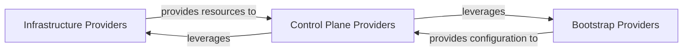

## Details

The Cluster API project leverages a modular, provider-based architecture to manage Kubernetes cluster lifecycles. At its core, the system defines abstract contracts for different aspects of cluster management: `Infrastructure Providers` handle the provisioning and management of underlying cloud or virtualized infrastructure, adhering to the `InfrastructureClusterContract`. `Bootstrap Providers` are responsible for generating the necessary configuration to initialize new cluster nodes, following the `BootstrapContract`. Finally, `Control Plane Providers` manage the Kubernetes control plane components, implementing the `ControlPlaneContract`. These components interact to orchestrate the complete lifecycle of a Kubernetes cluster, with Control Plane Providers often leveraging Infrastructure Providers to provision the necessary resources for the control plane. This clear separation of concerns allows for extensibility and support for various infrastructure and bootstrap mechanisms.

### Infrastructure Providers
These controllers are responsible for reconciling provider-specific infrastructure Custom Resources (CRDs) to provision, update, and deprovision underlying infrastructure resources (e.g., virtual machines, networks, load balancers) for a Kubernetes cluster on a specific cloud or virtualization platform (e.g., AWS, Azure, vSphere, Docker). They implement the `InfrastructureClusterContract` interface.

**Related Classes/Methods**:

- `sigs.k8s.io/cluster-api/internal/contract.InfrastructureClusterContract`

### Bootstrap Providers
These controllers are responsible for reconciling provider-specific bootstrap Custom Resources (CRDs) to generate configuration data (e.g., cloud-init scripts, Ignition configs) that allows a machine to initialize itself and join a Kubernetes cluster as a node. They implement the `BootstrapContract` interface.

**Related Classes/Methods**:

- `sigs.k8s.io/cluster-api/internal/contract.BootstrapContract`

### Control Plane Providers
These controllers are responsible for reconciling provider-specific control plane Custom Resources (CRDs) to manage the lifecycle of Kubernetes control plane components (API Server, etcd, Controller Manager, Scheduler). This includes provisioning, scaling, upgrading, and ensuring the high availability of the control plane. They implement the `ControlPlaneContract` interface.

**Related Classes/Methods**:

- `sigs.k8s.io/cluster-api/internal/contract.ControlPlaneContract`

### [FAQ](https://github.com/CodeBoarding/GeneratedOnBoardings/tree/main?tab=readme-ov-file#faq)