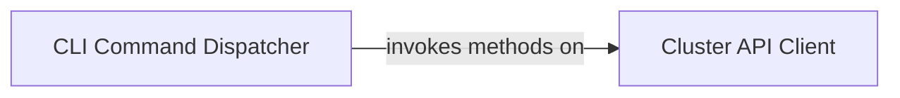

## Details

The `clusterctl` tool, a core component of the Cluster API project, provides a command-line interface for managing Kubernetes clusters. Its architecture is centered around a `CLI Command Dispatcher` that serves as the primary entry point, parsing user commands and delegating them to the `Cluster API Client`. This client, in turn, offers a high-level abstraction for interacting with Kubernetes and Cluster API resources, encapsulating the complexities of API communication and resource management. This design pattern ensures a clear separation of concerns, with the CLI handling user interaction and command orchestration, and the client managing the domain-specific logic for Cluster API operations.

### CLI Command Dispatcher
This component serves as the primary entry point for the `clusterctl` CLI. It is responsible for parsing command-line arguments and flags, identifying the requested `clusterctl` operation (e.g., `init`, `generate`, `upgrade`, `delete`), validating input parameters, and orchestrating the execution flow by dispatching the command to the appropriate handler. This aligns with Kubernetes tooling patterns by providing a user-friendly, declarative interface to complex operations.

**Related Classes/Methods**:

- `sigs.k8s.io/cluster-api/cmd/clusterctl.main`:1-99999

### Cluster API Client
This component provides a high-level programmatic interface for `clusterctl` operations, abstracting the complexities of directly interacting with the Kubernetes API server and Cluster API Custom Resources (CRs). It handles Kubernetes `client-go` interactions, including authentication, context management, and the serialization/deserialization of Cluster, Machine, MachineDeployment, KubeadmControlPlane, and provider-specific infrastructure CRs. This component is crucial for a Kubernetes Operator/Tooling project as it encapsulates the domain-specific logic for managing Cluster API objects.

**Related Classes/Methods**:

- `sigs.k8s.io/cluster-api/cmd/clusterctl/client.Client`:1-99999

### [FAQ](https://github.com/CodeBoarding/GeneratedOnBoardings/tree/main?tab=readme-ov-file#faq)