```mermaid
graph LR
    clusterctl_CLI_Tool["clusterctl CLI Tool"]
    Cluster_API_Custom_Resources_CRs_["Cluster API Custom Resources (CRs)"]
    Kubernetes_Control_Plane_API_Server_etcd_["Kubernetes Control Plane (API Server & etcd)"]
    Admission_Webhooks["Admission Webhooks"]
    Core_Cluster_API_Controllers["Core Cluster API Controllers"]
    Provider_Controllers_Infrastructure_Bootstrap_Control_Plane_["Provider Controllers (Infrastructure, Bootstrap, Control Plane)"]
    Cloud_Virtualization_Provider_APIs["Cloud/Virtualization Provider APIs"]
    Target_Kubernetes_Cluster["Target Kubernetes Cluster"]
    clusterctl_CLI_Tool -- "creates/updates" --> Cluster_API_Custom_Resources_CRs_
    clusterctl_CLI_Tool -- "reads" --> Cluster_API_Custom_Resources_CRs_
    Kubernetes_Control_Plane_API_Server_etcd_ -- "persists" --> Cluster_API_Custom_Resources_CRs_
    Kubernetes_Control_Plane_API_Server_etcd_ -- "retrieves" --> Cluster_API_Custom_Resources_CRs_
    Kubernetes_Control_Plane_API_Server_etcd_ -- "sends API requests to" --> Admission_Webhooks
    Kubernetes_Control_Plane_API_Server_etcd_ -- "notifies of CR changes" --> Core_Cluster_API_Controllers
    Admission_Webhooks -- "validates/mutates" --> Cluster_API_Custom_Resources_CRs_
    Admission_Webhooks -- "receives requests from" --> Kubernetes_Control_Plane_API_Server_etcd_
    Core_Cluster_API_Controllers -- "watches" --> Kubernetes_Control_Plane_API_Server_etcd_
    Core_Cluster_API_Controllers -- "updates status of" --> Cluster_API_Custom_Resources_CRs_
    Core_Cluster_API_Controllers -- "requests provisioning/configuration from" --> Provider_Controllers_Infrastructure_Bootstrap_Control_Plane_
    Provider_Controllers_Infrastructure_Bootstrap_Control_Plane_ -- "reports status to" --> Core_Cluster_API_Controllers
    Provider_Controllers_Infrastructure_Bootstrap_Control_Plane_ -- "invokes APIs on" --> Cloud_Virtualization_Provider_APIs
    Provider_Controllers_Infrastructure_Bootstrap_Control_Plane_ -- "configures nodes/components in" --> Target_Kubernetes_Cluster
    Cloud_Virtualization_Provider_APIs -- "receives requests from" --> Provider_Controllers_Infrastructure_Bootstrap_Control_Plane_
    Cloud_Virtualization_Provider_APIs -- "sends responses to" --> Provider_Controllers_Infrastructure_Bootstrap_Control_Plane_
    Target_Kubernetes_Cluster -- "is configured by" --> Provider_Controllers_Infrastructure_Bootstrap_Control_Plane_
    click clusterctl_CLI_Tool href "https://github.com/CodeBoarding/GeneratedOnBoardings/blob/main/cluster-api/clusterctl_CLI_Tool.md" "Details"
    click Cluster_API_Custom_Resources_CRs_ href "https://github.com/CodeBoarding/GeneratedOnBoardings/blob/main/cluster-api/Cluster_API_Custom_Resources_CRs_.md" "Details"
    click Kubernetes_Control_Plane_API_Server_etcd_ href "https://github.com/CodeBoarding/GeneratedOnBoardings/blob/main/cluster-api/Kubernetes_Control_Plane_API_Server_etcd_.md" "Details"
    click Admission_Webhooks href "https://github.com/CodeBoarding/GeneratedOnBoardings/blob/main/cluster-api/Admission_Webhooks.md" "Details"
    click Core_Cluster_API_Controllers href "https://github.com/CodeBoarding/GeneratedOnBoardings/blob/main/cluster-api/Core_Cluster_API_Controllers.md" "Details"
    click Provider_Controllers_Infrastructure_Bootstrap_Control_Plane_ href "https://github.com/CodeBoarding/GeneratedOnBoardings/blob/main/cluster-api/Provider_Controllers_Infrastructure_Bootstrap_Control_Plane_.md" "Details"
```

## Details

The Cluster API project orchestrates Kubernetes cluster lifecycle management by defining a set of declarative APIs and controllers. The architecture is modular, allowing for extensibility through various infrastructure, bootstrap, and control plane providers. The core components interact with Kubernetes' native mechanisms like Custom Resources (CRs) and Admission Webhooks, while also interfacing with external cloud/virtualization provider APIs to provision and manage the underlying infrastructure.

### clusterctl CLI Tool [[Expand]](./clusterctl_CLI_Tool.md)
The primary command-line interface for operators and users to interact with and manage Cluster API deployments and clusters. It provides functionalities for initialization, cluster generation, upgrades, deletion, and status description.

**Related Classes/Methods**:

- `cmd/clusterctl/main.go`
- `cmd/clusterctl/client/client.go`

### Cluster API Custom Resources (CRs) [[Expand]](./Cluster_API_Custom_Resources_CRs_.md)
These are the core declarative API objects (e.g., `Cluster`, `Machine`, `MachineSet`, `MachineDeployment`) that define the desired state of Kubernetes clusters and their underlying infrastructure. They serve as the central data models managed and reconciled by Cluster API controllers.

**Related Classes/Methods**:

- `api/core/v1beta1/cluster_types.go`
- `api/core/v1beta1/machine_types.go`

### Kubernetes Control Plane (API Server & etcd) [[Expand]](./Kubernetes_Control_Plane_API_Server_etcd_.md)
This represents the fundamental Kubernetes control plane components. The Kubernetes API Server acts as the central hub for all API interactions, including those related to Cluster API CRs. `etcd` serves as the distributed, consistent key-value store where all cluster data, including the state of Cluster API Custom Resources, is persistently stored. This is an external dependency, not part of the Cluster API codebase itself.

**Related Classes/Methods**: _None_

### Admission Webhooks [[Expand]](./Admission_Webhooks.md)
Kubernetes admission controllers that intercept API requests for Cluster API resources. They perform crucial validation, mutation, or defaulting operations on these objects before they are persisted in `etcd`, ensuring data integrity and adherence to Cluster API conventions.

**Related Classes/Methods**:

- `internal/webhooks/cluster.go`
- `internal/webhooks/machine.go`

### Core Cluster API Controllers [[Expand]](./Core_Cluster_API_Controllers.md)
These are the primary reconciliation loops that continuously observe the desired state (defined by CRs) and the actual state of Kubernetes clusters. They orchestrate the entire cluster lifecycle, including provisioning, scaling, and upgrading, by interacting with other components and external providers.

**Related Classes/Methods**:

- `main.go`
- `internal/controllers/cluster/cluster_controller.go`

### Provider Controllers (Infrastructure, Bootstrap, Control Plane) [[Expand]](./Provider_Controllers_Infrastructure_Bootstrap_Control_Plane_.md)
This logical grouping encompasses controllers responsible for interacting with external systems (e.g., cloud providers, bootstrapping tools like Kubeadm) to provision and configure the underlying infrastructure and Kubernetes components. Each provider type (e.g., AWS, Azure, Kubeadm) implements its own set of controllers that reconcile their specific custom resources.

**Related Classes/Methods**:

- `internal/contract/infrastructure_cluster.go`
- `internal/contract/bootstrap.go`
- `internal/contract/controlplane.go`

### Cloud/Virtualization Provider APIs
These are external APIs exposed by various cloud providers (e.g., AWS EC2, Azure Compute, GCP Compute Engine) or virtualization platforms (e.g., vSphere, Docker). Infrastructure Provider Controllers invoke these APIs to provision and manage virtual machines, networks, and other infrastructure resources required for Kubernetes clusters. This is an external dependency.

**Related Classes/Methods**: _None_

### Target Kubernetes Cluster
This represents the actual Kubernetes cluster that is being provisioned, managed, and scaled by Cluster API. It is where the Kubernetes control plane (API Server, etcd, Controller Manager, Scheduler) and worker nodes ultimately run. This is the end product of the Cluster API's operations and is an external entity.

**Related Classes/Methods**: _None_

### [FAQ](https://github.com/CodeBoarding/GeneratedOnBoardings/tree/main?tab=readme-ov-file#faq)