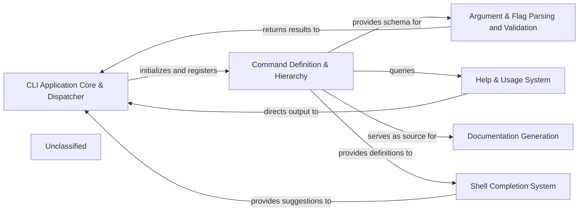

## Details

The Cobra project provides a robust framework for building command-line interfaces, centered around a flexible `Command` structure. The `CLI Application Core & Dispatcher` acts as the entry point, orchestrating the execution flow and managing global application settings. It relies heavily on the `Command Definition & Hierarchy` component to understand the available commands and their relationships. User input is processed by the `Argument & Flag Parsing and Validation` component, which ensures that commands receive valid parameters. For user assistance, the `Help & Usage System` dynamically generates help messages based on command definitions. Beyond runtime, the `Documentation Generation` component leverages the command structure to produce static documentation in various formats. Finally, the `Shell Completion System` integrates with popular shells to offer interactive command and flag suggestions, enhancing user experience. This modular design allows for clear separation of concerns, making the framework extensible and maintainable.

### CLI Application Core & Dispatcher
The central orchestrator, handling application initialization, global settings, error reporting, and dispatching control to specific commands. It also provides core utility functions for I/O and string manipulation.

**Related Classes/Methods**:

- <a href="https://github.com/spf13/cobra/blob/maincobra.go" target="_blank" rel="noopener noreferrer">`cobra.Execute`</a>
- <a href="https://github.com/spf13/cobra/blob/maincommand.go" target="_blank" rel="noopener noreferrer">`cobra.Command.Execute`</a>

### Command Definition & Hierarchy
Defines the structure and properties of all commands and subcommands, managing their hierarchical relationships, descriptions, flags, and arguments. This component is crucial for building the command tree.

**Related Classes/Methods**:

- <a href="https://github.com/spf13/cobra/blob/maincommand.go" target="_blank" rel="noopener noreferrer">`cobra.Command`</a>

### Argument & Flag Parsing and Validation
Responsible for parsing command-line arguments and flags, validating them against predefined rules, ensuring correct types, formats, and adherence to constraints.

**Related Classes/Methods**:

- <a href="https://github.com/spf13/cobra/blob/mainargs.go" target="_blank" rel="noopener noreferrer">`cobra.NoArgs`</a>
- <a href="https://github.com/spf13/cobra/blob/mainargs.go" target="_blank" rel="noopener noreferrer">`cobra.OnlyValidArgs`</a>
- <a href="https://github.com/spf13/cobra/blob/mainargs.go" target="_blank" rel="noopener noreferrer">`cobra.MinimumNArgs`</a>
- <a href="https://github.com/spf13/cobra/blob/mainargs.go" target="_blank" rel="noopener noreferrer">`cobra.MaximumNArgs`</a>
- <a href="https://github.com/spf13/cobra/blob/mainargs.go" target="_blank" rel="noopener noreferrer">`cobra.ExactArgs`</a>
- <a href="https://github.com/spf13/cobra/blob/mainargs.go" target="_blank" rel="noopener noreferrer">`cobra.RangeArgs`</a>
- <a href="https://github.com/spf13/cobra/blob/mainargs.go" target="_blank" rel="noopener noreferrer">`cobra.MatchAll`</a>
- <a href="https://github.com/spf13/cobra/blob/mainflag_groups.go" target="_blank" rel="noopener noreferrer">`cobra.ValidateFlagGroups`</a>
- <a href="https://github.com/spf13/cobra/blob/mainflag_groups.go" target="_blank" rel="noopener noreferrer">`cobra.MarkFlagsRequiredTogether`</a>
- <a href="https://github.com/spf13/cobra/blob/mainflag_groups.go" target="_blank" rel="noopener noreferrer">`cobra.MarkFlagsOneRequired`</a>
- <a href="https://github.com/spf13/cobra/blob/mainflag_groups.go" target="_blank" rel="noopener noreferrer">`cobra.MarkFlagsMutuallyExclusive`</a>

### Help & Usage System
Generates and displays runtime help messages, usage instructions, and version information to the user, leveraging command definitions for accurate assistance.

**Related Classes/Methods**:

- <a href="https://github.com/spf13/cobra/blob/maincommand.go" target="_blank" rel="noopener noreferrer">`cobra.Command.Help`</a>
- <a href="https://github.com/spf13/cobra/blob/maincommand.go" target="_blank" rel="noopener noreferrer">`cobra.Command.Usage`</a>
- <a href="https://github.com/spf13/cobra/blob/mainactive_help.go" target="_blank" rel="noopener noreferrer">`cobra.AppendActiveHelp`</a>
- <a href="https://github.com/spf13/cobra/blob/mainactive_help.go" target="_blank" rel="noopener noreferrer">`cobra.GetActiveHelpConfig`</a>

### Documentation Generation
Creates static documentation files in various formats (Markdown, YAML, reStructuredText, Man Pages) based on the command definitions, used for project READMEs, online documentation, or manual pages.

**Related Classes/Methods**:

- <a href="https://github.com/spf13/cobra/blob/maindoc/md_docs.go" target="_blank" rel="noopener noreferrer">`doc.GenMarkdown`</a>
- <a href="https://github.com/spf13/cobra/blob/maindoc/yaml_docs.go" target="_blank" rel="noopener noreferrer">`doc.GenYaml`</a>
- <a href="https://github.com/spf13/cobra/blob/maindoc/rest_docs.go" target="_blank" rel="noopener noreferrer">`doc.GenReST`</a>
- <a href="https://github.com/spf13/cobra/blob/maindoc/man_docs.go" target="_blank" rel="noopener noreferrer">`doc.GenMan`</a>

### Shell Completion System
Implements the core logic for identifying completable elements and managing custom completion functions, then generates shell-specific completion scripts for various environments.

**Related Classes/Methods**:

- <a href="https://github.com/spf13/cobra/blob/maincompletions.go" target="_blank" rel="noopener noreferrer">`cobra.RegisterFlagCompletionFunc`</a>
- <a href="https://github.com/spf13/cobra/blob/maincompletions.go" target="_blank" rel="noopener noreferrer">`cobra.GetFlagCompletionFunc`</a>
- <a href="https://github.com/spf13/cobra/blob/mainbash_completions.go" target="_blank" rel="noopener noreferrer">`cobra.GenBashCompletion`</a>
- <a href="https://github.com/spf13/cobra/blob/mainfish_completions.go" target="_blank" rel="noopener noreferrer">`cobra.GenFishCompletion`</a>
- <a href="https://github.com/spf13/cobra/blob/mainzsh_completions.go" target="_blank" rel="noopener noreferrer">`cobra.GenZshCompletion`</a>
- <a href="https://github.com/spf13/cobra/blob/mainpowershell_completions.go" target="_blank" rel="noopener noreferrer">`cobra.GenPowerShellCompletion`</a>

### Unclassified
Component for all unclassified files and utility functions (Utility functions/External Libraries/Dependencies)

**Related Classes/Methods**: _None_

### [FAQ](https://github.com/CodeBoarding/GeneratedOnBoardings/tree/main?tab=readme-ov-file#faq)