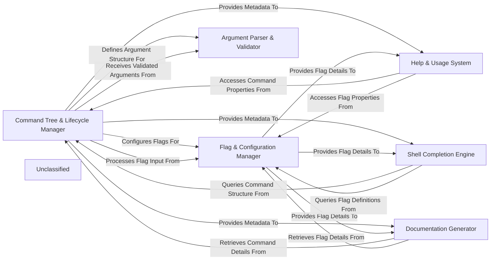

## Details

The Cobra project is architected around a central `Command Tree & Lifecycle Manager` that orchestrates the entire command-line interface (CLI) application. This core component is responsible for defining the hierarchical structure of commands and subcommands, managing their lifecycle, and dispatching execution based on user input. It interacts closely with the `Flag & Configuration Manager` to handle command-line flags and integrate with configuration systems, and with the `Argument Parser & Validator` to process and validate positional arguments. The system also includes specialized components for user assistance and extensibility. The `Help & Usage System` provides dynamic help messages and usage instructions, drawing information from the command structure and flag definitions. For enhanced user experience, the `Shell Completion Engine` offers intelligent tab-completion across various shell environments. Finally, the `Documentation Generator` automates the creation of comprehensive documentation in multiple formats by traversing the command tree and extracting metadata. This modular design ensures clear separation of concerns, making the CLI framework robust, extensible, and easy to maintain.

### Command Tree & Lifecycle Manager
The central orchestrator defining and managing the hierarchical structure of commands and subcommands, handling their registration, parsing of the command line, and dispatching execution.

**Related Classes/Methods**:

- <a href="https://github.com/spf13/cobra/blob/maincobra.go" target="_blank" rel="noopener noreferrer">`cobra.go`</a>
- <a href="https://github.com/spf13/cobra/blob/maincommand.go" target="_blank" rel="noopener noreferrer">`command.go`</a>

### Flag & Configuration Manager
Responsible for defining, parsing, and managing command-line flags, supporting inheritance and integration with configuration systems.

**Related Classes/Methods**:

- <a href="https://github.com/spf13/cobra/blob/mainflag_groups.go" target="_blank" rel="noopener noreferrer">`flag_groups.go`</a>
- <a href="https://github.com/spf13/cobra/blob/maincommand.go" target="_blank" rel="noopener noreferrer">`command.go`</a>

### Argument Parser & Validator
Processes and validates positional arguments provided to commands, ensuring correct input formatting and adherence to rules.

**Related Classes/Methods**:

- <a href="https://github.com/spf13/cobra/blob/mainargs.go" target="_blank" rel="noopener noreferrer">`args.go`</a>

### Help & Usage System
Manages the generation and display of user-facing help information, including detailed messages and active help suggestions.

**Related Classes/Methods**:

- <a href="https://github.com/spf13/cobra/blob/mainactive_help.go" target="_blank" rel="noopener noreferrer">`active_help.go`</a>
- <a href="https://github.com/spf13/cobra/blob/maincommand.go" target="_blank" rel="noopener noreferrer">`command.go`</a>

### Shell Completion Engine
Provides dynamic shell completion capabilities for various environments, generating scripts for tab-completion of commands, subcommands, and flags.

**Related Classes/Methods**:

- <a href="https://github.com/spf13/cobra/blob/maincompletions.go" target="_blank" rel="noopener noreferrer">`completions.go`</a>
- <a href="https://github.com/spf13/cobra/blob/mainbash_completions.go" target="_blank" rel="noopener noreferrer">`bash_completions.go`</a>
- <a href="https://github.com/spf13/cobra/blob/mainfish_completions.go" target="_blank" rel="noopener noreferrer">`fish_completions.go`</a>
- <a href="https://github.com/spf13/cobra/blob/mainzsh_completions.go" target="_blank" rel="noopener noreferrer">`zsh_completions.go`</a>
- <a href="https://github.com/spf13/cobra/blob/mainpowershell_completions.go" target="_blank" rel="noopener noreferrer">`powershell_completions.go`</a>

### Documentation Generator
Automatically generates comprehensive documentation for the CLI application in various formats by traversing the command tree and extracting metadata.

**Related Classes/Methods**:

- <a href="https://github.com/spf13/cobra/blob/maindoc/md_docs.go" target="_blank" rel="noopener noreferrer">`doc/md_docs.go`</a>
- <a href="https://github.com/spf13/cobra/blob/maindoc/rest_docs.go" target="_blank" rel="noopener noreferrer">`doc/rest_docs.go`</a>
- <a href="https://github.com/spf13/cobra/blob/maindoc/yaml_docs.go" target="_blank" rel="noopener noreferrer">`doc/yaml_docs.go`</a>
- <a href="https://github.com/spf13/cobra/blob/maindoc/man_docs.go" target="_blank" rel="noopener noreferrer">`doc/man_docs.go`</a>
- <a href="https://github.com/spf13/cobra/blob/maindoc/util.go" target="_blank" rel="noopener noreferrer">`doc/util.go`</a>

### Unclassified
Component for all unclassified files and utility functions (Utility functions/External Libraries/Dependencies)

**Related Classes/Methods**: _None_

### [FAQ](https://github.com/CodeBoarding/GeneratedOnBoardings/tree/main?tab=readme-ov-file#faq)