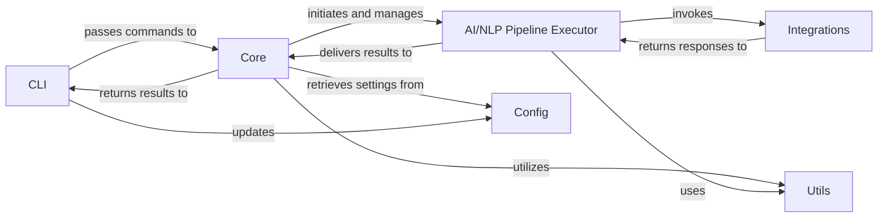

## Details

One paragraph explaining the functionality which is represented by this graph. What the main flow is and what is its purpose.

### CLI
The primary interface for user interaction, responsible for parsing commands, validating input, and displaying results. It acts as the entry point for all user-initiated operations.

**Related Classes/Methods**:

- <a href="https://github.com/Pipelex/cocode/blob/main/cocode/cli.py#L1-L1" target="_blank" rel="noopener noreferrer">`cocode.cli.CocodeCLI` (1:1)</a>
- <a href="https://github.com/Pipelex/cocode/blob/main/cocode/cli.py#L1-L1" target="_blank" rel="noopener noreferrer">`cocode.cli.app` (1:1)</a>

### Core [[Expand]](./Core.md)
Contains the central business logic and orchestrates the overall application flow. It coordinates interactions between various components, translating CLI commands into internal operations and managing the execution of pipelines.

**Related Classes/Methods**:

- `cocode.core.main` (1:1)

### AI/NLP Pipeline Executor [[Expand]](./AI_NLP_Pipeline_Executor.md)
Manages and executes various AI and Natural Language Processing pipelines on processed code or documentation. This component leverages external AI models (e.g., OpenAI, Anthropic, Vertex AI) for tasks such as document proofreading, code summarization, or vulnerability detection, handling their invocation and result retrieval.

**Related Classes/Methods**:

- `pipelex.pipelex.Pipelex` (1:1)

### Integrations
Provides a standardized interface for interacting with external third-party services, specifically various AI model APIs (e.g., OpenAI, Anthropic, Vertex AI). It abstracts the complexities of API calls, authentication, and rate limiting.

**Related Classes/Methods**:

- `cocode.integrations.openai` (1:1)
- `cocode.integrations.anthropic` (1:1)

### Config
Manages all application configuration settings, including API keys, model parameters, and user preferences. It provides a centralized and persistent mechanism for accessing and updating these settings.

**Related Classes/Methods**:

- `cocode.config.settings` (1:1)

### Utils
A collection of common helper functions and reusable utilities that support various components across the application. This includes file system operations, data parsing, string manipulation, and other general-purpose functionalities.

**Related Classes/Methods**:

- <a href="https://github.com/Pipelex/cocode/blob/main/cocode/utils.py#L1-L1" target="_blank" rel="noopener noreferrer">`cocode.utils.file_helpers` (1:1)</a>
- <a href="https://github.com/Pipelex/cocode/blob/main/cocode/utils.py#L1-L1" target="_blank" rel="noopener noreferrer">`cocode.utils.parsers` (1:1)</a>

### [FAQ](https://github.com/CodeBoarding/GeneratedOnBoardings/tree/main?tab=readme-ov-file#faq)