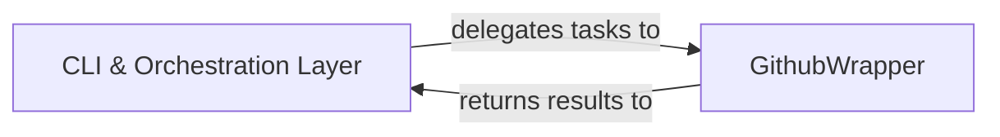

## Details

One paragraph explaining the functionality which is represented by this graph. What the main flow is and what is its purpose.

### CLI & Orchestration Layer [[Expand]](./CLI_Orchestration_Layer.md)
This component serves as the primary user interface, handling command-line argument parsing, input validation, and orchestrating the overall execution flow. It acts as the central coordinator, delegating tasks to other components based on user commands and presenting final results.

**Related Classes/Methods**:

- <a href="https://github.com/Pipelex/cocode/blob/main/cocode/cli.py#L1-L1000" target="_blank" rel="noopener noreferrer">`cocode.cli` (1:1000)</a>
- `cocode.github.github_cli`

### GithubWrapper
This component encapsulates all interactions with the GitHub API, providing a clean interface for other parts of the system to request GitHub-related data or perform actions without needing to know the underlying API details.

**Related Classes/Methods**:

- `cocode.github` (1:1000)

### [FAQ](https://github.com/CodeBoarding/GeneratedOnBoardings/tree/main?tab=readme-ov-file#faq)