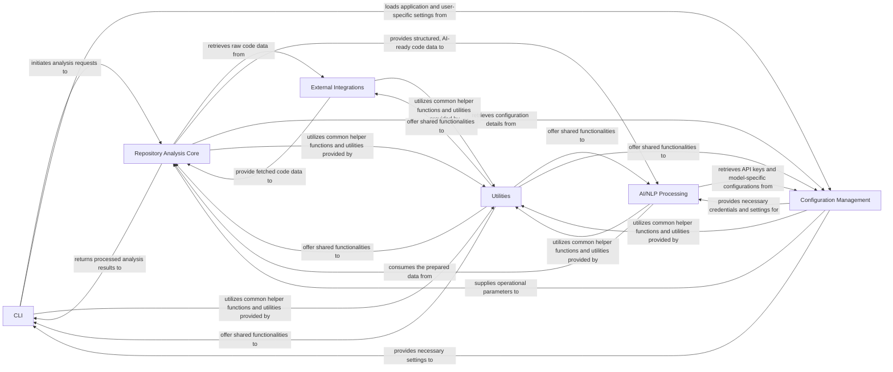

## Details

The `Repository Analysis Core` subsystem is a critical part of Cocode's architecture, acting as the bridge between raw code and AI-ready data. Based on the project context and the detailed analysis of `Repository Analysis Core`, the following component structure is proposed, adhering to CLI tool patterns and emphasizing modularity and layered design.

### CLI
The primary user-facing component responsible for parsing commands, arguments, and orchestrating the overall application workflow. It serves as the entry point for users to initiate code analysis and interact with the Cocode system.

**Related Classes/Methods**:

- <a href="https://github.com/Pipelex/cocode/blob/main/cocode/cli.py#L1-L1" target="_blank" rel="noopener noreferrer">`cocode.cli.*` (1:1)</a>
- `cocode.main` (1:1)

### Repository Analysis Core [[Expand]](./Repository_Analysis_Core.md)
The central processing unit for code repositories. It handles parsing source code, extracting structural metadata (e.g., functions, classes), indexing code elements, and preparing the data in a structured format suitable for subsequent AI/NLP analysis.

**Related Classes/Methods**:

- <a href="https://github.com/Pipelex/cocode/blob/main/cocode/repox/repox_processor.py#L1-L1" target="_blank" rel="noopener noreferrer">`cocode.repox.repox_processor.RepoxProcessor` (1:1)</a>
- `cocode.repox.*` (1:1)

### AI/NLP Processing
Components dedicated to applying Artificial Intelligence and Natural Language Processing techniques to the structured code data provided by the `Repository Analysis Core`. This includes tasks such as code summarization, vulnerability detection, or code generation.

**Related Classes/Methods**:

- `cocode.ai.*` (1:1)
- `cocode.nlp.*` (1:1)

### External Integrations
Manages all interactions with external services and platforms. This includes fetching code from Git repositories (e.g., GitHub via `GithubWrapper`) and interfacing with cloud-based AI services (e.g., OpenAI, Anthropic, Google Cloud Vertex AI).

**Related Classes/Methods**:

- `cocode.integrations.*` (1:1)
- `cocode.integrations.github_wrapper` (1:1)

### Configuration Management
Responsible for loading, parsing, and managing application-wide configurations, user-specific settings, and sensitive API credentials. It ensures consistent access to settings across different components.

**Related Classes/Methods**:

- `cocode.config.*` (1:1)

### Utilities
A collection of common helper functions, reusable data structures, and generic utilities that support various components across the system. This component aims to reduce code duplication and enhance overall code quality.

**Related Classes/Methods**:

- `cocode.utils.*`

### [FAQ](https://github.com/CodeBoarding/GeneratedOnBoardings/tree/main?tab=readme-ov-file#faq)