```mermaid
graph LR
    CLI_Orchestration_Layer["CLI & Orchestration Layer"]
    GitHub_Integration_Service["GitHub Integration Service"]
    Repository_Analysis_Core["Repository Analysis Core"]
    AI_NLP_Pipeline_Executor["AI/NLP Pipeline Executor"]
    CLI_Orchestration_Layer -- "Orchestrates" --> GitHub_Integration_Service
    CLI_Orchestration_Layer -- "Orchestrates & Presents Results" --> Repository_Analysis_Core
    GitHub_Integration_Service -- "Provides Repository Data To" --> Repository_Analysis_Core
    Repository_Analysis_Core -- "Exchanges Data With" --> AI_NLP_Pipeline_Executor
    Repository_Analysis_Core -- "Utilizes" --> GitHub_Integration_Service
    click CLI_Orchestration_Layer href "https://github.com/CodeBoarding/GeneratedOnBoardings/blob/main/cocode/CLI_Orchestration_Layer.md" "Details"
    click GitHub_Integration_Service href "https://github.com/CodeBoarding/GeneratedOnBoardings/blob/main/cocode/GitHub_Integration_Service.md" "Details"
    click Repository_Analysis_Core href "https://github.com/CodeBoarding/GeneratedOnBoardings/blob/main/cocode/Repository_Analysis_Core.md" "Details"
    click AI_NLP_Pipeline_Executor href "https://github.com/CodeBoarding/GeneratedOnBoardings/blob/main/cocode/AI_NLP_Pipeline_Executor.md" "Details"
```

## Details

Cocode is a Command-Line Interface (CLI) tool designed for software engineers, integrating code analysis with AI/ML capabilities. It leverages a modular and layered architecture, enabling users to interact with code repositories, perform deep analysis, and apply advanced AI/NLP pipelines for tasks like code summarization or vulnerability detection.

### CLI & Orchestration Layer [[Expand]](./CLI_Orchestration_Layer.md)
This component serves as the primary user interface, handling command-line argument parsing, input validation, and orchestrating the overall execution flow. It acts as the central coordinator, delegating tasks to other components based on user commands and presenting final results.

**Related Classes/Methods**:

- <a href="https://github.com/Pipelex/cocode/blob/main/cocode/cli.py" target="_blank" rel="noopener noreferrer">`cocode.cli`</a>
- `cocode.github.github_cli`

### GitHub Integration Service [[Expand]](./GitHub_Integration_Service.md)
Dedicated to managing all interactions with the GitHub platform, this component encapsulates operations such as repository cloning, fetching code, and potentially managing pull requests. It provides an abstraction layer for GitHub API calls, shielding other components from implementation details.

**Related Classes/Methods**:

- `cocode.github.github_wrapper`

### Repository Analysis Core [[Expand]](./Repository_Analysis_Core.md)
This is the central processing unit for code repositories. It's responsible for parsing source code, extracting structural metadata (e.g., functions, classes), indexing code elements, and preparing the data for subsequent AI/NLP analysis. It bridges raw code with AI-ready data.

**Related Classes/Methods**:

- <a href="https://github.com/Pipelex/cocode/blob/main/cocode/repox/repox_processor.py" target="_blank" rel="noopener noreferrer">`cocode.repox.repox_processor.RepoxProcessor`</a>

### AI/NLP Pipeline Executor [[Expand]](./AI_NLP_Pipeline_Executor.md)
Manages and executes various AI and Natural Language Processing pipelines on the processed code or documentation. This component leverages external AI models (e.g., OpenAI, Anthropic, Vertex AI) for tasks such as document proofreading, code summarization, or vulnerability detection, handling their invocation and result retrieval.

**Related Classes/Methods**:

- `cocode.pipelex_libraries.pipelines.doc_proofread.file_utils`
- <a href="https://github.com/Pipelex/cocode/blob/main/cocode/pipelex_libraries/pipelines/doc_proofread/doc_proofread_models.py" target="_blank" rel="noopener noreferrer">`cocode.pipelex_libraries.pipelines.doc_proofread.doc_proofread_models`</a>

### [FAQ](https://github.com/CodeBoarding/GeneratedOnBoardings/tree/main?tab=readme-ov-file#faq)