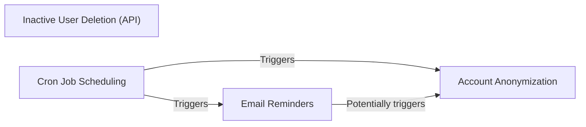

## Component Details

The Background Task Management component is responsible for scheduling and executing tasks that maintain the health, security, and compliance of the Code for Life platform. These tasks include sending email reminders to users who haven't verified their accounts or have been inactive, and anonymizing user data to comply with data privacy regulations. The component relies on cron jobs to trigger these tasks at specific intervals, ensuring that the platform remains up-to-date and user data is handled responsibly.

### Email Reminders
This component sends email reminders to users based on their account verification status and activity. It includes sending reminders to unverified users and inactive users. The reminders are sent in stages, with increasing urgency, before an account is anonymized.
- **Related Classes/Methods**: `portal.views.cron.user.FirstVerifyEmailReminderView:get`, `portal.views.cron.user.SecondVerifyEmailReminderView:get`, `portal.views.cron.user.FirstInactivityReminderView:get`, `portal.views.cron.user.SecondInactivityReminderView:get`, `portal.views.cron.user.FinalInactivityReminderView:get`

### Account Anonymization
This component handles the anonymization of user accounts. It is triggered by cron jobs for unverified accounts and inactive accounts. It also provides an API endpoint and admin action to manually anonymize accounts.
- **Related Classes/Methods**: `portal.views.cron.user.AnonymiseUnverifiedAccounts:get`, `portal.views.api:anonymise`, `portal.admin.UserAdmin:anonymise_user`, `cfl_common.common.migrations.0049_anonymise_orphan_users:anonymise_orphan_users`

### Inactive User Deletion (API)
This component provides an API endpoint to delete inactive users.
- **Related Classes/Methods**: `portal.views.api.InactiveUsersView:delete`

### Cron Job Scheduling
This component is responsible for scheduling and triggering the background tasks. It uses cron jobs to execute tasks at predefined intervals.
- **Related Classes/Methods**: `portal.views.cron.user`
