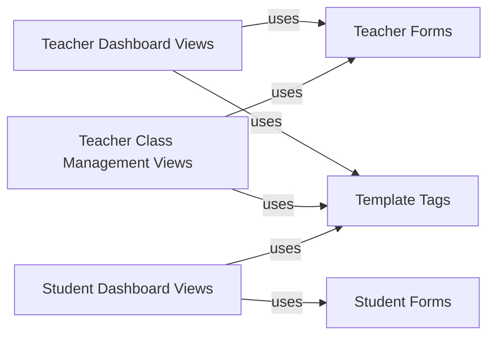

## Component Details

The Classroom and Resource Management component enables teachers to manage classes, students, and learning resources, while providing students access to learning materials and coding games. It encompasses teacher dashboards for school and account management, class management views for creating and editing classes, and student dashboards for accessing learning content. Forms are used for teacher and student registration, login, and account editing, with template tags controlling access and displaying user-specific information.

### Teacher Dashboard Views
Handles the display and functionality of the teacher's dashboard, including managing the school, account updates, and organization management. It provides views for teachers to manage their school, update account information, and handle organization-related tasks such as kicking users, toggling admin status, and accepting/rejecting student requests.
- **Related Classes/Methods**: `codeforlife-portal.portal.views.teacher.dashboard:dashboard_teacher_view`, `codeforlife-portal.portal.views.teacher.dashboard:process_update_school_form`, `codeforlife-portal.portal.views.teacher.dashboard:process_update_account_form`, `codeforlife-portal.portal.views.teacher.dashboard:dashboard_manage`, `codeforlife-portal.portal.views.teacher.dashboard:organisation_kick`, `codeforlife-portal.portal.views.teacher.dashboard:organisation_toggle_admin`, `codeforlife-portal.portal.views.teacher.dashboard:teacher_accept_student_request`, `codeforlife-portal.portal.views.teacher.dashboard:teacher_reject_student_request`, `codeforlife-portal.portal.views.teacher.dashboard:invited_teacher`, `codeforlife-portal.portal.views.teacher.dashboard:process_teacher_invitation`

### Teacher Class Management Views
Provides views for teachers to manage their classes, including creating, editing, viewing, and deleting classes, as well as managing student enrollment and passwords. It allows teachers to perform actions such as creating classes, editing class details, viewing class rosters, deleting students, editing student information, resetting passwords, and moving students between classes.
- **Related Classes/Methods**: `codeforlife-portal.portal.views.teacher.teach:teacher_onboarding_create_class`, `codeforlife-portal.portal.views.teacher.teach:process_edit_class`, `codeforlife-portal.portal.views.teacher.teach:teacher_onboarding_edit_class`, `codeforlife-portal.portal.views.teacher.teach:teacher_view_class`, `codeforlife-portal.portal.views.teacher.teach:teacher_delete_students`, `codeforlife-portal.portal.views.teacher.teach:teacher_edit_class`, `codeforlife-portal.portal.views.teacher.teach:process_level_control_form`, `codeforlife-portal.portal.views.teacher.teach:teacher_edit_student`, `codeforlife-portal.portal.views.teacher.teach:process_reset_password_form`, `codeforlife-portal.portal.views.teacher.teach:teacher_dismiss_students`, `codeforlife-portal.portal.views.teacher.teach:teacher_class_password_reset`, `codeforlife-portal.portal.views.teacher.teach:teacher_move_students`, `codeforlife-portal.portal.views.teacher.teach:teacher_move_students_to_class`, `codeforlife-portal.portal.views.teacher.teach:teacher_print_reminder_cards`, `codeforlife-portal.portal.views.teacher.teach:teacher_download_csv`, `codeforlife-portal.portal.views.teacher.teach:count_student_pack_downloads_click`

### Teacher Forms
Defines forms used by teachers for registration, login, account editing, and student management, including validation and error handling. These forms handle tasks such as password resets, account editing, login authentication, and student password management, ensuring data integrity and security.
- **Related Classes/Methods**: `codeforlife-portal.portal.forms.registration.TeacherPasswordResetSetPasswordForm:clean_new_password1`, `codeforlife-portal.portal.forms.teach.InvitedTeacherForm:clean_teacher_password`, `codeforlife-portal.portal.forms.teach.InvitedTeacherForm:clean`, `codeforlife-portal.portal.forms.teach.TeacherEditAccountForm:clean_password`, `codeforlife-portal.portal.forms.teach.TeacherEditAccountForm:clean`, `codeforlife-portal.portal.forms.teach.TeacherEditAccountForm:check_password_errors`, `codeforlife-portal.portal.forms.teach.TeacherLoginForm:clean`, `codeforlife-portal.portal.forms.teach.TeacherLoginForm:find_user`, `codeforlife-portal.portal.forms.teach.TeacherLoginForm:check_email_errors`, `codeforlife-portal.portal.forms.teach.TeacherSetStudentPass:clean_password`, `codeforlife-portal.portal.forms.teach.TeacherSetStudentPass:clean`, `codeforlife-portal.portal.forms.teach:validateStudentNames`, `codeforlife-portal.portal.forms.teach.BaseTeacherMoveStudentsDisambiguationFormSet:clean`, `codeforlife-portal.portal.forms.teach.BaseTeacherDismissStudentsFormSet:clean`, `codeforlife-portal.portal.forms.teach.StudentCreationForm:clean`

### Student Dashboard Views
Handles the display of student dashboards for both school and independent students, including computing scores and managing organization joining. It provides customized dashboards for school and independent students, computes scores based on their progress, and manages the process of students joining organizations.
- **Related Classes/Methods**: `codeforlife-portal.portal.views.student.play.SchoolStudentDashboard:get_context_data`, `codeforlife-portal.portal.views.student.play.IndependentStudentDashboard:get_context_data`, `codeforlife-portal.portal.views.student.play:_compute_scores`, `codeforlife-portal.portal.views.student.play:student_join_organisation`

### Student Forms
Defines forms used by students for login, account editing, and signup, including validation and error handling for both school and independent students. These forms handle student login, account editing, and signup processes, with specific validation and error handling for both school and independent student accounts.
- **Related Classes/Methods**: `codeforlife-portal.portal.forms.play.StudentLoginForm:clean`, `codeforlife-portal.portal.forms.play.StudentEditAccountForm:clean_password`, `codeforlife-portal.portal.forms.play.StudentEditAccountForm:clean`, `codeforlife-portal.portal.forms.play.IndependentStudentEditAccountForm:clean_password`, `codeforlife-portal.portal.forms.play.IndependentStudentEditAccountForm:clean`, `codeforlife-portal.portal.forms.play:clean_confirm_password`, `codeforlife-portal.portal.forms.play.IndependentStudentSignupForm:clean_password`, `codeforlife-portal.portal.forms.play.IndependentStudentLoginForm:confirm_login_allowed`, `codeforlife-portal.portal.forms.play.IndependentStudentLoginForm:get_invalid_login_error`

### Template Tags
Provides template tags for controlling access and displaying user-specific information, such as login status, beta access, and onboarding status. These tags are used in templates to control access to features and display information based on user roles, login status, beta access, and onboarding completion.
- **Related Classes/Methods**: `codeforlife-portal.portal.templatetags.app_tags:has_beta_access`, `codeforlife-portal.portal.templatetags.app_tags:is_logged_in_as_teacher`, `codeforlife-portal.portal.templatetags.app_tags:is_logged_in_as_admin_teacher`, `codeforlife-portal.portal.templatetags.app_tags:is_logged_in_as_student`, `codeforlife-portal.portal.templatetags.app_tags:is_independent_student`, `codeforlife-portal.portal.templatetags.app_tags:has_teacher_finished_onboarding`, `codeforlife-portal.portal.templatetags.app_tags:is_logged_in_as_school_user`, `codeforlife-portal.portal.templatetags.app_tags:get_user_status`
