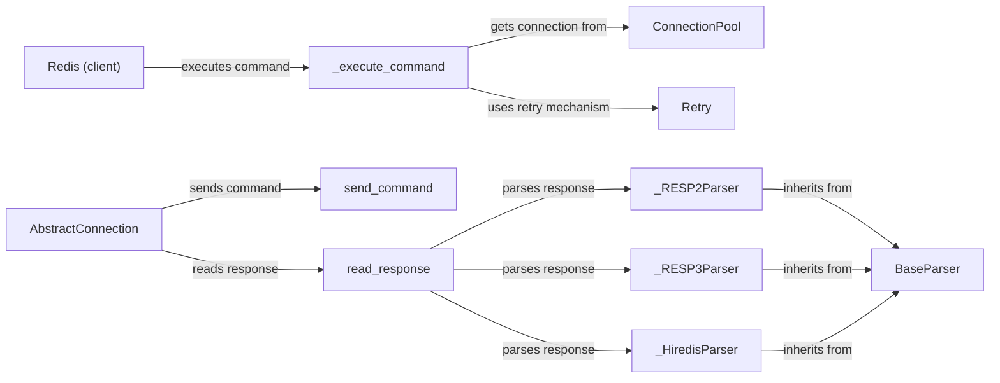

## Component Details

The Command Execution and Parsing component orchestrates the process of sending commands to a Redis server and interpreting the responses. It begins with the Redis client's `_execute_command` method, which retrieves a connection from the `ConnectionPool` and leverages the `Retry` mechanism for handling potential failures. The `AbstractConnection` class then takes over, using its `send_command` method to transmit the formatted command. Upon receiving a response, the `read_response` method dispatches the raw data to the appropriate parser (`_RESP2Parser`, `_RESP3Parser`, or `_HiredisParser`) based on the Redis protocol in use. The chosen parser then transforms the raw response into a usable Python data structure, which is returned to the client.

### Redis (client)
The Redis class (both synchronous and asynchronous) serves as the primary interface for interacting with the Redis server. It encapsulates the connection pool and provides methods for executing commands.
- **Related Classes/Methods**: `redis-py.redis.client.Redis`, `redis-py.redis.asyncio.client.Redis`

### _execute_command
This method, present in both synchronous and asynchronous Redis clients, is responsible for preparing and sending commands to the Redis server. It obtains a connection from the connection pool and utilizes the retry mechanism if necessary.
- **Related Classes/Methods**: `redis-py.redis.client.Redis:_execute_command`, `redis-py.redis.asyncio.client.Redis:_execute_command`

### ConnectionPool
The ConnectionPool (both synchronous and asynchronous) manages a pool of connections to the Redis server. It provides connections to the client when needed and handles connection management, including connection creation, recycling, and health checks.
- **Related Classes/Methods**: `redis-py.redis.connection.ConnectionPool`, `redis-py.redis.asyncio.connection.ConnectionPool`

### AbstractConnection
The AbstractConnection class (both synchronous and asynchronous) represents a single connection to the Redis server. It handles the low-level details of sending commands and receiving responses.
- **Related Classes/Methods**: `redis-py.redis.connection.AbstractConnection`, `redis-py.redis.asyncio.connection.AbstractConnection`

### send_command
This method, within AbstractConnection, is responsible for sending the formatted command to the Redis server over the established connection.
- **Related Classes/Methods**: `redis-py.redis.connection.AbstractConnection:send_command`, `redis-py.redis.asyncio.connection.AbstractConnection:send_command`

### read_response
This method, within AbstractConnection, reads the response from the Redis server after a command has been sent. It receives the raw response data and passes it to the appropriate parser.
- **Related Classes/Methods**: `redis-py.redis.connection.AbstractConnection:read_response`, `redis-py.redis.asyncio.connection.AbstractConnection:read_response`

### Retry
The Retry class (both synchronous and asynchronous) implements a retry mechanism for handling command failures. It determines whether a command should be retried based on the type of error encountered and the retry policy configured.
- **Related Classes/Methods**: `redis-py.redis.retry.Retry`, `redis-py.redis.asyncio.retry.Retry`

### BaseParser
The BaseParser class serves as an abstract base class for all Redis response parsers. It defines the interface for parsing responses and provides common functionality.
- **Related Classes/Methods**: `redis-py.redis._parsers.base.BaseParser`

### _RESP2Parser
The _RESP2Parser class (both synchronous and asynchronous) is responsible for parsing responses formatted according to the RESP2 protocol, the older Redis serialization protocol.
- **Related Classes/Methods**: `redis-py.redis._parsers.resp2._RESP2Parser`, `redis-py.redis._parsers.resp2._AsyncRESP2Parser`

### _RESP3Parser
The _RESP3Parser class (both synchronous and asynchronous) handles parsing responses that adhere to the RESP3 protocol, the newer and more feature-rich Redis serialization protocol.
- **Related Classes/Methods**: `redis-py.redis._parsers.resp3._RESP3Parser`, `redis-py.redis._parsers.resp3._AsyncRESP3Parser`

### _HiredisParser
The _HiredisParser class (both synchronous and asynchronous) leverages the hiredis library, a high-performance C library, to parse Redis responses. It provides faster parsing compared to the pure-Python parsers.
- **Related Classes/Methods**: `redis-py.redis._parsers.hiredis._HiredisParser`, `redis-py.redis._parsers.hiredis._AsyncHiredisParser`
