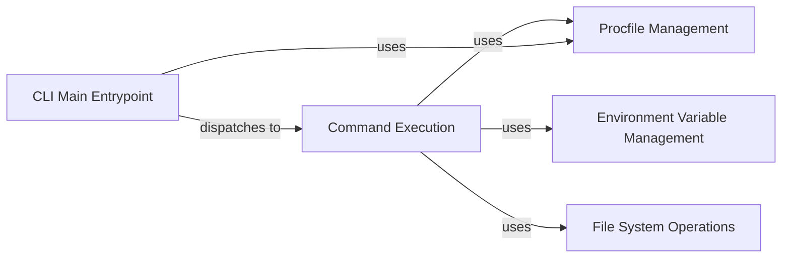

## Component Details

The Honcho CLI provides a command-line interface for managing Procfile-based applications. It allows users to start, run, export, and check processes defined in a Procfile. The CLI parses command-line arguments, reads the Procfile and .env files, and orchestrates the execution of other components to manage the application's processes.

### CLI Main Entrypoint
The main entry point for the Honcho command-line tool. It uses `argparse` to parse command-line arguments and dispatches to the appropriate command handler based on the user's input. This component is responsible for initializing the CLI and handling top-level commands.
- **Related Classes/Methods**: `honcho.honcho.command:main`

### Command Execution
This component encapsulates the execution logic for individual commands such as `start`, `run`, `export`, and `check`. It receives the parsed command-line arguments from the `CLI Main Entrypoint` and orchestrates the necessary actions to fulfill the command's purpose. This includes reading the Procfile, loading environment variables, and managing processes.
- **Related Classes/Methods**: `honcho.honcho.command:command_start`, `honcho.honcho.command:command_run`, `honcho.honcho.command:command_export`, `honcho.honcho.command:command_check`

### Procfile Management
This component handles the reading, parsing, and locating of the Procfile. It provides functions to read the Procfile, parse its contents into a dictionary of process names and commands, and locate the Procfile based on command-line arguments or default locations. It encapsulates the logic for interacting with the Procfile.
- **Related Classes/Methods**: `honcho.honcho.command:_procfile`, `honcho.honcho.command:_choose_procfile`

### Environment Variable Management
This component is responsible for reading and parsing the .env file, returning a dictionary of environment variables. It handles the logic for reading the .env file and parsing its contents into a dictionary of key-value pairs representing environment variables.
- **Related Classes/Methods**: `honcho.honcho.command:_read_env`

### File System Operations
This component provides utility functions for interacting with the file system, such as creating directories and writing files. It is used by the `export` command to create the directory for the exported configuration files and write the configuration files to disk.
- **Related Classes/Methods**: `honcho.honcho.command:_mkdir`, `honcho.honcho.command:_write_file`
